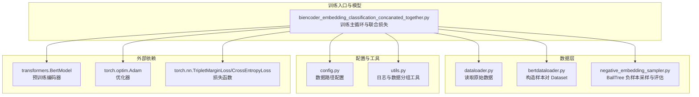
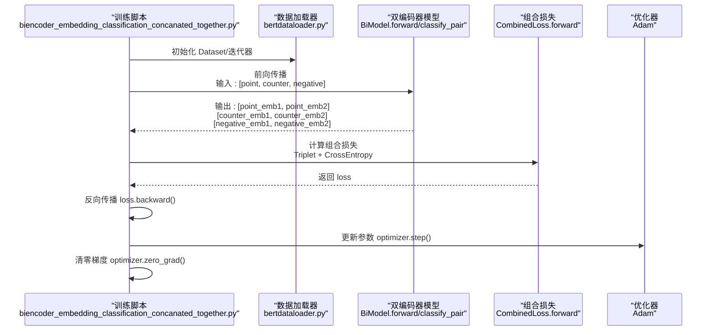
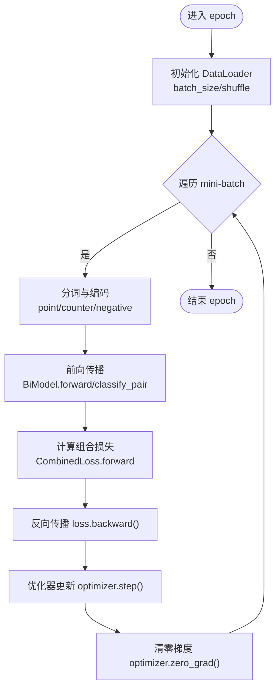
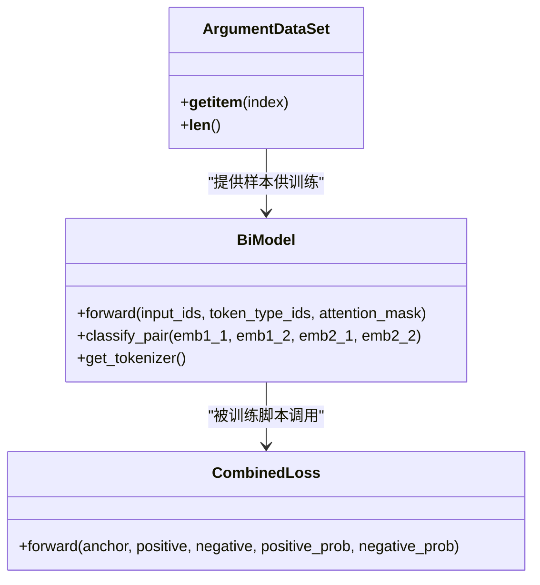
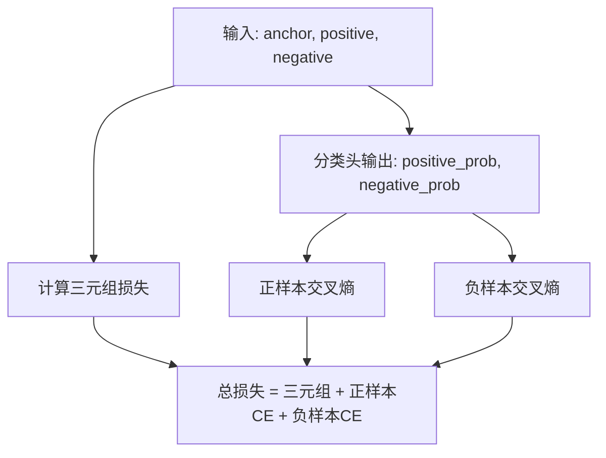
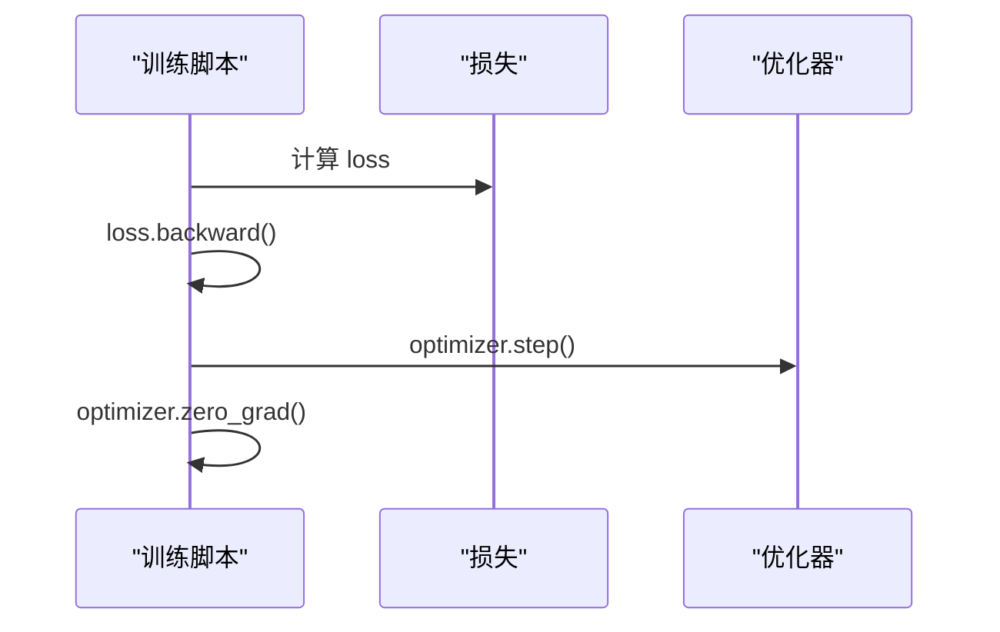
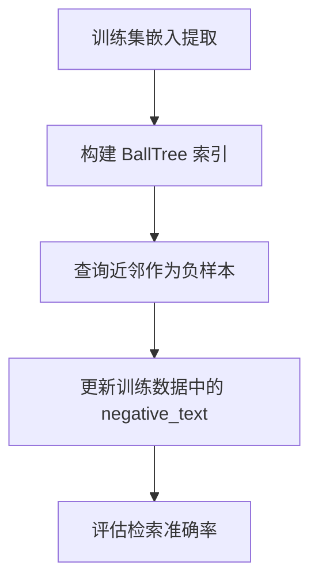
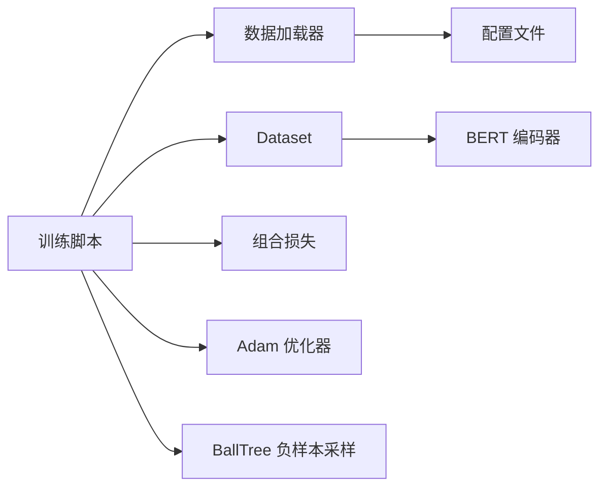

# 训练循环机制

<cite>
**本文引用的文件**
- [biencoder_embedding_classification_concanated_together.py](file://bert/biencoder/biencoder_embedding_classification_concanated_together.py)
- [bertdataloader.py](file://bert/bertdataloader.py)
- [dataloader.py](file://dataloader.py)
- [config.py](file://config.py)
- [negative_embedding_sampler.py](file://bert/negative_embedding_sampler.py)
- [utils.py](file://utils.py)
- [README.md](file://README.md)
</cite>

## 目录
1. [引言](#引言)
2. [项目结构](#项目结构)
3. [核心组件](#核心组件)
4. [架构总览](#架构总览)
5. [详细组件分析](#详细组件分析)
6. [依赖关系分析](#依赖关系分析)
7. [性能考量](#性能考量)
8. [故障排查指南](#故障排查指南)
9. [结论](#结论)
10. [附录](#附录)

## 引言
本文件围绕“联合优化的双编码器训练循环”进行系统化说明，重点覆盖以下方面：
- 每个 epoch 的完整训练流程：数据加载、前向传播、损失计算（组合损失：三元组损失 + 分类交叉熵）、反向传播与优化器更新。
- 批次处理、梯度清零、loss 回传与模型状态管理。
- 如何在训练中协调“分类任务”与“检索任务”的联合优化。
- 典型训练日志输出的解读示例。
- 常见训练问题（如梯度爆炸、loss 震荡）的成因与解决建议，以及学习率、batch size 等关键超参数的调优范围。

## 项目结构
该仓库采用按功能模块划分的组织方式，训练主循环位于双编码器实现文件中，数据准备与采样由独立模块负责，整体结构如下图所示：

图表来源
- [biencoder_embedding_classification_concanated_together.py](file://bert/biencoder/biencoder_embedding_classification_concanated_together.py#L1-L280)
- [dataloader.py](file://dataloader.py#L1-L87)
- [bertdataloader.py](file://bert/bertdataloader.py#L1-L44)
- [negative_embedding_sampler.py](file://bert/negative_embedding_sampler.py#L1-L92)
- [config.py](file://config.py#L1-L11)
- [utils.py](file://utils.py#L1-L304)

章节来源
- [README.md](file://README.md#L1-L7)
- [config.py](file://config.py#L1-L11)

## 核心组件
- 双编码器模型与分类头
  - 使用预训练 BERT 作为编码器，输出两个嵌入向量，分别用于相似度计算与分类拼接。
  - 分类头将两对语句的嵌入拼接后送入线性层，输出二分类概率，用于区分正负样本对。
- 组合损失函数 CombinedLoss
  - 包含三元组损失（用于检索任务的排序优化）与交叉熵损失（用于分类任务的判别优化），二者加权求和。
- 数据加载与负样本采样
  - 通过 Dataset 将每条记录转换为“正样本对 + 负样本文本”的三元组。
  - 使用 BallTree 近似最近邻搜索，动态选择负样本，支持随机率控制以增强鲁棒性。
- 训练主循环
  - 每个 epoch 内部进行多轮 mini-batch 训练；在每个 epoch 结束时重新采样负样本并对检索性能进行评估。

章节来源
- [biencoder_embedding_classification_concanated_together.py](file://bert/biencoder/biencoder_embedding_classification_concanated_together.py#L48-L174)
- [bertdataloader.py](file://bert/bertdataloader.py#L30-L44)
- [negative_embedding_sampler.py](file://bert/negative_embedding_sampler.py#L1-L92)

## 架构总览
下图展示了从数据到模型再到损失与优化器的整体调用链路，映射到实际源码文件：

图表来源
- [biencoder_embedding_classification_concanated_together.py](file://bert/biencoder/biencoder_embedding_classification_concanated_together.py#L147-L174)
- [bertdataloader.py](file://bert/bertdataloader.py#L30-L44)
- [negative_embedding_sampler.py](file://bert/negative_embedding_sampler.py#L1-L92)

## 详细组件分析

### 训练主循环与批次处理
- 每个 epoch 的流程
  - 构造 DataLoader 并按批读取样本。
  - 对每个样本执行分词与编码，得到两对语句的嵌入。
  - 通过分类头对正负样本对分别计算分类概率。
  - 使用组合损失函数计算总损失。
  - 执行反向传播与参数更新。
- 关键实现位置
  - 训练循环主体与批次处理：[biencoder_embedding_classification_concanated_together.py](file://bert/biencoder/biencoder_embedding_classification_concanated_together.py#L147-L174)
  - 数据集封装与取样：[bertdataloader.py](file://bert/bertdataloader.py#L30-L44)

图表来源
- [biencoder_embedding_classification_concanated_together.py](file://bert/biencoder/biencoder_embedding_classification_concanated_together.py#L147-L174)

章节来源
- [biencoder_embedding_classification_concanated_together.py](file://bert/biencoder/biencoder_embedding_classification_concanated_together.py#L147-L174)
- [bertdataloader.py](file://bert/bertdataloader.py#L30-L44)

### 前向传播与模型状态管理
- 前向传播
  - 编码器输出两个向量：用于相似度计算的嵌入与池化后的表示。
  - 分类头将四维嵌入拼接后经线性层输出二分类 logits。
- 模型状态管理
  - 使用 DataParallel 在多 GPU 上并行训练。
  - 分类头通过 module 接口访问，保证在 DataParallel 下的正确调用。
- 关键实现位置
  - 模型定义与前向传播：[biencoder_embedding_classification_concanated_together.py](file://bert/biencoder/biencoder_embedding_classification_concanated_together.py#L48-L78)
  - 多 GPU 并行与分类头调用：[biencoder_embedding_classification_concanated_together.py](file://bert/biencoder/biencoder_embedding_classification_concanated_together.py#L81-L88)

图表来源
- [biencoder_embedding_classification_concanated_together.py](file://bert/biencoder/biencoder_embedding_classification_concanated_together.py#L48-L146)
- [bertdataloader.py](file://bert/bertdataloader.py#L30-L44)

章节来源
- [biencoder_embedding_classification_concanated_together.py](file://bert/biencoder/biencoder_embedding_classification_concanated_together.py#L48-L88)

### 损失计算：组合损失（三元组损失 + 交叉熵）
- 三元组损失
  - 用于检索任务，鼓励正样本对的嵌入距离小于负样本对的距离。
- 分类交叉熵
  - 正样本对标签为 1，负样本对标签为 0，分别计算交叉熵并求和。
- 组合策略
  - 将三元组损失与两类交叉熵相加作为最终损失，实现联合优化。
- 关键实现位置
  - 组合损失定义与前向计算：[biencoder_embedding_classification_concanated_together.py](file://bert/biencoder/biencoder_embedding_classification_concanated_together.py#L129-L139)

图表来源
- [biencoder_embedding_classification_concanated_together.py](file://bert/biencoder/biencoder_embedding_classification_concanated_together.py#L129-L139)

章节来源
- [biencoder_embedding_classification_concanated_together.py](file://bert/biencoder/biencoder_embedding_classification_concanated_together.py#L129-L139)

### 反向传播与优化器更新
- 反向传播
  - 使用自动微分计算梯度。
- 优化器更新
  - Adam 优化器根据梯度更新模型参数。
- 梯度清零
  - 每次更新后清零梯度，避免累积。
- 关键实现位置
  - 反向传播与优化器步骤：[biencoder_embedding_classification_concanated_together.py](file://bert/biencoder/biencoder_embedding_classification_concanated_together.py#L171-L173)

图表来源
- [biencoder_embedding_classification_concanated_together.py](file://bert/biencoder/biencoder_embedding_classification_concanated_together.py#L171-L173)

章节来源
- [biencoder_embedding_classification_concanated_together.py](file://bert/biencoder/biencoder_embedding_classification_concanated_together.py#L171-L173)

### 负样本采样与检索评估
- 负样本采样
  - 使用 BallTree 对正样本嵌入构建索引，查询近邻作为负样本。
  - 支持随机率控制，平衡确定性与多样性。
- 检索评估
  - 使用 BallTreeEvaluater 计算 Top-K 准确率，评估检索质量。
- 关键实现位置
  - 负样本采样与评估：[negative_embedding_sampler.py](file://bert/negative_embedding_sampler.py#L1-L92)

图表来源
- [negative_embedding_sampler.py](file://bert/negative_embedding_sampler.py#L1-L92)
- [biencoder_embedding_classification_concanated_together.py](file://bert/biencoder/biencoder_embedding_classification_concanated_together.py#L175-L204)

章节来源
- [negative_embedding_sampler.py](file://bert/negative_embedding_sampler.py#L1-L92)
- [biencoder_embedding_classification_concanated_together.py](file://bert/biencoder/biencoder_embedding_classification_concanated_together.py#L175-L204)

### 训练日志解读示例
- 日志内容
  - 当前 mini-batch 的 loss 数值。
  - 每个 epoch 结束后的检索 Top-K 准确率（训练集、验证集、测试集）。
- 解读要点
  - 若 loss 波动较大，需检查学习率与 batch size。
  - 若 Top-K 准确率提升缓慢，可考虑调整负样本采样策略或增加随机率。
- 关键实现位置
  - 日志打印与评估：[biencoder_embedding_classification_concanated_together.py](file://bert/biencoder/biencoder_embedding_classification_concanated_together.py#L168-L170)
  - 检索评估与准确率输出：[biencoder_embedding_classification_concanated_together.py](file://bert/biencoder/biencoder_embedding_classification_concanated_together.py#L205-L277)

章节来源
- [biencoder_embedding_classification_concanated_together.py](file://bert/biencoder/biencoder_embedding_classification_concanated_together.py#L168-L170)
- [biencoder_embedding_classification_concanated_together.py](file://bert/biencoder/biencoder_embedding_classification_concanated_together.py#L205-L277)

## 依赖关系分析
- 文件间依赖
  - 训练脚本依赖数据加载器、Dataset、损失函数与优化器。
  - 数据加载器依赖配置文件与基础数据读取模块。
  - 负样本采样模块依赖嵌入向量与 BallTree 库。
- 关键依赖链
  - 训练脚本 -> 数据加载器 -> Dataset -> 分词与编码 -> 模型前向 -> 组合损失 -> 反向传播 -> 优化器。
- 可能的耦合点
  - 训练脚本与 Dataset 的耦合度较高，建议在后续版本中抽象出统一的数据接口以降低紧耦合。

图表来源
- [biencoder_embedding_classification_concanated_together.py](file://bert/biencoder/biencoder_embedding_classification_concanated_together.py#L1-L280)
- [bertdataloader.py](file://bert/bertdataloader.py#L1-L44)
- [config.py](file://config.py#L1-L11)
- [negative_embedding_sampler.py](file://bert/negative_embedding_sampler.py#L1-L92)

章节来源
- [biencoder_embedding_classification_concanated_together.py](file://bert/biencoder/biencoder_embedding_classification_concanated_together.py#L1-L280)
- [bertdataloader.py](file://bert/bertdataloader.py#L1-L44)
- [config.py](file://config.py#L1-L11)
- [negative_embedding_sampler.py](file://bert/negative_embedding_sampler.py#L1-L92)

## 性能考量
- 计算与内存
  - 使用 DataParallel 在多 GPU 上并行，可显著提升吞吐量。
  - 注意批大小与显存占用的平衡，过大可能导致 OOM。
- 训练稳定性
  - 学习率过大会导致 loss 震荡；过小会导致收敛缓慢。
  - 三元组损失的 margin 设置影响检索排序效果，需与学习率协同调整。
- 数据效率
  - 负样本采样策略直接影响训练难度与泛化能力，建议结合随机率与近邻数量进行调优。
- 评估频率
  - 每个 epoch 后进行检索评估会增加训练时间，可根据资源情况调整评估频率。

## 故障排查指南
- 梯度爆炸
  - 症状：loss 突增、NaN 或 Inf。
  - 原因：学习率过高、梯度过大、数据分布异常。
  - 解决方案：降低学习率、添加梯度裁剪、检查数据清洗与标签一致性。
- loss 震荡
  - 症状：loss 在多个 epoch 内波动较大。
  - 原因：学习率不稳定、batch size 过小、负样本噪声高。
  - 解决方案：平滑学习率调度、增大 batch size、优化负样本采样策略。
- 收敛缓慢
  - 症状：loss 下降缓慢、Top-K 准确率提升有限。
  - 原因：学习率过低、margin 设置不当、数据不平衡。
  - 解决方案：提高学习率、调整 margin、平衡正负样本比例。
- OOM（显存不足）
  - 症状：训练报错或中断。
  - 原因：batch size 过大、模型参数过多、嵌入维度过高。
  - 解决方案：减小 batch size、减少嵌入维度、关闭不必要的中间变量缓存。

## 结论
本训练循环通过“联合损失”将检索任务（三元组损失）与分类任务（交叉熵）有机结合，配合动态负样本采样与检索评估，形成闭环优化流程。实践中应重点关注学习率、batch size、margin 与负样本采样策略的协同调优，并结合日志与评估指标持续监控训练稳定性与检索性能。

## 附录
- 关键超参数建议范围
  - 学习率：1e-6 ~ 1e-5（根据 batch size 归一化）
  - batch size：8 ~ 32（依据显存容量）
  - margin：0.5 ~ 2.0（三元组损失）
  - 随机率：0.6 ~ 0.9（BallTree 负样本采样）
- 数据准备与路径
  - 数据目录：参考配置文件中的训练/验证/测试路径。
  - 数据格式：按领域、主题、立场与话语类型组织，确保正负样本配对一致。

章节来源
- [config.py](file://config.py#L1-L11)
- [dataloader.py](file://dataloader.py#L1-L87)
- [README.md](file://README.md#L1-L7)