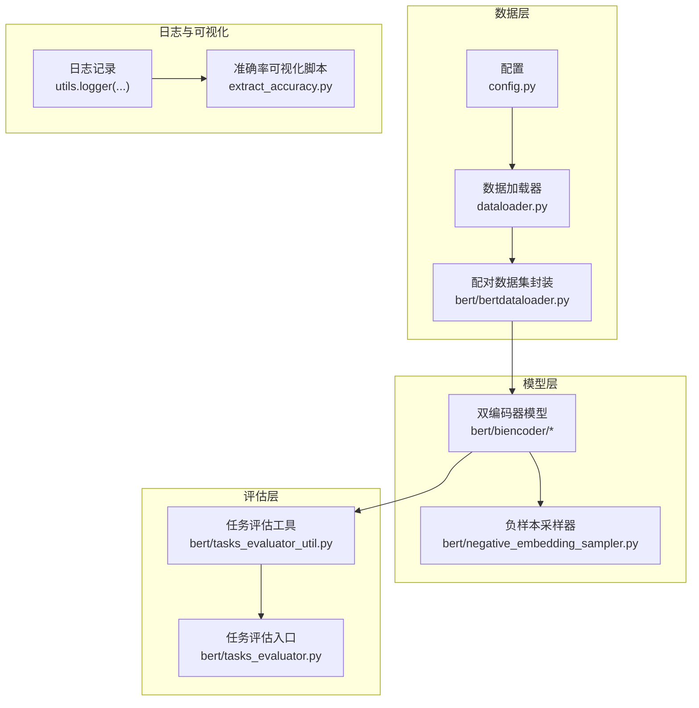
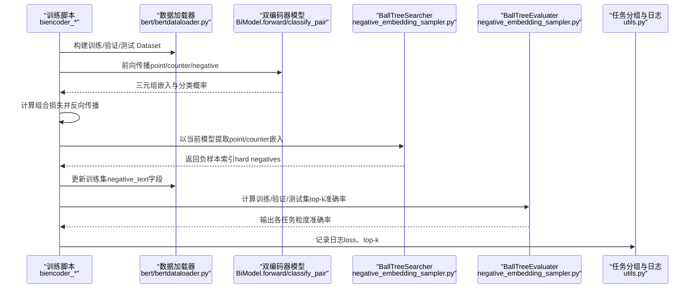
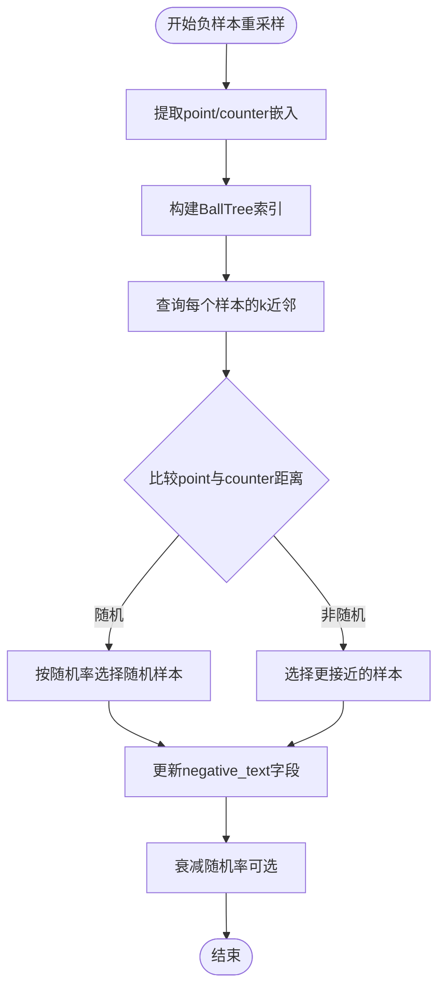
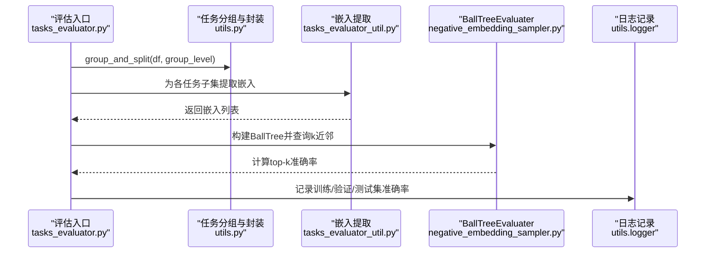
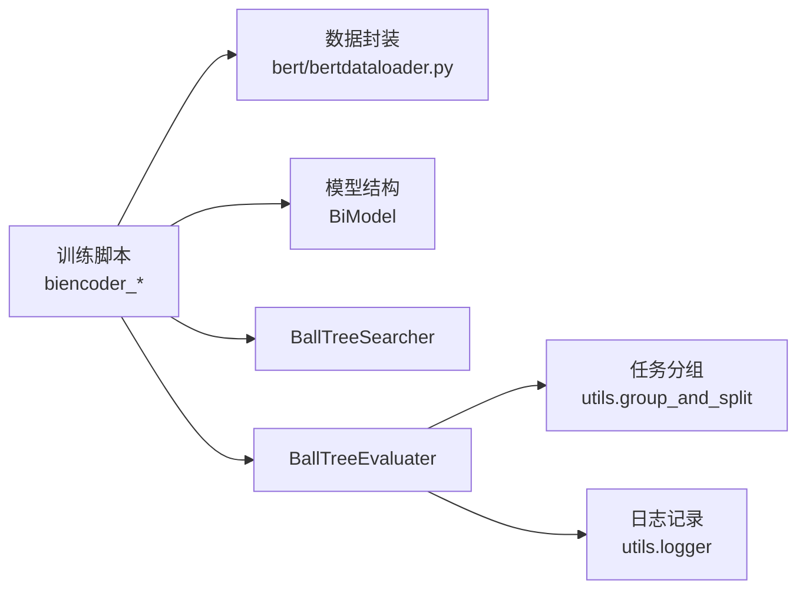

# 训练流程

<cite>
**本文引用的文件**
- [bert/biencoder/biencoder_embedding_classification_concanated_together.py](file://bert/biencoder/biencoder_embedding_classification_concanated_together.py)
- [bert/bertdataloader.py](file://bert/bertdataloader.py)
- [dataloader.py](file://dataloader.py)
- [config.py](file://config.py)
- [utils.py](file://utils.py)
- [bert/negative_embedding_sampler.py](file://bert/negative_embedding_sampler.py)
- [bert/tasks_evaluator.py](file://bert/tasks_evaluator.py)
- [bert/tasks_evaluator_util.py](file://bert/tasks_evaluator_util.py)
- [extract_accuracy.py](file://extract_accuracy.py)
- [README.md](file://README.md)
</cite>

## 目录
1. [简介](#简介)
2. [项目结构](#项目结构)
3. [核心组件](#核心组件)
4. [架构总览](#架构总览)
5. [详细组件分析](#详细组件分析)
6. [依赖关系分析](#依赖关系分析)
7. [性能考量](#性能考量)
8. [故障排查指南](#故障排查指南)
9. [结论](#结论)
10. [附录](#附录)

## 简介
本文件面向“端到端训练流程”的全面解析，覆盖从数据准备、模型前向传播、损失计算、反向传播与参数更新，到每个 epoch 结束后负样本重采样（基于 BallTree 的最近邻检索）与多任务评估（sdoc、sdoa 等）的完整周期。同时提供训练日志解读与常见收敛问题排查建议，帮助读者快速理解并优化训练过程。

## 项目结构
该项目围绕“论点-反驳”配对检索任务展开，采用双编码器（BiEncoder）结构，通过对比学习与分类头联合优化，训练时动态更新负样本，评估阶段在多个粒度的任务上计算 top-k 准确率。

图表来源
- [config.py](file://config.py#L1-L11)
- [dataloader.py](file://dataloader.py#L1-L87)
- [bert/bertdataloader.py](file://bert/bertdataloader.py#L1-L44)
- [bert/biencoder/biencoder_embedding_classification_concanated_together.py](file://bert/biencoder/biencoder_embedding_classification_concanated_together.py#L1-L280)
- [bert/negative_embedding_sampler.py](file://bert/negative_embedding_sampler.py#L1-L92)
- [bert/tasks_evaluator_util.py](file://bert/tasks_evaluator_util.py#L1-L101)
- [bert/tasks_evaluator.py](file://bert/tasks_evaluator.py#L1-L37)
- [utils.py](file://utils.py#L297-L304)
- [extract_accuracy.py](file://extract_accuracy.py#L1-L38)

章节来源
- [README.md](file://README.md#L1-L7)
- [config.py](file://config.py#L1-L11)
- [dataloader.py](file://dataloader.py#L1-L87)
- [bert/bertdataloader.py](file://bert/bertdataloader.py#L1-L44)
- [bert/biencoder/biencoder_embedding_classification_concanated_together.py](file://bert/biencoder/biencoder_embedding_classification_concanated_together.py#L1-L280)
- [bert/negative_embedding_sampler.py](file://bert/negative_embedding_sampler.py#L1-L92)
- [bert/tasks_evaluator_util.py](file://bert/tasks_evaluator_util.py#L1-L101)
- [bert/tasks_evaluator.py](file://bert/tasks_evaluator.py#L1-L37)
- [utils.py](file://utils.py#L297-L304)
- [extract_accuracy.py](file://extract_accuracy.py#L1-L38)

## 核心组件
- 数据准备与配对
  - 数据目录结构由配置文件定义，数据加载器递归读取训练/验证/测试目录，组织为 DataFrame。
  - 将按主题、立场、句段 ID 分组的数据转换为“point-text/counter-text”配对，形成三元组样本（point, counter, negative）。
- 双编码器模型
  - 使用预训练 BERT 提取句向量，线性层将 768 维映射至 128 维用于相似度计算；分类头合并四路嵌入（point1/2、counter1/2）进行二分类。
- 负样本采样与更新
  - 每个 epoch 结束后，使用当前模型提取 point 与 counter 文本的嵌入，构建 BallTree，按策略选择 hard negatives 更新训练集的 negative_text 字段。
- 多任务评估
  - 在训练过程中定期评估训练集、验证集、测试集的 top-k 准确率，涵盖 sdoc、sdoa、sdc、sda、stc、sta、epc、epa 八个任务粒度。

章节来源
- [config.py](file://config.py#L1-L11)
- [dataloader.py](file://dataloader.py#L1-L87)
- [bert/bertdataloader.py](file://bert/bertdataloader.py#L12-L44)
- [bert/biencoder/biencoder_embedding_classification_concanated_together.py](file://bert/biencoder/biencoder_embedding_classification_concanated_together.py#L47-L120)
- [bert/negative_embedding_sampler.py](file://bert/negative_embedding_sampler.py#L1-L92)
- [bert/tasks_evaluator.py](file://bert/tasks_evaluator.py#L1-L37)
- [bert/tasks_evaluator_util.py](file://bert/tasks_evaluator_util.py#L1-L101)

## 架构总览
下图展示一次完整的训练循环：数据准备、前向传播、损失计算、反向传播、参数更新、负样本重采样与评估。

图表来源
- [bert/biencoder/biencoder_embedding_classification_concanated_together.py](file://bert/biencoder/biencoder_embedding_classification_concanated_together.py#L92-L209)
- [bert/bertdataloader.py](file://bert/bertdataloader.py#L30-L44)
- [bert/negative_embedding_sampler.py](file://bert/negative_embedding_sampler.py#L13-L60)
- [bert/tasks_evaluator.py](file://bert/tasks_evaluator.py#L27-L37)
- [utils.py](file://utils.py#L297-L304)

## 详细组件分析

### 数据准备与配对
- 配置路径
  - 训练/验证/测试目录由配置文件定义，供数据加载器读取。
- 数据读取
  - 递归扫描目录，读取每条文本，构造包含领域、标题、立场、句段类型与内容的 DataFrame。
- 配对构造
  - 按领域、标题、句段 ID、立场聚合，将同一句段的 point 与 counter 合并为一行，形成 point_text/counter_text 列。
- Dataset 封装
  - ArgumentDataSet 返回三元组（point, counter, negative_text），作为训练批次输入。

章节来源
- [config.py](file://config.py#L1-L11)
- [dataloader.py](file://dataloader.py#L1-L87)
- [bert/bertdataloader.py](file://bert/bertdataloader.py#L12-L44)

### 双编码器模型与前向传播
- 模型结构
  - 使用 BERT 编码器输出句向量，线性层将 768 维映射到 128 维用于相似度计算；分类头将四路嵌入拼接后进行二分类。
- 前向传播
  - 输入 tokenization 后进入 BERT，返回两类嵌入；分类头对正负样本对分别计算分类概率。
- 损失函数
  - 组合损失包含三元组对比损失与正负样本交叉熵损失，共同优化嵌入空间与判别能力。

章节来源
- [bert/biencoder/biencoder_embedding_classification_concanated_together.py](file://bert/biencoder/biencoder_embedding_classification_concanated_together.py#L47-L120)

### 反向传播与参数更新
- 优化器
  - 使用 Adam 优化器，学习率固定或可调整。
- 训练循环
  - 每个 epoch 内按 mini-batch 进行前向、计算损失、反向传播与梯度清零。
- 日志记录
  - 定期打印 loss，便于监控收敛趋势。

章节来源
- [bert/biencoder/biencoder_embedding_classification_concanated_together.py](file://bert/biencoder/biencoder_embedding_classification_concanated_together.py#L123-L174)
- [utils.py](file://utils.py#L297-L304)

### 每个 epoch 结束后的负样本重采样
- 步骤概览
  - 使用当前模型对训练集的 point 与 counter 文本进行嵌入提取，得到两套 128 维嵌入。
  - 构建 BallTree（point 与 counter 分别建立索引）。
  - 对每个样本，查询其最近邻，按策略选择 hard negative 或随机负例，更新训练集的 negative_text 字段。
  - 随着训练推进，逐步降低随机率，提升 hard negative 的占比。
- 关键实现要点
  - BallTreeSearcher.search 支持根据随机率在“更接近的样本”与“完全随机样本”之间折中。
  - 更新策略以“point 与 counter 的距离比较”为依据，避免选择自身。

图表来源
- [bert/biencoder/biencoder_embedding_classification_concanated_together.py](file://bert/biencoder/biencoder_embedding_classification_concanated_together.py#L175-L204)
- [bert/negative_embedding_sampler.py](file://bert/negative_embedding_sampler.py#L13-L60)

章节来源
- [bert/biencoder/biencoder_embedding_classification_concanated_together.py](file://bert/biencoder/biencoder_embedding_classification_concanated_together.py#L175-L204)
- [bert/negative_embedding_sampler.py](file://bert/negative_embedding_sampler.py#L13-L60)

### 多任务评估（sdoc、sdoa 等）与 top-k 准确率
- 任务分组
  - 通过 group_and_split 将数据按不同粒度（如 sdoc、sdoa、sdc、sda、stc、sta、epc、epa）进行分组与拆分。
- 评估流程
  - 在训练/验证/测试集上提取嵌入，构建 BallTree，查询 k 近邻；对每个样本与其候选对，使用分类头计算正样本概率，统计命中率。
  - 输出各任务粒度的 top-k 准确率，通常以 top-10 为准。
- 日志与可视化
  - 训练日志中记录各集合的 top-k 准确率；提供脚本自动读取日志并绘制曲线。

图表来源
- [bert/tasks_evaluator.py](file://bert/tasks_evaluator.py#L27-L37)
- [utils.py](file://utils.py#L259-L296)
- [bert/tasks_evaluator_util.py](file://bert/tasks_evaluator_util.py#L1-L101)
- [bert/negative_embedding_sampler.py](file://bert/negative_embedding_sampler.py#L48-L92)
- [utils.py](file://utils.py#L297-L304)

章节来源
- [bert/tasks_evaluator.py](file://bert/tasks_evaluator.py#L1-L37)
- [utils.py](file://utils.py#L259-L296)
- [bert/tasks_evaluator_util.py](file://bert/tasks_evaluator_util.py#L1-L101)
- [bert/negative_embedding_sampler.py](file://bert/negative_embedding_sampler.py#L48-L92)
- [utils.py](file://utils.py#L297-L304)

## 依赖关系分析
- 文件间耦合
  - 训练脚本依赖数据封装与模型结构；模型依赖负样本采样器与评估工具；评估工具依赖任务分组与日志记录。
- 外部依赖
  - Transformers（BERT）、Scikit-learn（BallTree）、PyTorch（优化器、数据加载）。
- 潜在环依赖
  - 当前模块化设计清晰，未发现直接环依赖；注意避免在模型与采样器之间引入双向强耦合。

图表来源
- [bert/biencoder/biencoder_embedding_classification_concanated_together.py](file://bert/biencoder/biencoder_embedding_classification_concanated_together.py#L1-L280)
- [bert/bertdataloader.py](file://bert/bertdataloader.py#L1-L44)
- [bert/negative_embedding_sampler.py](file://bert/negative_embedding_sampler.py#L1-L92)
- [utils.py](file://utils.py#L259-L304)

章节来源
- [bert/biencoder/biencoder_embedding_classification_concanated_together.py](file://bert/biencoder/biencoder_embedding_classification_concanated_together.py#L1-L280)
- [bert/bertdataloader.py](file://bert/bertdataloader.py#L1-L44)
- [bert/negative_embedding_sampler.py](file://bert/negative_embedding_sampler.py#L1-L92)
- [utils.py](file://utils.py#L259-L304)

## 性能考量
- 训练稳定性
  - 学习率与损失权重需结合任务规模与数据分布调试；三元组损失与交叉熵损失的平衡影响收敛速度与泛化。
- 负样本质量
  - 随机率随训练衰减有助于在早期稳定，在后期提升区分度；BallTree 查询 k 值与 leaf_size 可微调以平衡召回与速度。
- 评估效率
  - 评估阶段可采用批处理嵌入提取与一次性 BallTree 查询，减少重复计算；top-k 评估中 softmax 计算可缓存或复用中间结果。
- 并行与显存
  - 使用 DataParallel 与合适的 batch size；长序列截断与 padding 控制显存占用。

## 故障排查指南
- 训练不收敛或震荡
  - 检查学习率是否过大或过小；核对损失函数权重与标签一致性；观察 mini-batch loss 是否稳定。
- 负样本更新异常
  - 确认嵌入维度与 BallTree 构建无 NaN/空向量；检查随机率衰减逻辑与索引映射是否正确。
- 评估指标偏低
  - 核对任务分组是否符合预期；确认分类头输入拼接顺序与维度一致；检查 top-k 查询与概率阈值设置。
- 日志与可视化
  - 使用日志可视化脚本读取“top-k”记录，观察训练/验证/测试曲线变化趋势；定位过拟合或欠拟合阶段。

章节来源
- [extract_accuracy.py](file://extract_accuracy.py#L1-L38)
- [bert/biencoder/biencoder_embedding_classification_concanated_together.py](file://bert/biencoder/biencoder_embedding_classification_concanated_together.py#L147-L209)
- [bert/negative_embedding_sampler.py](file://bert/negative_embedding_sampler.py#L13-L92)

## 结论
本训练流程以双编码器为核心，结合动态负样本重采样与多任务评估，实现了从数据准备到模型评估的闭环。通过 BallTree 近邻检索与分类头概率排序，能够在不同粒度的任务上持续监控性能。建议在实际部署中关注学习率、负样本策略与评估指标的协同优化，并利用日志与可视化工具进行迭代改进。

## 附录
- 数据目录规范
  - 训练/验证/测试目录由配置文件统一管理，确保路径一致。
- 任务粒度说明
  - sdoc/sdoa/sdc/sda/stc/sta/epc/epa 代表不同聚合层级的任务划分，详见任务分组工具。

章节来源
- [config.py](file://config.py#L1-L11)
- [utils.py](file://utils.py#L259-L296)