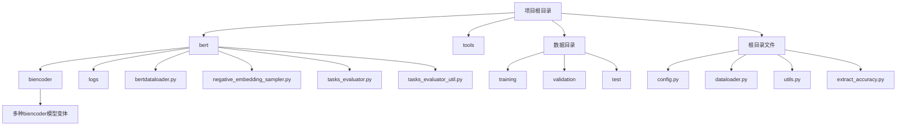
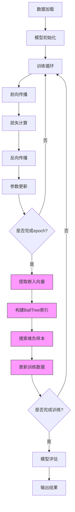
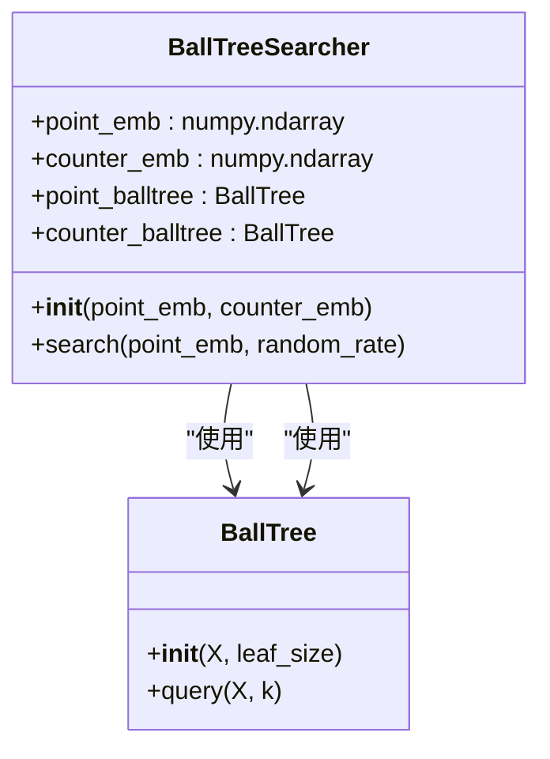
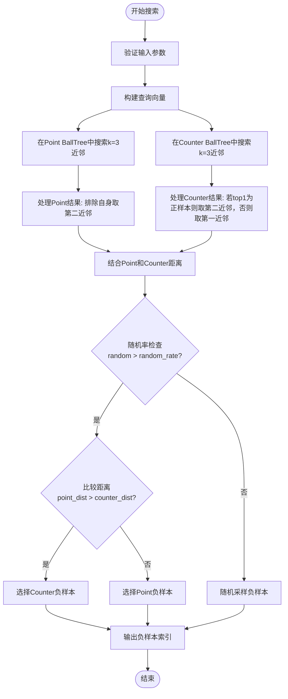
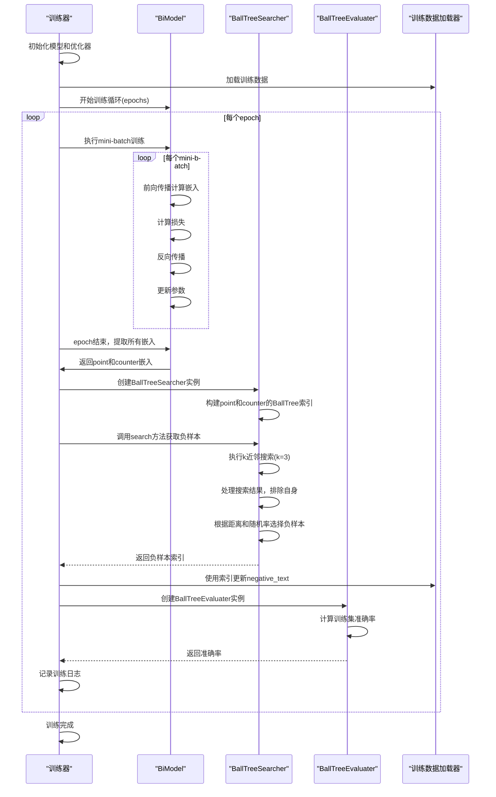
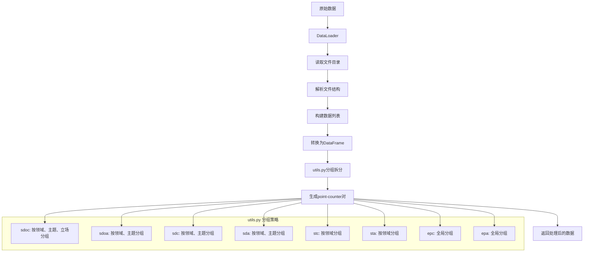
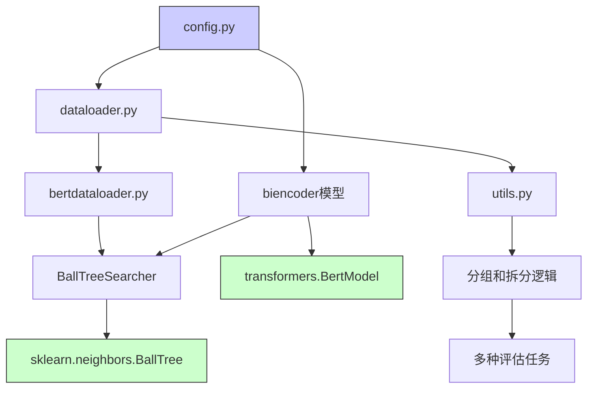

# 负样本更新流程

<cite>
**本文档中引用的文件**
- [negative_embedding_sampler.py](file://bert/negative_embedding_sampler.py)
- [biencoder_embedding_classification_concanated_together.py](file://bert/biencoder/biencoder_embedding_classification_concanated_together.py)
- [bertdataloader.py](file://bert/bertdataloader.py)
- [dataloader.py](file://dataloader.py)
- [utils.py](file://utils.py)
- [tasks_evaluator_util.py](file://bert/tasks_evaluator_util.py)
</cite>

## 目录
1. [引言](#引言)
2. [项目结构](#项目结构)
3. [核心组件](#核心组件)
4. [架构概述](#架构概述)
5. [详细组件分析](#详细组件分析)
6. [依赖分析](#依赖分析)
7. [性能考虑](#性能考虑)
8. [故障排除指南](#故障排除指南)
9. [结论](#结论)

## 引言
本文档深入解析了在每个训练周期（epoch）结束后负样本的动态更新机制。该机制通过在线难例挖掘（online hard negative mining）策略，利用当前训练阶段的模型对所有point和counter文本进行嵌入向量提取，构建高效近邻索引，并基于语义相似度搜索生成更难的负样本（hard negatives）。文档详细说明了BallTree搜索器的实现原理、距离度量方式、搜索策略及性能优化方法，并描述了更新后的负样本如何注入到下一个epoch的训练数据中，形成完整的闭环训练流程。同时提供了负样本质量评估方法和应对潜在问题（如采样偏差）的策略。

## 项目结构
项目结构清晰地组织了数据处理、模型训练和评估等核心功能模块。主要目录包括`bert`目录下的模型实现和数据加载器，`tools`目录下的辅助工具，以及根目录下的配置文件和通用工具。

**图源**
- [dataloader.py](file://dataloader.py#L6)
- [config.py](file://config.py#L3-L5)

**节源**
- [dataloader.py](file://dataloader.py#L11-L87)
- [config.py](file://config.py#L1-L11)

## 核心组件
系统的核心组件包括负样本嵌入采样器（BallTreeSearcher）、双编码器模型（BiModel）和数据加载器（ArgumentDataSet）。这些组件协同工作，实现了在线难例挖掘的完整流程。BallTreeSearcher负责构建高效的近邻搜索索引并生成难负样本，BiModel提供文本嵌入和分类功能，而ArgumentDataSet则管理训练数据的组织和访问。

**节源**
- [negative_embedding_sampler.py](file://bert/negative_embedding_sampler.py#L13-L46)
- [biencoder_embedding_classification_concanated_together.py](file://bert/biencoder/biencoder_embedding_classification_concanated_together.py#L48-L78)
- [bertdataloader.py](file://bert/bertdataloader.py#L30-L44)

## 架构概述
系统采用双阶段训练架构，结合了嵌入提取和分类任务。在每个epoch结束时，系统会执行负样本更新流程，形成一个闭环的在线学习系统。该架构充分利用了BallTree数据结构的高效搜索能力，实现了大规模文本数据的快速近邻检索。

**图源**
- [biencoder_embedding_classification_concanated_together.py](file://bert/biencoder/biencoder_embedding_classification_concanated_together.py#L94-L204)
- [negative_embedding_sampler.py](file://bert/negative_embedding_sampler.py#L13-L46)

## 详细组件分析

### BallTreeSearcher 分析
BallTreeSearcher是实现在线难例挖掘的核心组件，负责在每个epoch结束后更新负样本。它通过构建两个独立的BallTree索引（分别针对point和counter文本）来实现高效的近邻搜索。

#### 类图

**图源**
- [negative_embedding_sampler.py](file://bert/negative_embedding_sampler.py#L13-L46)

#### 搜索流程

**图源**
- [negative_embedding_sampler.py](file://bert/negative_embedding_sampler.py#L20-L46)

**节源**
- [negative_embedding_sampler.py](file://bert/negative_embedding_sampler.py#L13-L46)

### 训练循环分析
训练循环实现了完整的在线难例挖掘流程，包括模型训练、嵌入提取、负样本更新和模型评估等关键步骤。

#### 训练循环序列图

**图源**
- [biencoder_embedding_classification_concanated_together.py](file://bert/biencoder/biencoder_embedding_classification_concanated_together.py#L147-L204)
- [negative_embedding_sampler.py](file://bert/negative_embedding_sampler.py#L13-L46)

**节源**
- [biencoder_embedding_classification_concanated_together.py](file://bert/biencoder/biencoder_embedding_classification_concanated_together.py#L147-L280)

### 数据处理分析
数据处理组件负责将原始文本数据转换为模型可处理的格式，并支持复杂的分组和拆分逻辑，以适应不同的评估任务需求。

#### 数据处理流程

**图源**
- [dataloader.py](file://dataloader.py#L11-L87)
- [utils.py](file://utils.py#L259-L295)

**节源**
- [dataloader.py](file://dataloader.py#L11-L87)
- [utils.py](file://utils.py#L4-L295)

## 依赖分析
系统各组件之间存在明确的依赖关系，形成了一个层次化的架构。核心依赖关系包括数据加载器对配置文件的依赖、模型对数据加载器的依赖，以及负样本采样器对机器学习库的依赖。

**图源**
- [config.py](file://config.py#L3-L5)
- [dataloader.py](file://dataloader.py#L6)
- [biencoder_embedding_classification_concanated_together.py](file://bert/biencoder/biencoder_embedding_classification_concanated_together.py#L5-L6)
- [negative_embedding_sampler.py](file://bert/negative_embedding_sampler.py#L6)

**节源**
- [config.py](file://config.py#L1-L11)
- [dataloader.py](file://dataloader.py#L1-L87)
- [negative_embedding_sampler.py](file://bert/negative_embedding_sampler.py#L1-L92)

## 性能考虑
系统的性能优化主要体现在以下几个方面：BallTree数据结构的选择、批量处理策略、GPU加速计算和内存管理。BallTree在高维空间中的搜索效率优于传统的KD-Tree，特别适合文本嵌入向量的近邻搜索。系统通过设置leaf_size=2来优化树的构建和查询性能。

在训练过程中，系统采用了不同的批量大小策略：在负样本更新阶段使用较大的批量（batch_size=16）以提高嵌入提取效率，而在实际训练阶段使用较小的批量（batch_size=8）以获得更稳定的梯度更新。此外，系统充分利用了GPU加速计算，将模型和张量都转移到CUDA设备上进行运算。

随机率衰减策略（random_rate从0.8开始每轮减少0.02）也是一个重要的性能和效果平衡机制。随着训练的进行，系统逐渐减少随机采样的比例，更多地依赖模型自身发现的难负样本，这有助于模型逐步聚焦于更具挑战性的样本。

## 故障排除指南
在使用该系统时可能遇到的一些常见问题及其解决方案：

1. **负样本质量下降**：如果发现后续epoch的负样本变得太容易，可能是random_rate衰减过快。可以调整衰减速率，如将`0.8-i*0.02`改为`0.8-i*0.01`。

2. **训练不稳定**：如果训练过程中损失波动较大，可以尝试减小学习率或增加训练批量大小。

3. **内存不足**：对于大规模数据集，BallTree构建可能消耗大量内存。可以考虑使用近似最近邻搜索库（如Faiss）替代BallTree。

4. **准确率停滞**：如果验证集准确率长时间不提升，可能是负样本过于困难导致模型无法学习。可以增加随机采样比例或引入课程学习策略。

5. **数据加载错误**：确保数据目录结构正确，且所有必要的文件都存在。检查config.py中的路径配置是否正确。

**节源**
- [biencoder_embedding_classification_concanated_together.py](file://bert/biencoder/biencoder_embedding_classification_concanated_together.py#L200)
- [negative_embedding_sampler.py](file://bert/negative_embedding_sampler.py#L39-L45)

## 结论
本文档详细解析了基于BallTree的在线难例挖掘机制，展示了如何通过动态更新负样本提升模型性能。该系统通过在每个epoch结束后利用当前模型提取文本嵌入，构建BallTree索引，并搜索语义上更接近的难负样本，实现了有效的在线学习闭环。BallTreeSearcher组件的设计巧妙地平衡了随机采样和基于模型的难例挖掘，通过随机率衰减策略实现了从易到难的课程学习过程。这种机制不仅提高了模型对难例的识别能力，还避免了模型过早陷入局部最优。系统的模块化设计使得各个组件可以独立优化和替换，为未来的改进提供了良好的基础。