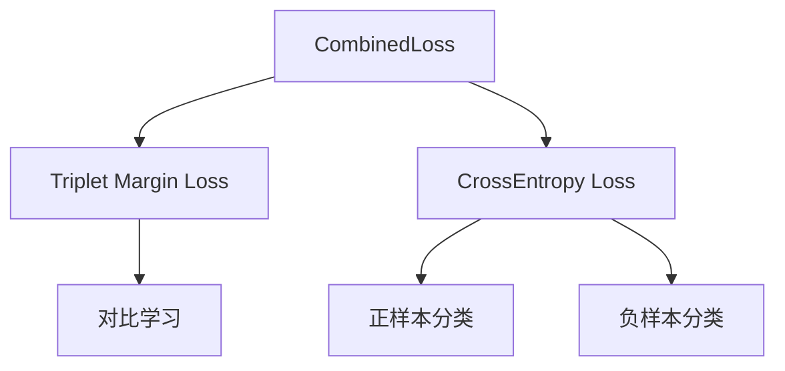
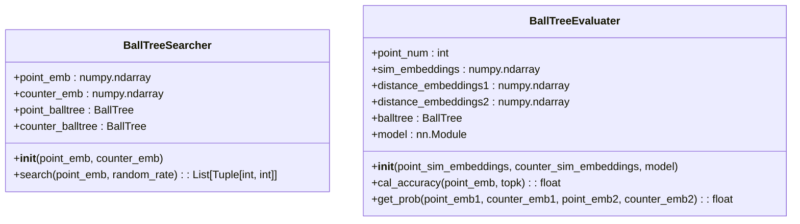
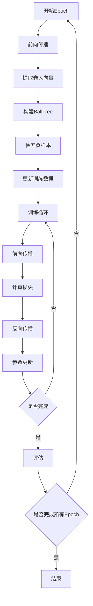
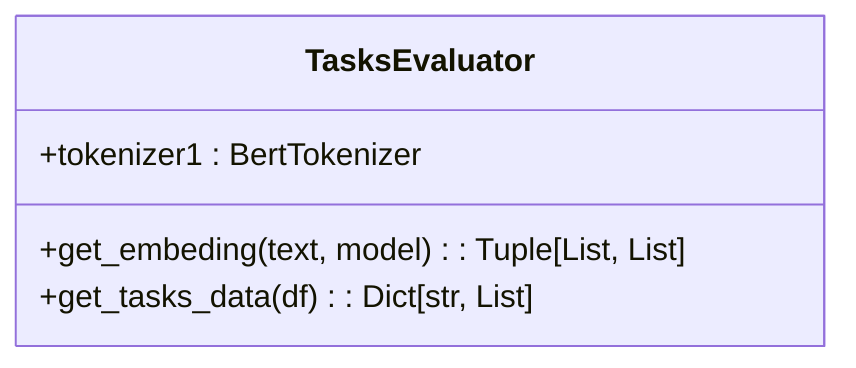
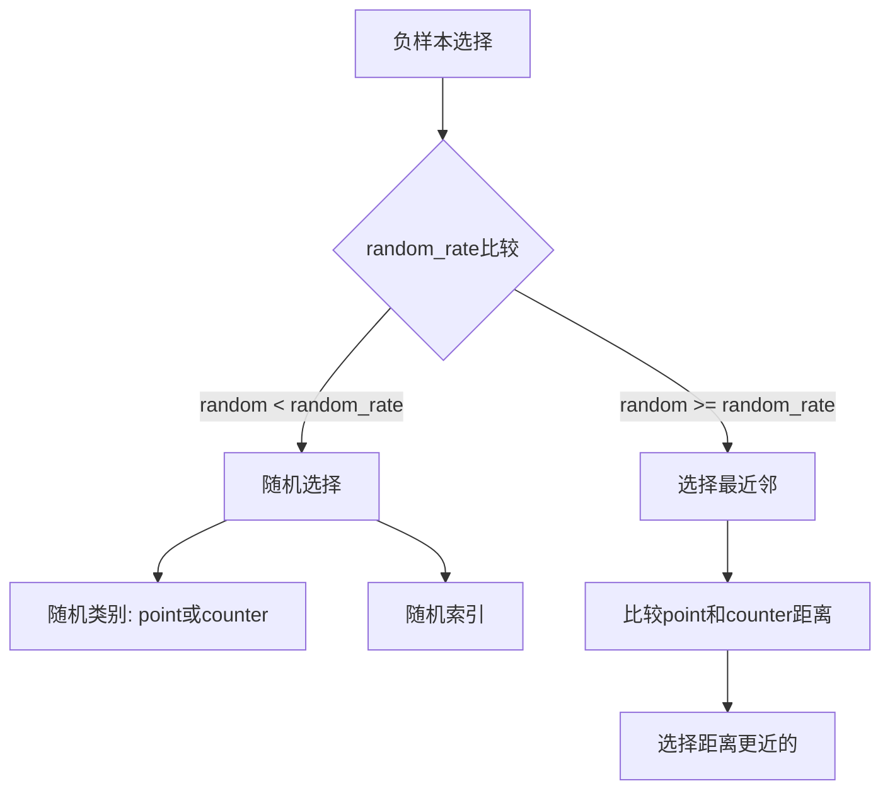

# 训练策略

<cite>
**本文档中引用的文件**  
- [biencoder_embedding_classification_concanated_together.py](file://bert/biencoder/biencoder_embedding_classification_concanated_together.py)
- [biencoder_embedding_classification_concanated_together_random.py](file://bert/biencoder/biencoder_embedding_classification_concanated_together_random.py)
- [biencoder_embedding_classification_concanated_together_without_random.py](file://bert/biencoder/biencoder_embedding_classification_concanated_together_without_random.py)
- [negative_embedding_sampler.py](file://bert/negative_embedding_sampler.py)
- [tasks_evaluator.py](file://bert/tasks_evaluator.py)
- [bertdataloader.py](file://bert/bertdataloader.py)
- [dataloader.py](file://dataloader.py)
- [config.py](file://config.py)
- [utils.py](file://utils.py)
</cite>

## 目录
1. [项目结构](#项目结构)
2. [核心训练范式](#核心训练范式)
3. [损失函数设计](#损失函数设计)
4. [负样本采样机制](#负样本采样机制)
5. [训练循环流程](#训练循环流程)
6. [多任务评估策略](#多任务评估策略)
7. [不同采样策略对比](#不同采样策略对比)

## 项目结构

本项目采用模块化设计，主要包含以下核心组件：

- **bert/**: 包含BERT模型相关的训练脚本、数据加载器和采样器
- **tools/**: 辅助工具模块
- **logs/**: 训练日志存储目录
- **model_structure_*/**: 不同模型结构和训练策略的实验配置

关键文件包括：
- `biencoder/*.py`: 不同变体的双编码器模型实现
- `negative_embedding_sampler.py`: 基于BallTree的负样本采样器
- `tasks_evaluator.py`: 多任务评估器
- `bertdataloader.py`: BERT专用数据加载器
- `dataloader.py`: 通用数据加载器
- `config.py`: 数据路径配置

**Section sources**
- [config.py](file://config.py)
- [dataloader.py](file://dataloader.py)
- [bertdataloader.py](file://bert/bertdataloader.py)

## 核心训练范式

该项目采用创新的分阶段训练范式，结合了对比学习与分类任务的双重目标。训练过程分为两个主要阶段：

1. **初始化阶段**：在每个epoch开始前，使用当前模型对训练集中的所有样本进行前向传播，提取句子嵌入向量
2. **动态更新阶段**：基于提取的嵌入向量构建BallTree索引，用于高效检索难负样本
3. **训练阶段**：使用更新后的负样本进行模型训练，优化联合损失函数

这种分阶段的方法允许模型在每个epoch后动态调整负样本选择策略，从而实现渐进式学习。

**Section sources**
- [biencoder_embedding_classification_concanated_together.py](file://bert/biencoder/biencoder_embedding_classification_concanated_together.py)

## 损失函数设计

### CombinedLoss 组成

模型采用组合损失函数CombinedLoss，将对比学习与分类任务有机结合：



**Diagram sources**
- [biencoder_embedding_classification_concanated_together.py](file://bert/biencoder/biencoder_embedding_classification_concanated_together.py#L129-L139)

#### Triplet Margin Loss（对比学习）

用于对比学习的三元组损失函数，其目标是拉近正样本对的距离，同时推远负样本对的距离：

- **Anchor**: 论点（point）的嵌入表示
- **Positive**: 反论点（counter）的嵌入表示
- **Negative**: 难负样本的嵌入表示

通过设置margin=1.0和p=2（欧几里得距离），确保正样本对的距离至少比负样本对小1.0个单位。

#### CrossEntropy Loss（分类任务）

用于二分类任务的交叉熵损失，包含两个部分：

1. **正样本分类损失**：将正样本对（point-counter）分类为正类
2. **负样本分类损失**：将负样本对（point-negative）分类为负类

这种双重监督机制增强了模型的判别能力。

**Section sources**
- [biencoder_embedding_classification_concanated_together.py](file://bert/biencoder/biencoder_embedding_classification_concanated_together.py#L129-L139)

## 负样本采样机制

### 基于BallTree的硬负例挖掘

`negative_embedding_sampler.py`实现了基于BallTree的高效硬负例挖掘算法：



**Diagram sources**
- [negative_embedding_sampler.py](file://bert/negative_embedding_sampler.py#L13-L92)

#### 算法流程

1. **初始化**：为论点（point）和反论点（counter）分别构建BallTree索引
2. **查询**：对于每个查询样本，同时在point和counter的BallTree中查询最近邻
3. **选择策略**：
   - 如果查询样本在自身类别中的最近邻是自身，则选择第二近邻
   - 否则选择最近邻
4. **随机混合**：以一定概率(random_rate)选择随机负样本，平衡难负样本与随机负样本

#### 动态更新机制

在每个epoch结束后，模型会：
1. 使用当前模型重新提取所有训练样本的嵌入向量
2. 基于新的嵌入向量重建BallTree索引
3. 更新训练数据中的负样本引用

这种动态更新机制确保了负样本的选择始终基于最新的模型状态。

**Section sources**
- [negative_embedding_sampler.py](file://bert/negative_embedding_sampler.py#L13-L92)
- [biencoder_embedding_classification_concanated_together.py](file://bert/biencoder/biencoder_embedding_classification_concanated_together.py#L116-L204)

## 训练循环流程



**Diagram sources**
- [biencoder_embedding_classification_concanated_together.py](file://bert/biencoder/biencoder_embedding_classification_concanated_together.py#L147-L280)

### 关键步骤详解

1. **前向传播**：使用BERT模型提取句子嵌入表示
2. **损失计算**：计算CombinedLoss的三个组成部分
3. **负样本检索更新**：在每个epoch结束后执行
4. **反向传播**：通过梯度下降优化模型参数

**Section sources**
- [biencoder_embedding_classification_concanated_together.py](file://bert/biencoder/biencoder_embedding_classification_concanated_together.py#L147-L280)

## 多任务评估策略

### TasksEvaluator 实现

`tasks_evaluator.py`实现了多任务评估框架，支持在8个不同任务上监控模型性能：



**Diagram sources**
- [tasks_evaluator.py](file://bert/tasks_evaluator.py#L7-L37)

#### 评估流程

1. **嵌入提取**：使用训练好的模型提取句子向量
2. **任务分组**：根据不同的评估维度（如sdoc、sdoa等）对数据进行分组
3. **准确率计算**：在每个任务上计算top-k准确率

评估在每个epoch结束后执行，覆盖训练集、验证集和测试集，全面监控模型性能。

**Section sources**
- [tasks_evaluator.py](file://bert/tasks_evaluator.py#L7-L37)
- [biencoder_embedding_classification_concanated_together.py](file://bert/biencoder/biencoder_embedding_classification_concanated_together.py#L205-L277)

## 不同采样策略对比

### 三种主要策略

| 策略类型 | 实现文件 | 特点 | random_rate变化 |
|---------|---------|------|---------------|
| 随机采样 | biencoder_embedding_classification_concanated_together_random.py | 固定随机率 | 0.8 |
| 递减随机率 | biencoder_embedding_classification_concanated_together.py | 随epoch递减 | 0.8 → 0 |
| 纯随机负样本 | biencoder_embedding_classification_concanated_together_without_random.py | 完全随机 | 1.0 |

### 策略实现差异



**Diagram sources**
- [negative_embedding_sampler.py](file://bert/negative_embedding_sampler.py#L39-L45)

#### 递减随机率策略

在`biencoder_embedding_classification_concanated_together.py`中实现了递减随机率策略：

```python
random_rate = 0.8 - i * 0.02 if 0.8 - i * 0.02 > 0 else 0
```

随着训练进行，随机采样的概率逐渐降低，模型更多地关注难负样本，实现从探索到利用的平滑过渡。

#### 纯随机策略

在`biencoder_embedding_classification_decreased_0.02.py`和`biencoder_embedding_classification_concanated_together_without_random.py`中，random_rate固定为1.0，完全依赖随机采样，作为基线对比。

**Section sources**
- [biencoder_embedding_classification_concanated_together.py](file://bert/biencoder/biencoder_embedding_classification_concanated_together.py#L200)
- [biencoder_embedding_classification_decreased_0.02.py](file://bert/model_structure_with_different_decreased_random_rate/biencoder_embedding_classification_decreased_0.02.py#L202)
- [biencoder_embedding_classification_concanated_together_without_random.py](file://bert/model_structure_with_simply_random_negative/biencoder_embedding_classification_concanated_together.py#L202)