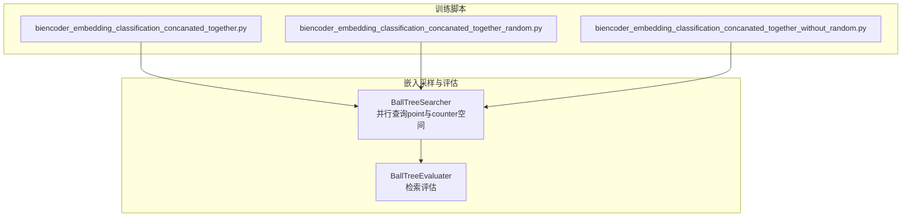
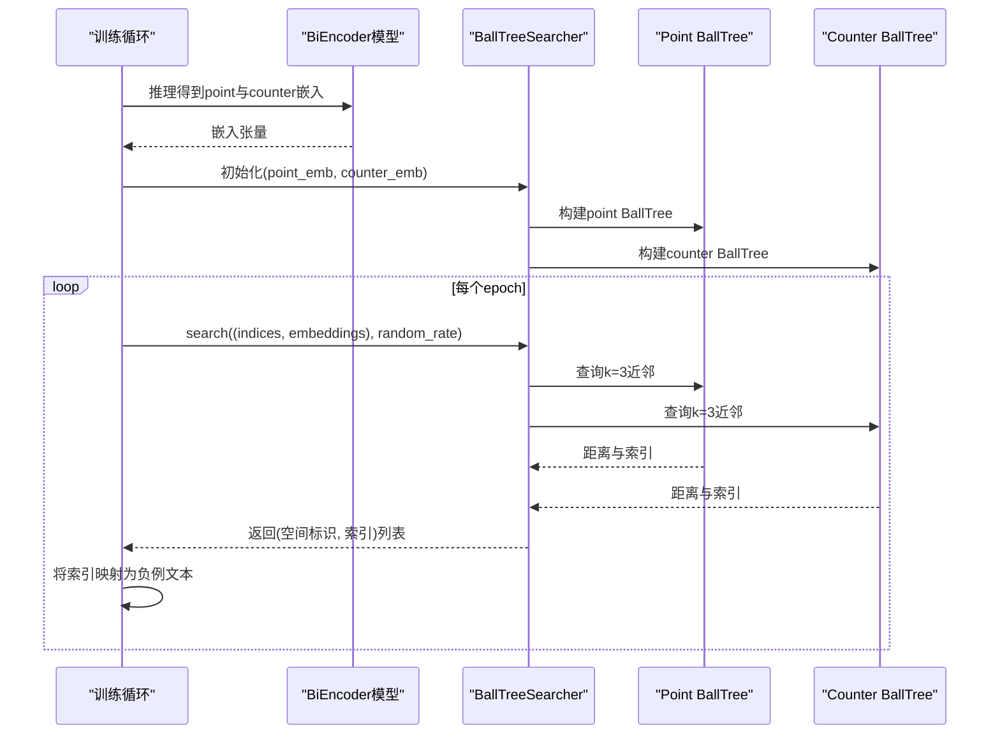
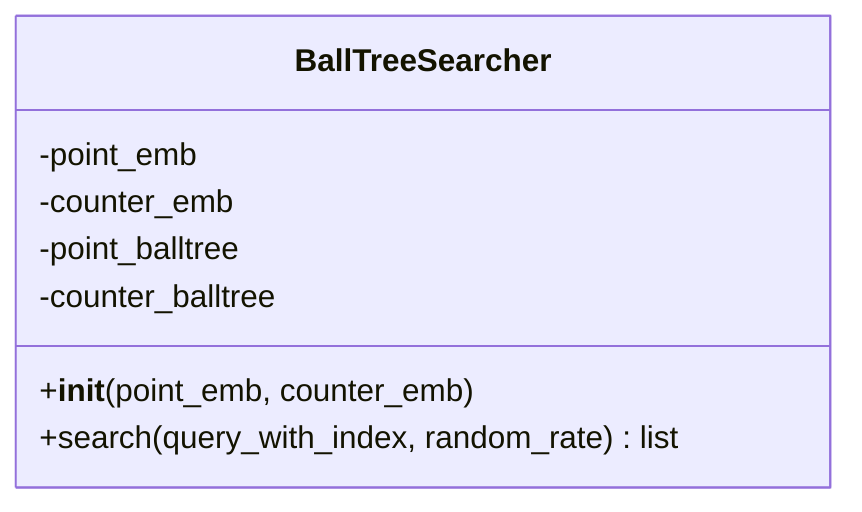
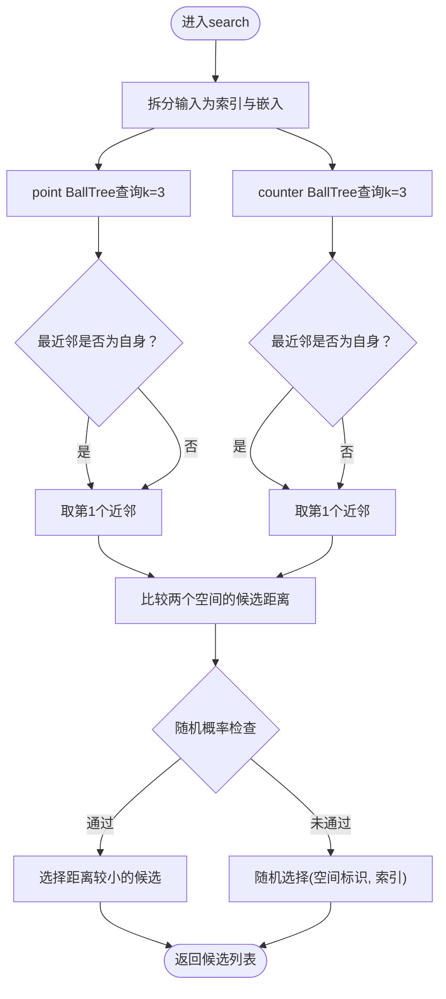
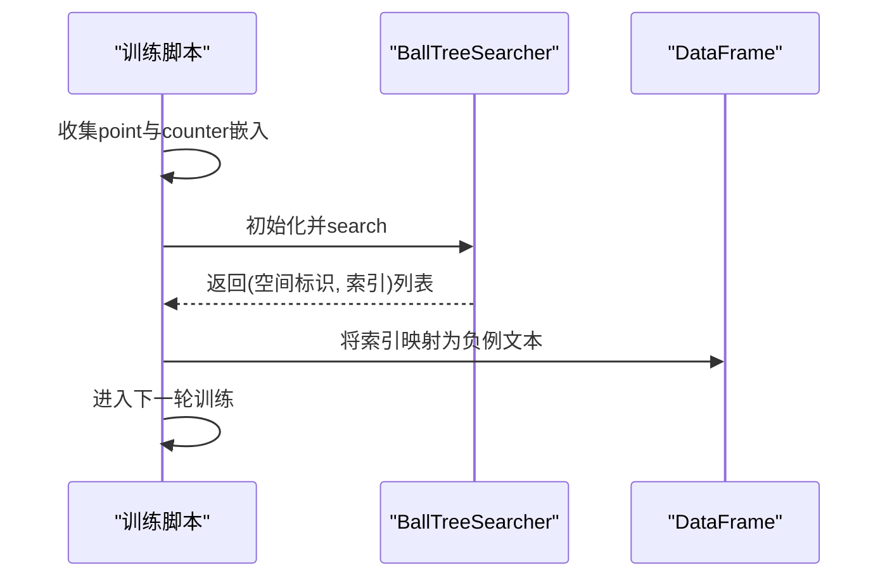
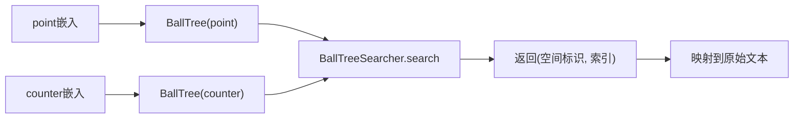

# 硬负例挖掘

<cite>
**本文引用的文件列表**
- [negative_embedding_sampler.py](file://bert/negative_embedding_sampler.py)
- [biencoder_embedding_classification_concanated_together.py](file://bert/biencoder/biencoder_embedding_classification_concanated_together.py)
- [biencoder_embedding_classification_concanated_together_random.py](file://bert/biencoder/biencoder_embedding_classification_concanated_together_random.py)
- [biencoder_embedding_classification_concanated_together_without_random.py](file://bert/biencoder/biencoder_embedding_classification_concanated_together_without_random.py)
</cite>

## 目录
1. [简介](#简介)
2. [项目结构](#项目结构)
3. [核心组件](#核心组件)
4. [架构总览](#架构总览)
5. [详细组件分析](#详细组件分析)
6. [依赖关系分析](#依赖关系分析)
7. [性能考量](#性能考量)
8. [故障排查指南](#故障排查指南)
9. [结论](#结论)
10. [附录：调用示例与参数说明](#附录调用示例与参数说明)

## 简介
本文件围绕基于BallTree的“硬负例”（Hard Negative）挖掘机制展开，重点解析BallTreeSearcher类如何利用BallTree数据结构在两个嵌入空间（point与counter）中并行检索语义相近的难负样本。文档将详细说明：
- 在point与counter两个嵌入空间中并行查询最近邻的实现逻辑；
- 为何选择top-2（或更准确地说，k=3以确保能取到top-2）并根据索引是否匹配自身来决定候选样本；
- query过程中距离计算与候选选择策略；
- BallTree在高维语义空间中的检索效率优势；
- 实际调用示例，展示如何初始化BallTreeSearcher并执行搜索操作；
- leaf_size参数对性能的影响；
- 训练初期嵌入质量较差时可能引入噪声的问题及应对策略。

## 项目结构
本仓库包含多个BiEncoder模型变体与负例采样模块。与BallTree硬负例挖掘直接相关的核心文件位于以下路径：
- bert/negative_embedding_sampler.py：BallTreeSearcher与BallTreeEvaluater的实现
- bert/biencoder/...：各BiEncoder训练脚本，其中多处调用BallTreeSearcher进行负例采样

图表来源
- [negative_embedding_sampler.py](file://bert/negative_embedding_sampler.py#L1-L92)
- [biencoder_embedding_classification_concanated_together.py](file://bert/biencoder/biencoder_embedding_classification_concanated_together.py#L110-L204)

章节来源
- [negative_embedding_sampler.py](file://bert/negative_embedding_sampler.py#L1-L92)
- [biencoder_embedding_classification_concanated_together.py](file://bert/biencoder/biencoder_embedding_classification_concanated_together.py#L110-L204)

## 核心组件
- BallTreeSearcher：在point与counter两个嵌入空间分别构建BallTree，对每个查询向量并行检索最近邻，依据距离与自否匹配规则选择硬负例，并可按比例引入随机性。
- BallTreeEvaluater：用于评估检索质量，通过BallTree对拼接后的相似/不相似样本集合进行检索，结合分类器概率打分统计准确率。

章节来源
- [negative_embedding_sampler.py](file://bert/negative_embedding_sampler.py#L13-L47)
- [negative_embedding_sampler.py](file://bert/negative_embedding_sampler.py#L48-L92)

## 架构总览
BallTreeSearcher在训练过程中被多次调用：先在每个epoch结束时，从当前模型推理得到的point与counter嵌入中构建BallTree，再对训练集中的每个样本查询其在两个空间中的近邻，作为“硬负例”的候选索引。随后将这些索引映射回原始文本，替换掉随机负例，进入下一轮训练。

图表来源
- [negative_embedding_sampler.py](file://bert/negative_embedding_sampler.py#L13-L47)
- [biencoder_embedding_classification_concanated_together.py](file://bert/biencoder/biencoder_embedding_classification_concanated_together.py#L175-L204)

## 详细组件分析

### BallTreeSearcher类
BallTreeSearcher在构造函数中分别对point与counter嵌入构建BallTree；在search方法中，对每个查询向量并行查询k=3的近邻，然后根据“自身不命中”原则选择第二近邻，最后比较两个空间的距离，选择更接近的作为硬负例；同时支持以一定概率引入随机负例，平衡探索与利用。

图表来源
- [negative_embedding_sampler.py](file://bert/negative_embedding_sampler.py#L13-L47)

关键实现要点
- 并行查询：对point与counter各自执行BallTree查询，返回k=3的候选，确保能取到“非自身”的第二近邻。
- 自身过滤：若最近邻即自身，则取第二近邻；否则取最近邻。
- 距离比较：比较两个空间的最近有效候选距离，选择更近者作为最终负例。
- 随机性：以random_rate控制是否采用随机策略，避免过拟合于检索结果。

章节来源
- [negative_embedding_sampler.py](file://bert/negative_embedding_sampler.py#L13-L47)

### 查询流程与候选选择策略
下面给出search方法的流程图，对应具体实现逻辑。

图表来源
- [negative_embedding_sampler.py](file://bert/negative_embedding_sampler.py#L20-L46)

章节来源
- [negative_embedding_sampler.py](file://bert/negative_embedding_sampler.py#L20-L46)

### 在训练脚本中的调用
训练脚本在每个epoch结束后，会收集当前模型推理得到的point与counter嵌入，构建BallTreeSearcher并执行search，将返回的(空间标识, 索引)映射回原始文本，替换随机负例后继续训练。

图表来源
- [biencoder_embedding_classification_concanated_together.py](file://bert/biencoder/biencoder_embedding_classification_concanated_together.py#L175-L204)

章节来源
- [biencoder_embedding_classification_concanated_together.py](file://bert/biencoder/biencoder_embedding_classification_concanated_together.py#L175-L204)

## 依赖关系分析
- BallTreeSearcher依赖sklearn.neighbors.BallTree进行高效最近邻检索。
- 训练脚本通过调用search方法，将检索到的索引映射回原始数据，形成硬负例。
- BallTreeEvaluater同样依赖BallTree，但用于评估检索质量而非负例采样。

图表来源
- [negative_embedding_sampler.py](file://bert/negative_embedding_sampler.py#L13-L47)
- [biencoder_embedding_classification_concanated_together.py](file://bert/biencoder/biencoder_embedding_classification_concanated_together.py#L175-L204)

章节来源
- [negative_embedding_sampler.py](file://bert/negative_embedding_sampler.py#L13-L47)
- [biencoder_embedding_classification_concanated_together.py](file://bert/biencoder/biencoder_embedding_classification_concanated_together.py#L175-L204)

## 性能考量
- BallTree查询复杂度：BallTree在高维空间中仍能提供较优的查询性能，尤其当数据分布相对均匀且leaf_size适中时。较大的leaf_size会减少树深度，提升查询速度，但可能降低构建阶段的精确度；较小leaf_size会增加树深度，查询更慢但构建更精细。
- k的选择：代码中使用k=3，目的是确保能取到“非自身”的第二近邻，从而避免误选自身为负例。k越大，召回越充分，但查询开销越大。
- 随机性：通过random_rate在不同epoch动态衰减，有助于在训练初期引入更多探索，后期稳定收敛。
- leaf_size参数：在构造BallTreeSearcher时，leaf_size=2，这使得树更深、查询更快，适合大规模检索场景；但在数据量极小或维度极高时，可能需要权衡。

章节来源
- [negative_embedding_sampler.py](file://bert/negative_embedding_sampler.py#L13-L47)
- [biencoder_embedding_classification_concanated_together.py](file://bert/biencoder/biencoder_embedding_classification_concanated_together.py#L197-L200)

## 故障排查指南
- 训练初期噪声问题：当嵌入质量较差时，BallTree检索到的“近邻”可能并非真正的语义相近样本，导致硬负例引入噪声。建议：
  - 逐步降低random_rate，提高随机负例比例，缓解过拟合检索结果；
  - 延长预热期，待嵌入质量提升后再启用高比例硬负例；
  - 结合BallTreeEvaluater评估检索质量，观察top-k准确率变化趋势。
- 自身命中问题：若最近邻总是自身，说明嵌入空间中存在重复或退化，应检查数据清洗与模型微调过程。
- k设置不当：k过小可能导致无法获得“非自身”的候选；k过大则增加计算负担。建议从k=3开始，结合性能监控调整。

章节来源
- [negative_embedding_sampler.py](file://bert/negative_embedding_sampler.py#L20-L46)
- [biencoder_embedding_classification_concanated_together.py](file://bert/biencoder/biencoder_embedding_classification_concanated_together.py#L197-L200)

## 结论
BallTreeSearcher通过在point与counter两个嵌入空间并行检索，结合“自身不命中”与距离比较策略，能够高效地筛选出语义相近的难负样本。配合随机性与动态衰减的策略，在训练初期缓解噪声影响，随着嵌入质量提升逐步增强硬负例的引导效果。leaf_size参数对查询性能有直接影响，需结合数据规模与维度进行权衡。

## 附录：调用示例与参数说明
- 初始化BallTreeSearcher
  - 输入：point_sim_embeddings（形状为N×D）、counter_sim_embeddings（形状为N×D）
  - 输出：Searcher实例
  - 示例路径：[初始化与调用](file://bert/biencoder/biencoder_embedding_classification_concanated_together.py#L116-L118)
- 执行search
  - 输入：(indices, embeddings)，其中indices为样本索引，embeddings为查询向量
  - 参数：random_rate（默认0.8），随训练轮次动态衰减
  - 输出：(空间标识, 索引)列表，空间标识为0表示point空间，1表示counter空间
  - 示例路径：[search调用](file://bert/biencoder/biencoder_embedding_classification_concanated_together.py#L199-L200)
- 映射回原始文本
  - 将返回的索引映射到训练DataFrame中的对应列，生成负例文本
  - 示例路径：[映射与替换](file://bert/biencoder/biencoder_embedding_classification_concanated_together.py#L120-L121)
- leaf_size参数
  - 在BallTreeSearcher构造函数中设置，默认为2
  - 影响：较大leaf_size提升查询速度，较小leaf_size提升构建精度
  - 示例路径：[leaf_size设置](file://bert/negative_embedding_sampler.py#L13-L18)

章节来源
- [negative_embedding_sampler.py](file://bert/negative_embedding_sampler.py#L13-L18)
- [biencoder_embedding_classification_concanated_together.py](file://bert/biencoder/biencoder_embedding_classification_concanated_together.py#L116-L121)
- [biencoder_embedding_classification_concanated_together.py](file://bert/biencoder/biencoder_embedding_classification_concanated_together.py#L199-L200)