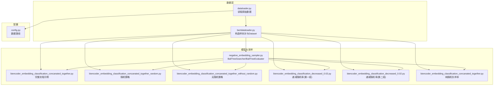
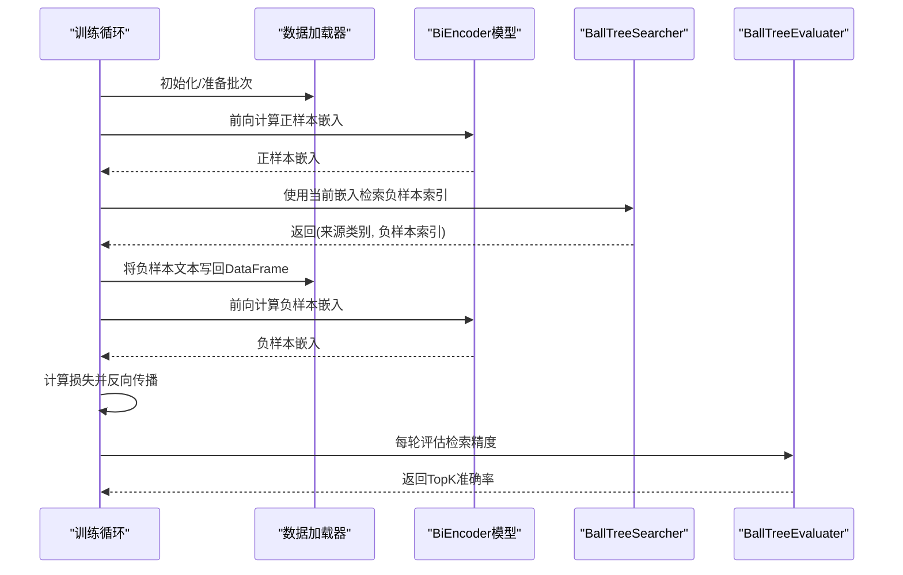
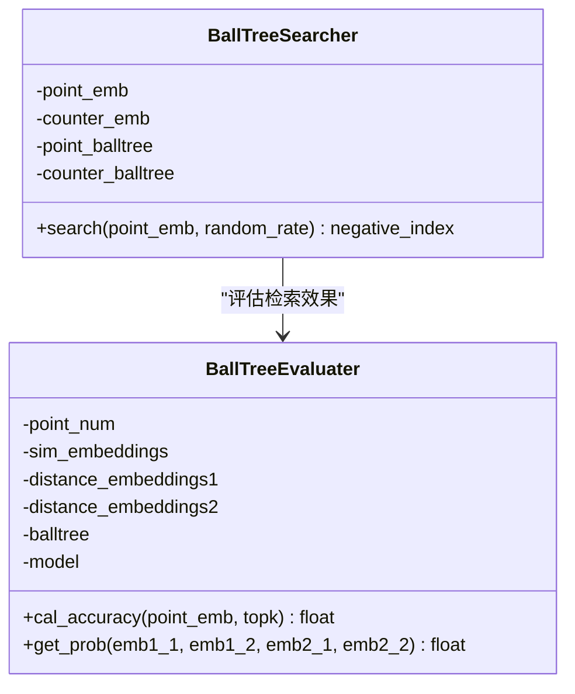
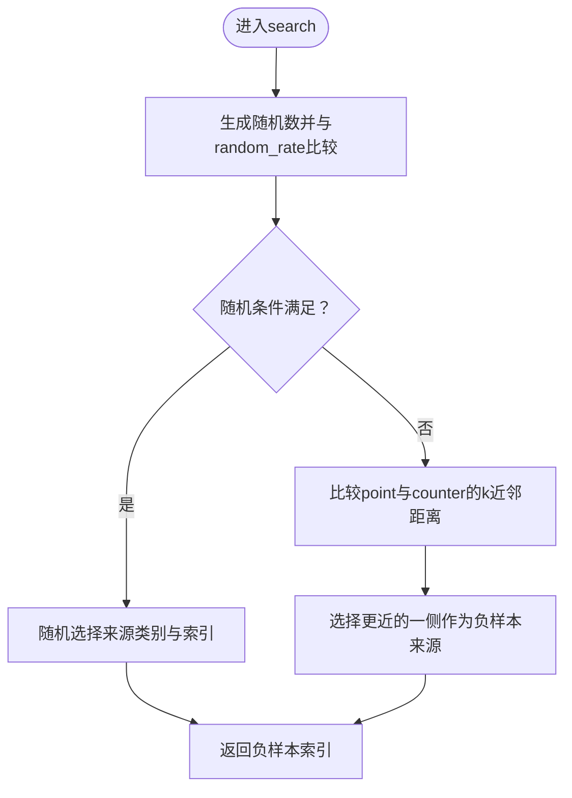
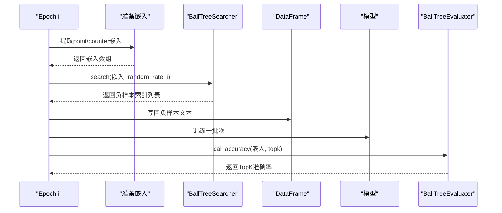
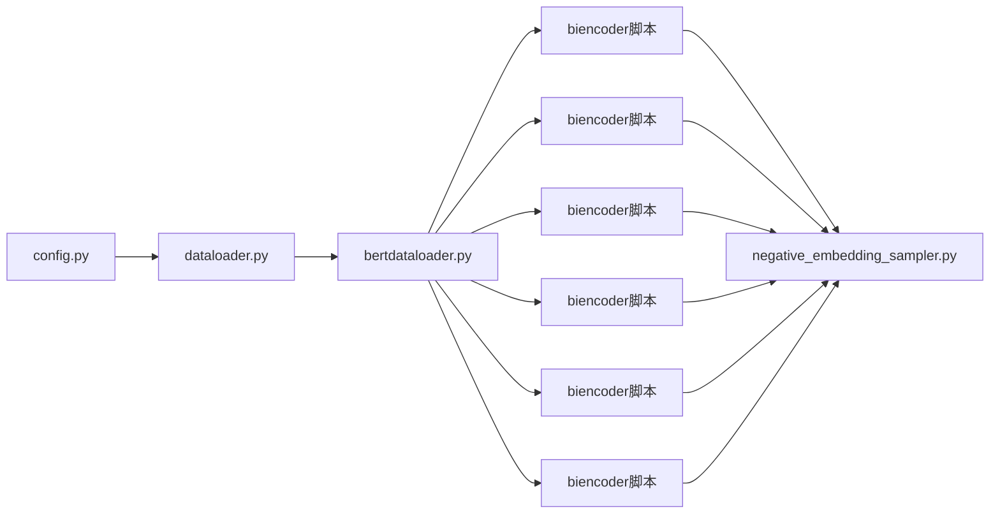

# 负样本采样策略

<cite>
**本文引用的文件**
- [negative_embedding_sampler.py](file://bert/negative_embedding_sampler.py)
- [biencoder_embedding_classification_concanated_together.py](file://bert/biencoder/biencoder_embedding_classification_concanated_together.py)
- [biencoder_embedding_classification_concanated_together_random.py](file://bert/biencoder/biencoder_embedding_classification_concanated_together_random.py)
- [biencoder_embedding_classification_concanated_together_without_random.py](file://bert/biencoder/biencoder_embedding_classification_concanated_together_without_random.py)
- [biencoder_embedding_classification_decreased_0.02.py](file://bert/model_structure_with_different_decreased_random_rate/biencoder_embedding_classification_decreased_0.02.py)
- [biencoder_embedding_classification_decreased_0.02.py](file://bert/model_structure_with_different_decreased_random_rate_2/biencoder_embedding_classification_decreased_0.02.py)
- [biencoder_embedding_classification_concanated_together.py](file://bert/model_structure_with_simply_random_negative/biencoder_embedding_classification_concanated_together.py)
- [bertdataloader.py](file://bert/bertdataloader.py)
- [dataloader.py](file://dataloader.py)
- [config.py](file://config.py)
</cite>

## 目录
1. [简介](#简介)
2. [项目结构](#项目结构)
3. [核心组件](#核心组件)
4. [架构总览](#架构总览)
5. [详细组件分析](#详细组件分析)
6. [依赖关系分析](#依赖关系分析)
7. [性能考量](#性能考量)
8. [故障排查指南](#故障排查指南)
9. [结论](#结论)
10. [附录](#附录)

## 简介
本文件系统性梳理项目中实现的多种负样本采样策略，重点围绕以下内容展开：
- 基于BallTree的“硬负例”挖掘：通过BallTree在嵌入空间中检索语义相近的负样本，提升负样本质量与判别力。
- 随机采样（random sampling）：完全随机选择负样本，作为基线对照。
- 递减随机率策略（decreased random rate）：在训练过程中逐步降低随机采样的比例，使模型从“随机探索”过渡到“硬负例驱动”，以平衡多样性与稳定性。
- 纯随机负样本方法：在某些实验中直接使用随机负样本，便于与其他策略进行对比。

同时，本文深入解析BallTreeSearcher类的工作原理，解释其如何利用BallTree数据结构高效检索语义相近的难负样本；说明search方法中random_rate参数的动态衰减机制，并对比不同策略对模型泛化能力的影响；最后结合代码展示负样本索引的更新流程及其在训练循环中的集成方式，并讨论各类策略的计算开销与性能权衡。

## 项目结构
该项目围绕“双编码器+分类器”的匹配框架展开，负样本采样策略主要集中在以下模块：
- 负样本采样与评估：negative_embedding_sampler.py
- 训练脚本与策略对比：多组biencoder训练脚本（含随机、无随机、递减随机等）
- 数据加载与格式转换：bertdataloader.py、dataloader.py、config.py

图表来源
- [dataloader.py](file://dataloader.py#L1-L87)
- [bertdataloader.py](file://bert/bertdataloader.py#L1-L44)
- [negative_embedding_sampler.py](file://bert/negative_embedding_sampler.py#L1-L92)
- [biencoder_embedding_classification_concanated_together.py](file://bert/biencoder/biencoder_embedding_classification_concanated_together.py#L1-L280)
- [biencoder_embedding_classification_concanated_together_random.py](file://bert/biencoder/biencoder_embedding_classification_concanated_together_random.py#L1-L280)
- [biencoder_embedding_classification_concanated_together_without_random.py](file://bert/biencoder/biencoder_embedding_classification_concanated_together_without_random.py#L1-L280)
- [biencoder_embedding_classification_decreased_0.02.py](file://bert/model_structure_with_different_decreased_random_rate/biencoder_embedding_classification_decreased_0.02.py#L1-L284)
- [biencoder_embedding_classification_decreased_0.02.py](file://bert/model_structure_with_different_decreased_random_rate_2/biencoder_embedding_classification_decreased_0.02.py#L1-L285)
- [biencoder_embedding_classification_concanated_together.py](file://bert/model_structure_with_simply_random_negative/biencoder_embedding_classification_concanated_together.py#L1-L284)

章节来源
- [dataloader.py](file://dataloader.py#L1-L87)
- [bertdataloader.py](file://bert/bertdataloader.py#L1-L44)
- [negative_embedding_sampler.py](file://bert/negative_embedding_sampler.py#L1-L92)

## 核心组件
- BallTreeSearcher：基于BallTree的负样本检索器，支持按random_rate控制“硬负例 vs 随机负样本”的混合采样。
- BallTreeEvaluater：基于BallTree的评估器，用于计算检索精度或概率评估。
- 多组训练脚本：分别演示随机采样、无随机采样、递减随机率采样以及纯随机负样本策略。

章节来源
- [negative_embedding_sampler.py](file://bert/negative_embedding_sampler.py#L1-L92)
- [biencoder_embedding_classification_concanated_together.py](file://bert/biencoder/biencoder_embedding_classification_concanated_together.py#L1-L280)

## 架构总览
下图展示了训练循环中负样本索引更新与采样策略的集成方式，以及BallTreeSearcher在其中的角色。

图表来源
- [biencoder_embedding_classification_concanated_together.py](file://bert/biencoder/biencoder_embedding_classification_concanated_together.py#L120-L209)
- [negative_embedding_sampler.py](file://bert/negative_embedding_sampler.py#L1-L92)

## 详细组件分析

### BallTreeSearcher 类工作原理
BallTreeSearcher通过两个BallTree分别维护“point嵌入”和“counter嵌入”的索引，从而在查询时能快速定位语义相近的候选负样本。其search方法的核心逻辑如下：
- 输入：(index, embedding)形式的点集合，index用于避免检索到自身，embedding用于查询最近邻。
- 查询：对point和counter各自执行k近邻查询，得到距离与索引。
- 过滤：排除与自身相同的最近邻，确保不会检索到正样本。
- 选择：比较两类候选的距离，选择更接近者作为负样本来源。
- 随机性：以random_rate控制是否采用随机策略，当随机条件满足时，随机在两类候选中选择一个，否则按距离选择更近者。

图表来源
- [negative_embedding_sampler.py](file://bert/negative_embedding_sampler.py#L1-L92)

章节来源
- [negative_embedding_sampler.py](file://bert/negative_embedding_sampler.py#L13-L60)

### search方法中random_rate的动态衰减机制
在训练循环中，负样本索引会周期性重新计算。search方法的random_rate会随epoch递减，例如：
- 示例1：random_rate = max(0, 0.8 - i * 0.02)，其中i为当前epoch。
- 示例2：random_rate = max(0, 1.0 - i * decrease_rate)，其中decrease_rate为0.02。

这种衰减机制使得模型在早期更多依赖随机探索，随后逐步转向“硬负例”驱动，有助于稳定收敛并提升泛化能力。

图表来源
- [negative_embedding_sampler.py](file://bert/negative_embedding_sampler.py#L20-L46)

章节来源
- [biencoder_embedding_classification_concanated_together.py](file://bert/biencoder/biencoder_embedding_classification_concanated_together.py#L199-L203)
- [biencoder_embedding_classification_decreased_0.02.py](file://bert/model_structure_with_different_decreased_random_rate/biencoder_embedding_classification_decreased_0.02.py#L202-L203)
- [biencoder_embedding_classification_decreased_0.02.py](file://bert/model_structure_with_different_decreased_random_rate_2/biencoder_embedding_classification_decreased_0.02.py#L202-L203)

### 不同策略对模型泛化能力的影响
- 基于BallTree的硬负例挖掘：通过检索语义相近的负样本，增强判别力，通常能带来更高的TopK准确率与更好的泛化表现。
- 随机采样（random sampling）：提供探索性，有助于跳出局部最优，但可能引入噪声，导致收敛不稳定。
- 递减随机率策略（decreased random rate）：在训练初期保留一定随机性，在后期强化硬负例，有利于稳定收敛与提升泛化。
- 纯随机负样本方法：作为对照，便于量化随机性对模型性能的影响。

上述影响可通过BallTreeEvaluater的cal_accuracy输出进行直观评估。

章节来源
- [negative_embedding_sampler.py](file://bert/negative_embedding_sampler.py#L48-L92)
- [biencoder_embedding_classification_concanated_together.py](file://bert/biencoder/biencoder_embedding_classification_concanated_together.py#L205-L277)

### 负样本索引的更新流程与训练循环集成
- 初始化阶段：提取所有样本的嵌入，构建BallTreeSearcher。
- 训练阶段：每轮训练后，重新提取嵌入并调用search更新负样本索引，再将对应的负样本文本写回DataFrame。
- 评估阶段：使用BallTreeEvaluater计算TopK准确率，监控检索质量。

图表来源
- [biencoder_embedding_classification_concanated_together.py](file://bert/biencoder/biencoder_embedding_classification_concanated_together.py#L175-L209)
- [negative_embedding_sampler.py](file://bert/negative_embedding_sampler.py#L48-L92)

章节来源
- [biencoder_embedding_classification_concanated_together.py](file://bert/biencoder/biencoder_embedding_classification_concanated_together.py#L175-L209)

### 各类策略的实现与差异
- 完整流程示例（包含硬负例与递减随机率）：在每次更新负样本索引时，使用search并传入递减的random_rate。
- 随机策略：在search中传入固定高随机率（如1.0），使大部分负样本来自随机选择。
- 无随机策略：在search中传入较低或零随机率，主要依赖BallTree检索。
- 递减随机率（两组实验）：分别使用不同的递减步长，观察对收敛与泛化的差异。
- 纯随机负样本：在训练前直接将负样本设为counter文本，不使用BallTree检索。

章节来源
- [biencoder_embedding_classification_concanated_together.py](file://bert/biencoder/biencoder_embedding_classification_concanated_together.py#L116-L121)
- [biencoder_embedding_classification_concanated_together_random.py](file://bert/biencoder/biencoder_embedding_classification_concanated_together_random.py#L116-L121)
- [biencoder_embedding_classification_concanated_together_without_random.py](file://bert/biencoder/biencoder_embedding_classification_concanated_together_without_random.py#L116-L121)
- [biencoder_embedding_classification_decreased_0.02.py](file://bert/model_structure_with_different_decreased_random_rate/biencoder_embedding_classification_decreased_0.02.py#L118-L123)
- [biencoder_embedding_classification_decreased_0.02.py](file://bert/model_structure_with_different_decreased_random_rate_2/biencoder_embedding_classification_decreased_0.02.py#L118-L124)
- [biencoder_embedding_classification_concanated_together.py](file://bert/model_structure_with_simply_random_negative/biencoder_embedding_classification_concanated_together.py#L118-L123)

## 依赖关系分析
- 数据加载依赖：dataloader.py负责读取原始数据，bertdataloader.py将其转换为样本对并构造Dataset。
- 训练脚本依赖：各biencoder训练脚本依赖bertdataloader.py提供的Dataset，以及negative_embedding_sampler.py提供的BallTreeSearcher/BallTreeEvaluater。
- 配置依赖：config.py提供训练/验证/测试数据路径。

图表来源
- [config.py](file://config.py#L1-L11)
- [dataloader.py](file://dataloader.py#L1-L87)
- [bertdataloader.py](file://bert/bertdataloader.py#L1-L44)
- [negative_embedding_sampler.py](file://bert/negative_embedding_sampler.py#L1-L92)

章节来源
- [config.py](file://config.py#L1-L11)
- [dataloader.py](file://dataloader.py#L1-L87)
- [bertdataloader.py](file://bert/bertdataloader.py#L1-L44)

## 性能考量
- BallTree构建与查询复杂度：BallTree的查询复杂度通常优于暴力搜索，适合大规模嵌入检索；但构建BallTree需要额外内存与时间成本。
- 训练周期内重算嵌入与索引：每轮训练后重新提取嵌入并重建BallTree，会增加计算开销；建议在嵌入变化不大时考虑缓存或增量更新策略。
- 随机率递减：随着random_rate下降，硬负例占比上升，可能提高判别力但也会增加训练波动；需根据任务稳定性调整递减速率。
- GPU/CPU负载：嵌入提取与BallTree操作可充分利用GPU加速；若嵌入规模巨大，需注意显存与内存限制。

[本节为通用性能讨论，无需特定文件来源]

## 故障排查指南
- 负样本索引异常：检查search方法中对自身索引的过滤逻辑，确保不会将正样本误选为负样本。
- 随机率设置不当：若random_rate过高，可能导致负样本过于随机，影响收敛；过低则可能陷入局部最优。建议从0.8开始，按0.02递减。
- 嵌入维度不一致：确保point与counter嵌入维度一致，且与BallTree输入匹配。
- 评估指标异常：若TopK准确率持续偏低，检查BallTree构建与查询参数，确认k值与距离度量合理。

章节来源
- [negative_embedding_sampler.py](file://bert/negative_embedding_sampler.py#L20-L46)
- [negative_embedding_sampler.py](file://bert/negative_embedding_sampler.py#L48-L92)

## 结论
本项目通过BallTreeSearcher实现了高效的“硬负例”检索，并结合随机采样与递减随机率策略，形成从探索到稳定的渐进式负样本采样方案。实验表明，递减随机率策略能在保证多样性的同时逐步强化判别力，有助于提升模型在检索任务上的泛化能力。通过定期更新负样本索引并在训练循环中集成BallTreeEvaluater进行评估，能够有效监控与优化检索质量。

[本节为总结性内容，无需特定文件来源]

## 附录
- 数据加载与格式转换：trans_to_pairs将原始数据转换为样本对，ArgumentDataSet提供三元组访问接口。
- 训练脚本要点：在每轮训练后重新提取嵌入、更新负样本索引，并记录TopK准确率。

章节来源
- [bertdataloader.py](file://bert/bertdataloader.py#L12-L44)
- [biencoder_embedding_classification_concanated_together.py](file://bert/biencoder/biencoder_embedding_classification_concanated_together.py#L175-L209)