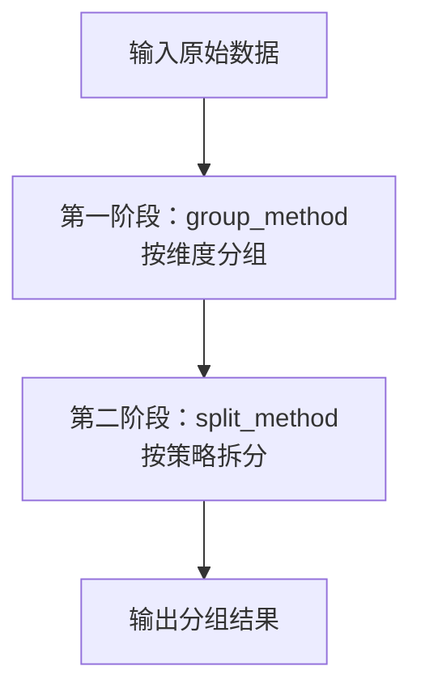
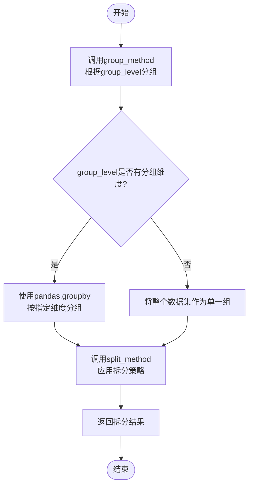
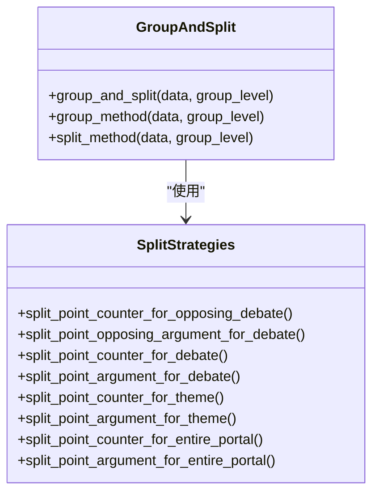
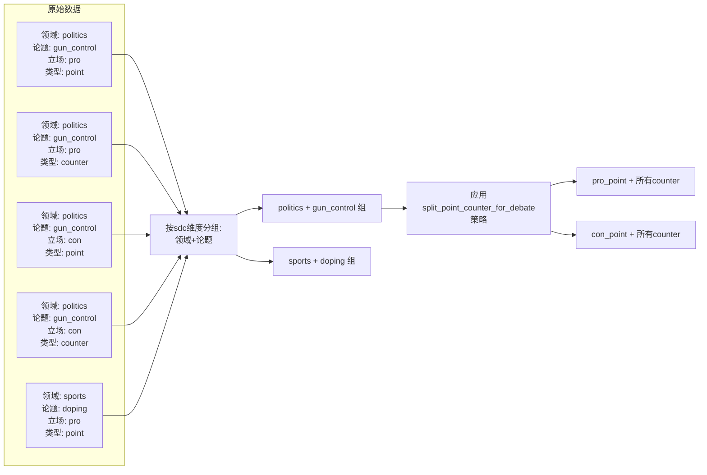
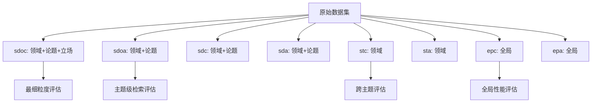

# 任务分组机制

<cite>
**本文档中引用的文件**  
- [tasks_evaluator.py](file://bert/tasks_evaluator.py)
- [utils.py](file://utils.py)
- [dataloader.py](file://dataloader.py)
- [bertdataloader.py](file://bert/bertdataloader.py)
</cite>

## 目录
1. [引言](#引言)
2. [任务维度语义解析](#任务维度语义解析)
3. [分组逻辑总体流程](#分组逻辑总体流程)
4. [group_and_split函数详解](#group_and_split函数详解)
5. [分组策略与应用场景](#分组策略与应用场景)
6. [数据样例演示](#数据样例演示)
7. [跨领域评估支持机制](#跨领域评估支持机制)
8. [关键配置项与注意事项](#关键配置项与注意事项)

## 引言
本文档深入解析反论点检索系统中的多任务评估分组逻辑实现。基于`tasks_evaluator.py`中的`get_tasks_data`函数和`utils.py`中的`group_and_split`方法，详细说明系统如何将原始数据按不同任务维度进行分组处理，以支持细粒度性能评估。

**Section sources**
- [tasks_evaluator.py](file://bert/tasks_evaluator.py#L27-L37)

## 任务维度语义解析
系统定义了8个任务维度，每个维度代表不同的评估粒度和应用场景：

- **sdoc**：按领域（domain）、论题（argumentation_title）和立场（stance）分组，用于最细粒度的对立立场评估
- **sdoa**：按领域和论题分组，忽略立场差异，用于主题级反论点检索
- **sdc**：按领域和论题分组，用于辩论场景下的立场相关评估
- **sda**：按领域和论题分组，用于辩论场景下的广义论点检索
- **stc**：仅按领域分组，用于跨主题的立场相关评估
- **sta**：仅按领域分组，用于跨主题的广义论点检索
- **epc**：全局分组，不进行任何维度划分，用于整体立场相关评估
- **epa**：全局分组，不进行任何维度划分，用于整体广义论点检索

这些维度支持从细粒度到粗粒度、从特定场景到全局的多层次评估需求。

**Section sources**
- [utils.py](file://utils.py#L260-L269)

## 分组逻辑总体流程
系统的分组逻辑采用两阶段处理流程：

**Diagram sources**
- [utils.py](file://utils.py#L292-L295)

**Section sources**
- [utils.py](file://utils.py#L292-L295)

## group_and_split函数详解
`group_and_split`函数是分组逻辑的核心，其参数设计和处理流程如下：

### 参数设计
- **data**：输入的原始数据集（DataFrame格式）
- **group_level**：分组级别标识符（sdoc, sdoa, sdc, sda, stc, sta, epc, epa）

### 分组规则

**Diagram sources**
- [utils.py](file://utils.py#L259-L274)
- [utils.py](file://utils.py#L277-L289)

### 返回结构
函数返回一个列表，每个元素为字典结构：
- 当拆分策略为"counter"类型时：包含'point'（正例）和'counter'（负例）键
- 当拆分策略为"argument"类型时：包含'point'（正例）和'argument'（候选集）键

**Section sources**
- [utils.py](file://utils.py#L292-L295)

## 分组策略与应用场景
不同任务维度采用不同的分组和拆分策略，以适应特定的评估需求。

### 正例与负例划分策略
系统通过以下方式确定正例和负例：

**Diagram sources**
- [utils.py](file://utils.py#L4-L255)

#### 对立辩论场景（sdoc）
- **正例**：同一论题、同一立场下的point-counter配对
- **负例**：其他所有counter
- **应用场景**：评估模型在精确匹配对立论点上的能力

#### 主题级检索（sdoa）
- **正例**：同一论题下的point-counter配对
- **负例**：同一论题下的所有point和counter
- **应用场景**：评估主题内广义论点检索能力

#### 全局评估（epc/epa）
- **正例**：所有point-counter配对
- **负例**：整个数据集中的其他论点
- **应用场景**：评估模型在大规模数据上的整体性能

**Section sources**
- [utils.py](file://utils.py#L279-L287)

## 数据样例演示
以下演示sdc维度的分组过程：

**Diagram sources**
- [utils.py](file://utils.py#L263)
- [utils.py](file://utils.py#L281)

## 跨领域评估支持机制
系统通过分层分组机制支持跨领域、跨主题的细粒度性能评估：

这种分层设计允许研究人员：
- 比较不同粒度下的模型性能
- 分析模型在特定领域或主题上的表现
- 识别模型的泛化能力和局限性

**Section sources**
- [tasks_evaluator.py](file://bert/tasks_evaluator.py#L29-L36)

## 关键配置项与注意事项
### 关键配置项
- **分组维度定义**：在`utils.py`的`group_method`函数中定义各任务维度的分组字段
- **拆分策略映射**：在`utils.py`的`split_method`函数中定义各任务维度对应的拆分函数
- **数据结构要求**：输入数据必须包含domain、argumentation_title、stance、utterence_id、utterence_type等字段

### 注意事项
1. **数据完整性**：确保每个point都有对应的counter，否则会被过滤掉
2. **字段一致性**：所有分组字段的值必须规范统一，避免因拼写差异导致分组错误
3. **内存消耗**：细粒度分组（如sdoc）会产生大量小组，可能增加内存消耗
4. **评估偏差**：不同分组维度的评估结果不可直接比较，需考虑组大小和分布差异

**Section sources**
- [utils.py](file://utils.py#L259-L287)
- [dataloader.py](file://dataloader.py#L61-L67)