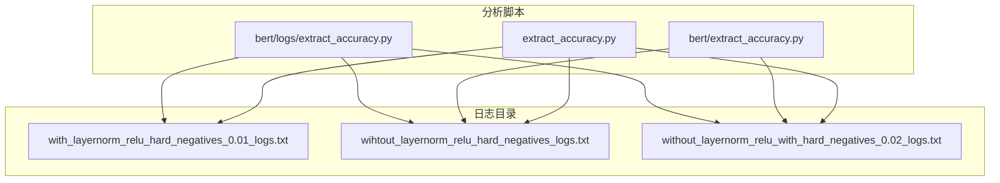
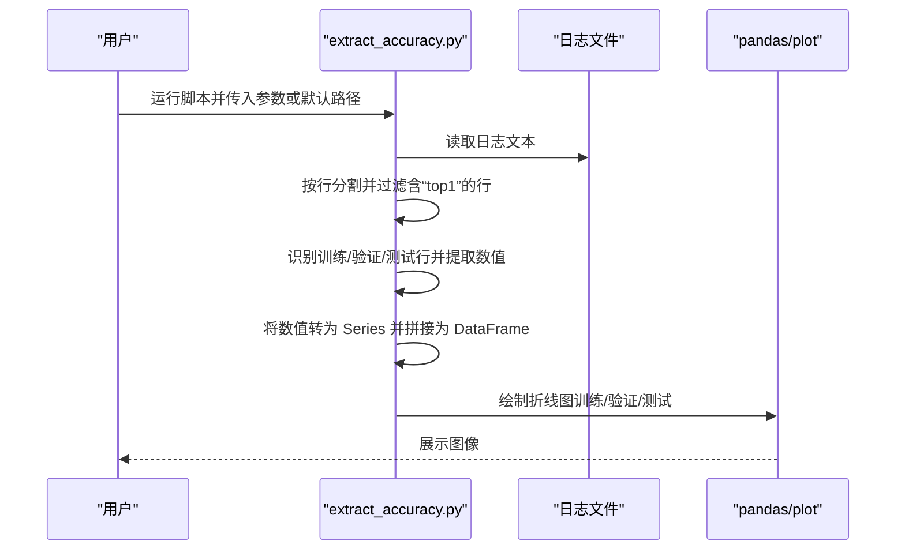
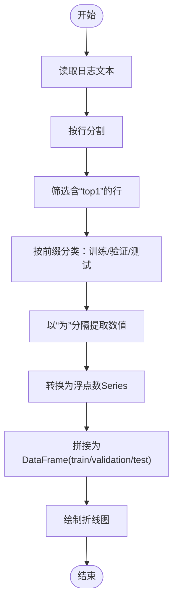
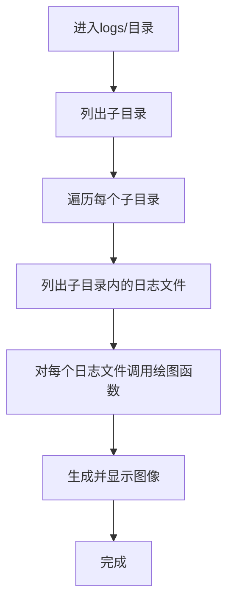

# 日志分析工具

<cite>
**本文引用的文件**
- [extract_accuracy.py](file://bert/logs/extract_accuracy.py)
- [extract_accuracy.py](file://bert/extract_accuracy.py)
- [extract_accuracy.py](file://extract_accuracy.py)
- [with_layernorm_relu_hard_negatives_0.01_logs.txt](file://bert/logs/with_layernorm_relu_hard_negatives_0.01_logs.txt)
- [wihtout_layernorm_relu_hard_negatives_logs.txt](file://bert/logs/wihtout_layernorm_relu_hard_negatives_logs.txt)
- [without_layernorm_relu_with_hard_negatives_0.02_logs.txt](file://bert/logs/without_layernorm_relu_with_hard_negatives_0.02_logs.txt)
</cite>

## 目录
1. [简介](#简介)
2. [项目结构](#项目结构)
3. [核心组件](#核心组件)
4. [架构总览](#架构总览)
5. [详细组件分析](#详细组件分析)
6. [依赖关系分析](#依赖关系分析)
7. [性能考量](#性能考量)
8. [故障排查指南](#故障排查指南)
9. [结论](#结论)
10. [附录](#附录)

## 简介
本文件系统性介绍日志分析工具 extract_accuracy.py 的功能与使用方法。该工具用于从训练过程中生成的日志文件中解析每轮 epoch 的关键指标（如 top1 准确率），并可视化展示训练集、验证集、测试集的准确率随训练轮次的变化趋势。通过对比不同实验配置（如不同的负采样率、归一化策略）下的性能曲线，可辅助定位最佳模型 checkpoint 并进行实验复现与性能调优。

## 项目结构
与日志分析直接相关的文件位于 bert/logs 目录及仓库根目录，包含：
- 多个日志文件：记录了各实验配置下的训练过程与评估指标
- 三个 extract_accuracy.py 版本：分别针对单文件分析、双文件对比以及批量自动扫描



图表来源
- [extract_accuracy.py](file://bert/logs/extract_accuracy.py#L1-L26)
- [extract_accuracy.py](file://bert/extract_accuracy.py#L1-L26)
- [extract_accuracy.py](file://extract_accuracy.py#L1-L38)
- [with_layernorm_relu_hard_negatives_0.01_logs.txt](file://bert/logs/with_layernorm_relu_hard_negatives_0.01_logs.txt#L1-L120)
- [wihtout_layernorm_relu_hard_negatives_logs.txt](file://bert/logs/wihtout_layernorm_relu_hard_negatives_logs.txt#L1-L120)
- [without_layernorm_relu_with_hard_negatives_0.02_logs.txt](file://bert/logs/without_layernorm_relu_with_hard_negatives_0.02_logs.txt#L1-L120)

章节来源
- [extract_accuracy.py](file://bert/logs/extract_accuracy.py#L1-L26)
- [extract_accuracy.py](file://bert/extract_accuracy.py#L1-L26)
- [extract_accuracy.py](file://extract_accuracy.py#L1-L38)

## 核心组件
- 单文件分析脚本（bert/logs/extract_accuracy.py）
  - 功能：从指定日志文件中提取训练集/验证集/测试集的 top1 准确率序列，并绘制折线图
  - 关键步骤：读取文本、按行切分、筛选包含“top1”的行、按语言标识区分训练/验证/测试、转换为数值序列、拼接为 DataFrame、绘图
- 双文件对比脚本（bert/extract_accuracy.py）
  - 功能：同时读取两个日志文件，分别提取并对比两组 top1 准确率曲线
- 批量自动扫描脚本（extract_accuracy.py）
  - 功能：遍历 logs/ 下的所有子目录与日志文件，自动调用绘图函数，批量生成多组对比图
  - 适用场景：同一实验系列下存在多个配置（如不同负采样率、不同归一化策略）

章节来源
- [extract_accuracy.py](file://bert/logs/extract_accuracy.py#L1-L26)
- [extract_accuracy.py](file://bert/extract_accuracy.py#L1-L26)
- [extract_accuracy.py](file://extract_accuracy.py#L1-L38)

## 架构总览
整体流程由“日志解析—指标抽取—数据聚合—可视化”四个阶段组成。三类脚本在“日志解析”阶段略有差异，但后续处理与绘图逻辑一致。



图表来源
- [extract_accuracy.py](file://bert/logs/extract_accuracy.py#L1-L26)
- [extract_accuracy.py](file://bert/extract_accuracy.py#L1-L26)
- [extract_accuracy.py](file://extract_accuracy.py#L1-L38)

## 详细组件分析

### 组件A：单文件分析（bert/logs/extract_accuracy.py）
- 输入：固定路径下的某一个日志文件
- 解析策略：
  - 文本按行分割后，仅保留包含“top1”的行
  - 通过前缀判断属于训练集/验证集/测试集，并以“为”字分隔提取数值
  - 将字符串转换为浮点数，构建 Series
  - 使用 pandas 合并为三列的 DataFrame
- 输出：训练集、验证集、测试集三条曲线的折线图



图表来源
- [extract_accuracy.py](file://bert/logs/extract_accuracy.py#L1-L26)

章节来源
- [extract_accuracy.py](file://bert/logs/extract_accuracy.py#L1-L26)

### 组件B：双文件对比（bert/extract_accuracy.py）
- 输入：两个日志文件
- 处理：对两个文件分别执行与单文件相同的解析与绘图流程，最终在同一张图上叠加两条曲线，便于直观对比
- 适用：快速对比两种不同配置（如是否使用层归一化、是否使用 ReLU、不同负采样率）的效果

章节来源
- [extract_accuracy.py](file://bert/extract_accuracy.py#L1-L26)

### 组件C：批量自动扫描（extract_accuracy.py）
- 输入：logs/ 目录下的多组实验配置
- 处理：递归遍历子目录与日志文件，自动调用绘图函数，逐个生成对比图
- 输出：多张对比图，覆盖所有实验组合，便于系统性比较



图表来源
- [extract_accuracy.py](file://extract_accuracy.py#L1-L38)

章节来源
- [extract_accuracy.py](file://extract_accuracy.py#L1-L38)

### 数据流与可视化
- 数据来源：日志文件中每轮 epoch 结束时输出的“训练/验证/测试 top1 accuracy”行
- 数据清洗：仅保留包含“top1”的行；按语言标识区分三类集合；数值转换
- 可视化：matplotlib 折线图，横轴为 epoch，纵轴为 accuracy@1，图例标注三类集合

章节来源
- [with_layernorm_relu_hard_negatives_0.01_logs.txt](file://bert/logs/with_layernorm_relu_hard_negatives_0.01_logs.txt#L50-L70)
- [wihtout_layernorm_relu_hard_negatives_logs.txt](file://bert/logs/wihtout_layernorm_relu_hard_negatives_logs.txt#L50-L70)
- [without_layernorm_relu_with_hard_negatives_0.02_logs.txt](file://bert/logs/without_layernorm_relu_with_hard_negatives_0.02_logs.txt#L50-L70)

## 依赖关系分析
- 外部依赖
  - pandas：数据结构与合并
  - matplotlib.pyplot：绘图
- 内部依赖
  - 三个版本脚本共享相似的数据解析与绘图逻辑，差异主要体现在输入来源（单文件/双文件/批量）
- 文件耦合
  - 单文件脚本与具体日志文件名强耦合（硬编码路径）
  - 批量脚本与目录结构强耦合（假设 logs/ 下存在多子目录与日志文件）

```mermaid
graph LR
P["pandas"] <- --> A["bert/logs/extract_accuracy.py"]
M["matplotlib.pyplot"] <- --> A
A2["bert/extract_accuracy.py"] --> P
A2 --> M
A3["extract_accuracy.py"] --> P
A3 --> M
A --- L["日志文件"]
A2 --- L2["两个日志文件"]
A3 --- L3["logs/多目录多文件"]
```

图表来源
- [extract_accuracy.py](file://bert/logs/extract_accuracy.py#L1-L26)
- [extract_accuracy.py](file://bert/extract_accuracy.py#L1-L26)
- [extract_accuracy.py](file://extract_accuracy.py#L1-L38)

章节来源
- [extract_accuracy.py](file://bert/logs/extract_accuracy.py#L1-L26)
- [extract_accuracy.py](file://bert/extract_accuracy.py#L1-L26)
- [extract_accuracy.py](file://extract_accuracy.py#L1-L38)

## 性能考量
- I/O 开销：日志文件通常较大（数万行），读取与按行处理的时间复杂度近似 O(N)，N 为行数
- 内存占用：pandas Series/DataFrame 在解析完成后占用内存与样本数量成正比
- 绘图开销：matplotlib 在大量数据点时可能较慢，建议在需要时降低采样频率或仅展示关键 epoch
- 批量处理：批量脚本会生成多张图，注意控制并发与保存策略，避免内存峰值过高

## 故障排查指南
- 无法找到日志文件
  - 症状：脚本报错提示找不到文件
  - 排查：确认日志文件路径与脚本中的相对路径一致；批量脚本需确保 logs/ 目录结构正确
- 解析不到“top1”行
  - 症状：训练/验证/测试序列为空
  - 排查：检查日志文件是否包含“top1 accuracy为...”格式；确认语言标识与脚本中的筛选条件一致
- 数值转换失败
  - 症状：类型转换报错
  - 排查：确认提取到的字符串为有效数字；必要时在解析前做异常捕获与清洗
- 图形不显示
  - 症状：脚本执行完毕无图像输出
  - 排查：确认运行环境支持 GUI 或使用非交互后端；批量脚本建议在 Jupyter 中查看或保存图像

章节来源
- [extract_accuracy.py](file://bert/logs/extract_accuracy.py#L1-L26)
- [extract_accuracy.py](file://bert/extract_accuracy.py#L1-L26)
- [extract_accuracy.py](file://extract_accuracy.py#L1-L38)

## 结论
extract_accuracy.py 提供了从训练日志中自动化提取与可视化关键指标的能力，适用于快速对比不同实验配置、定位最佳 checkpoint 与复现实验结果。根据使用场景选择合适的脚本版本（单文件、双文件、批量），并结合日志格式与路径规范，可显著提升实验效率与可重复性。

## 附录

### 命令行使用示例
- 单文件分析
  - 运行脚本：python bert/logs/extract_accuracy.py
  - 说明：脚本会读取固定路径下的日志文件并绘制曲线
- 双文件对比
  - 运行脚本：python bert/extract_accuracy.py
  - 说明：同时读取两个日志文件，对比两条曲线
- 批量自动扫描
  - 运行脚本：python extract_accuracy.py
  - 说明：遍历 logs/ 下的子目录与日志文件，自动生成多组对比图

章节来源
- [extract_accuracy.py](file://bert/logs/extract_accuracy.py#L1-L26)
- [extract_accuracy.py](file://bert/extract_accuracy.py#L1-L26)
- [extract_accuracy.py](file://extract_accuracy.py#L1-L38)

### 输出结果解读指南
- 曲线含义
  - 训练集曲线：反映模型在训练集上的拟合能力，通常随 epoch 上升而提高
  - 验证集曲线：反映模型泛化能力，常作为选择最佳 checkpoint 的依据
  - 测试集曲线：反映最终评估效果，应与验证集趋势一致
- 最佳 checkpoint 定位
  - 观察验证集曲线达到最高点对应的 epoch，即为潜在的最佳 checkpoint
  - 若验证集曲线震荡明显，可考虑早停策略或滑动平均平滑曲线
- 实验对比
  - 对比不同配置的曲线：若某条曲线在后期持续领先，则该配置更优
  - 注意控制变量：仅改变单一因素（如负采样率、归一化策略），以便得出明确结论

章节来源
- [with_layernorm_relu_hard_negatives_0.01_logs.txt](file://bert/logs/with_layernorm_relu_hard_negatives_0.01_logs.txt#L50-L70)
- [wihtout_layernorm_relu_hard_negatives_logs.txt](file://bert/logs/wihtout_layernorm_relu_hard_negatives_logs.txt#L50-L70)
- [without_layernorm_relu_with_hard_negatives_0.02_logs.txt](file://bert/logs/without_layernorm_relu_with_hard_negatives_0.02_logs.txt#L50-L70)