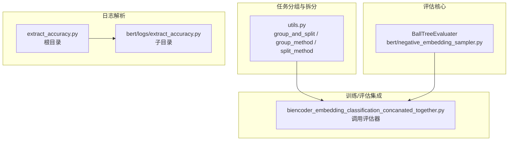
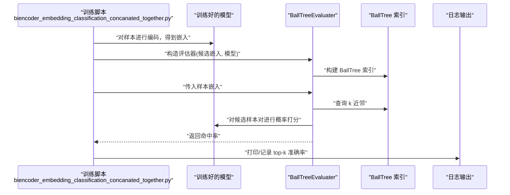
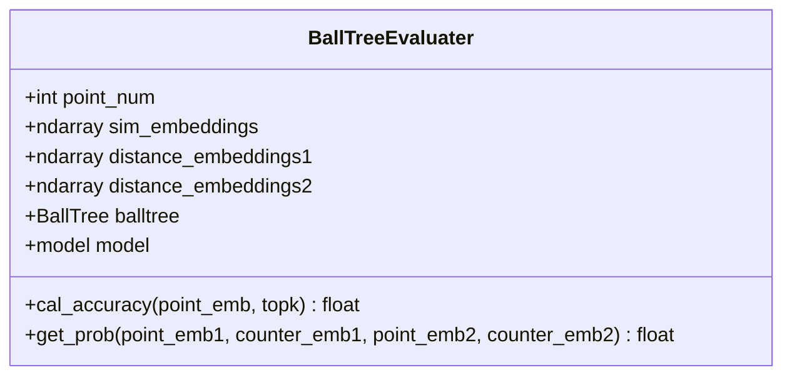
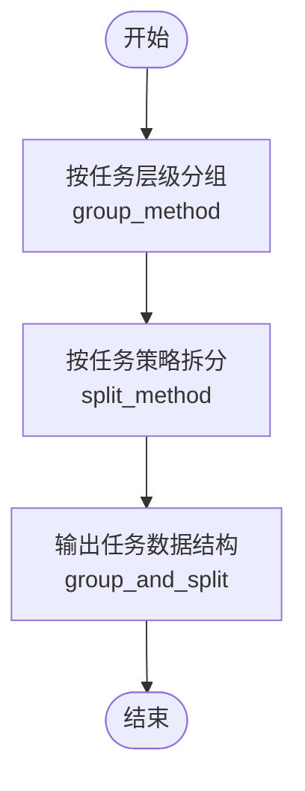
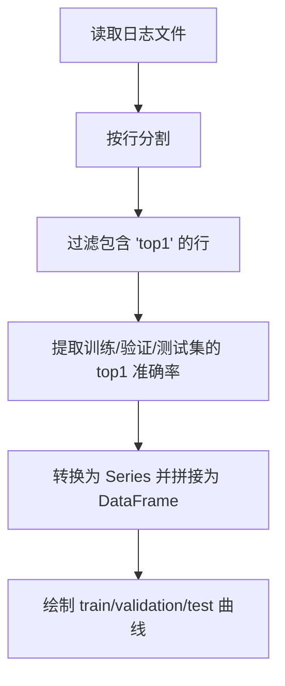
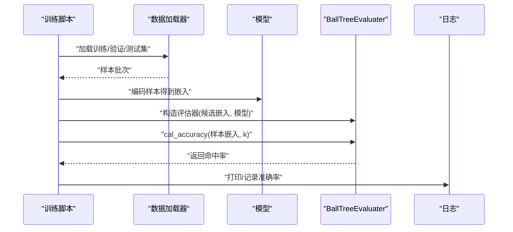
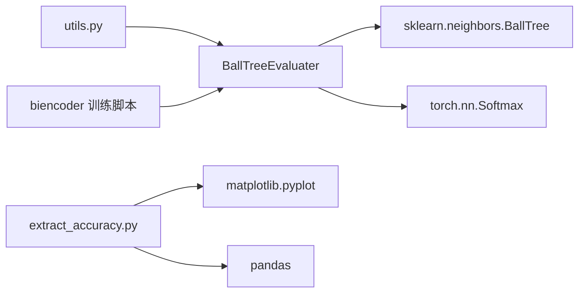

# 评估体系

<cite>
**本文引用的文件**
- [bert/negative_embedding_sampler.py](file://bert/negative_embedding_sampler.py)
- [bert/tasks_evaluator.py](file://bert/tasks_evaluator.py)
- [bert/tasks_evaluator_util.py](file://bert/tasks_evaluator_util.py)
- [utils.py](file://utils.py)
- [bert/biencoder/biencoder_embedding_classification_concanated_together.py](file://bert/biencoder/biencoder_embedding_classification_concanated_together.py)
- [bert/logs/extract_accuracy.py](file://bert/logs/extract_accuracy.py)
- [extract_accuracy.py](file://extract_accuracy.py)
- [README.md](file://README.md)
</cite>

## 目录
1. [简介](#简介)
2. [项目结构](#项目结构)
3. [核心组件](#核心组件)
4. [架构总览](#架构总览)
5. [详细组件分析](#详细组件分析)
6. [依赖关系分析](#依赖关系分析)
7. [性能考量](#性能考量)
8. [故障排查指南](#故障排查指南)
9. [结论](#结论)
10. [附录](#附录)

## 简介
本文件系统化阐述本项目的评估体系，重点说明 BallTreeEvaluater 的核心作用与工作原理，以及如何基于 BallTree 数据结构高效计算 top-k 检索准确率，评估模型在多任务（sdoc、sdoa、sdc、sda、stc、sta、epc、epa）上的表现。文档还解释：
- 评估流程：加载训练好的模型、编码所有文本、构建 BallTree 索引、执行 k 近邻搜索、计算命中率；
- tasks_evaluator_util.py 中辅助函数如何支持任务特定的分组逻辑；
- extract_accuracy.py 脚本如何解析训练日志文件（如 logs/ 目录下的 .txt 文件），提取并汇总关键性能指标；
- 评估结果的解读指南，帮助用户理解不同任务指标的含义及其对模型性能的反映。

## 项目结构
该项目围绕“论点反驳检索”任务展开，包含以下与评估直接相关的模块：
- 评估核心：BallTreeEvaluater 实现 top-k 检索与排序打分；
- 任务分组与拆分：utils.py 提供按任务层级进行分组与拆分的工具；
- 训练日志解析：extract_accuracy.py 与 bert/logs/extract_accuracy.py 用于从训练日志中提取 top-k 准确率曲线；
- Biencoder 训练/评估集成：在 biencoder 训练脚本中调用 BallTreeEvaluater 完成训练/验证/测试集的 top-k 准确率评估。

图表来源
- [bert/negative_embedding_sampler.py](file://bert/negative_embedding_sampler.py#L48-L92)
- [utils.py](file://utils.py#L259-L304)
- [extract_accuracy.py](file://extract_accuracy.py#L1-L38)
- [bert/logs/extract_accuracy.py](file://bert/logs/extract_accuracy.py#L1-L26)
- [bert/biencoder/biencoder_embedding_classification_concanated_together.py](file://bert/biencoder/biencoder_embedding_classification_concanated_together.py#L200-L280)

章节来源
- [README.md](file://README.md#L1-L7)
- [utils.py](file://utils.py#L259-L304)
- [bert/negative_embedding_sampler.py](file://bert/negative_embedding_sampler.py#L48-L92)
- [extract_accuracy.py](file://extract_accuracy.py#L1-L38)
- [bert/logs/extract_accuracy.py](file://bert/logs/extract_accuracy.py#L1-L26)
- [bert/biencoder/biencoder_embedding_classification_concanated_together.py](file://bert/biencoder/biencoder_embedding_classification_concanated_together.py#L200-L280)

## 核心组件
- BallTreeEvaluater：基于 BallTree 构建检索索引，对候选样本对进行排序打分，计算 top-k 命中率。其核心方法包括：
  - 构造函数：接收候选嵌入集合与模型分类层，构建 BallTree；
  - cal_accuracy：对输入样本执行 k 近邻查询，结合模型对每对候选进行概率打分，统计命中率；
  - get_prob：将样本对嵌入合并后经分类层得到正样本概率。
- 任务分组工具：utils.py 提供按任务层级（如 sdoc、sdoa、sdc、sda、stc、sta、epc、epa）进行分组与拆分的方法，支撑多任务评估的数据准备。
- 日志解析工具：extract_accuracy.py 与 bert/logs/extract_accuracy.py 从训练日志中提取 top1 准确率序列，绘制训练/验证/测试集曲线，便于直观评估收敛情况。

章节来源
- [bert/negative_embedding_sampler.py](file://bert/negative_embedding_sampler.py#L48-L92)
- [utils.py](file://utils.py#L259-L304)
- [extract_accuracy.py](file://extract_accuracy.py#L1-L38)
- [bert/logs/extract_accuracy.py](file://bert/logs/extract_accuracy.py#L1-L26)

## 架构总览
评估体系以“数据准备—编码—索引构建—检索—排序打分—命中率统计”为主线，贯穿训练/验证/测试三个阶段。Biencoder 训练脚本在每个阶段结束后，使用 BallTreeEvaluater 对样本对进行排序打分，并统计 top-k 命中率，从而量化模型在检索任务上的表现。

图表来源
- [bert/biencoder/biencoder_embedding_classification_concanated_together.py](file://bert/biencoder/biencoder_embedding_classification_concanated_together.py#L200-L280)
- [bert/negative_embedding_sampler.py](file://bert/negative_embedding_sampler.py#L48-L92)

## 详细组件分析

### BallTreeEvaluater 组件分析
BallTreeEvaluater 是评估体系的核心，负责：
- 将候选样本对的嵌入拼接为统一向量空间，构建 BallTree；
- 对输入样本执行 k 近邻查询；
- 使用模型对候选样本对进行排序打分，选择概率最高的候选作为预测；
- 统计命中率（命中即预测索引等于真实样本索引）。

图表来源
- [bert/negative_embedding_sampler.py](file://bert/negative_embedding_sampler.py#L48-L92)

章节来源
- [bert/negative_embedding_sampler.py](file://bert/negative_embedding_sampler.py#L48-L92)

### 任务分组与拆分工具分析
utils.py 提供了任务级分组与拆分的通用机制：
- group_method：根据任务层级（如 domain、argumentation_title、stance 等）进行分组；
- split_method：针对不同任务采用不同的拆分策略（如 point 与 counter 的配对规则）；
- group_and_split：组合分组与拆分，输出任务特定的数据结构，便于后续评估。

图表来源
- [utils.py](file://utils.py#L259-L304)

章节来源
- [utils.py](file://utils.py#L259-L304)

### 训练日志解析与可视化
extract_accuracy.py 与 bert/logs/extract_accuracy.py 用于从训练日志中提取 top1 准确率序列并绘制曲线：
- 从指定日志文件读取文本；
- 过滤包含“top1”的行，分别提取训练集、验证集、测试集的 top1 准确率；
- 将序列转换为 pandas Series 并拼接为 DataFrame；
- 使用 matplotlib 绘制三条曲线（train/validation/test）。

图表来源
- [extract_accuracy.py](file://extract_accuracy.py#L1-L38)
- [bert/logs/extract_accuracy.py](file://bert/logs/extract_accuracy.py#L1-L26)

章节来源
- [extract_accuracy.py](file://extract_accuracy.py#L1-L38)
- [bert/logs/extract_accuracy.py](file://bert/logs/extract_accuracy.py#L1-L26)

### 评估流程与 Biencoder 集成
在 biencoder 训练脚本中，评估流程如下：
- 加载训练好的模型；
- 对训练/验证/测试集中的样本进行编码，得到嵌入；
- 构造 BallTreeEvaluater，传入候选嵌入与模型；
- 执行 cal_accuracy 计算 top-k 命中率；
- 输出并记录结果。

图表来源
- [bert/biencoder/biencoder_embedding_classification_concanated_together.py](file://bert/biencoder/biencoder_embedding_classification_concanated_together.py#L200-L280)
- [bert/negative_embedding_sampler.py](file://bert/negative_embedding_sampler.py#L48-L92)

章节来源
- [bert/biencoder/biencoder_embedding_classification_concanated_together.py](file://bert/biencoder/biencoder_embedding_classification_concanated_together.py#L200-L280)
- [bert/negative_embedding_sampler.py](file://bert/negative_embedding_sampler.py#L48-L92)

## 依赖关系分析
- BallTreeEvaluater 依赖 sklearn.neighbors.BallTree 进行高效 k 近邻查询；
- 评估器通过模型的分类层对样本对进行概率打分；
- 任务分组工具依赖 pandas 的 groupby 与自定义拆分函数；
- 日志解析工具依赖 pandas 与 matplotlib。

图表来源
- [utils.py](file://utils.py#L259-L304)
- [bert/negative_embedding_sampler.py](file://bert/negative_embedding_sampler.py#L48-L92)
- [extract_accuracy.py](file://extract_accuracy.py#L1-L38)

章节来源
- [utils.py](file://utils.py#L259-L304)
- [bert/negative_embedding_sampler.py](file://bert/negative_embedding_sampler.py#L48-L92)
- [extract_accuracy.py](file://extract_accuracy.py#L1-L38)

## 性能考量
- BallTree 查询效率：BallTree 在高维稀疏或密集向量空间均能提供较优的查询性能，适合大规模检索场景；leaf_size 可根据数据规模调整以平衡查询与构建成本。
- 批处理与 GPU 利用：在 Biencoder 训练脚本中，编码过程使用 DataLoader 与 CUDA 加速，可显著提升吞吐；建议合理设置 batch_size 与设备内存上限。
- top-k 选择策略：评估时使用 k=10 的近邻查询，既保证召回又避免过多计算；可根据任务需求调整 k 值。
- 日志解析开销：日志解析仅在评估阶段运行，对主训练流程影响较小；建议定期清理冗余日志以降低 IO 开销。

## 故障排查指南
- 无法加载模型或嵌入维度不匹配
  - 现象：cal_accuracy 报错或返回 NaN；
  - 排查：确认模型输出的嵌入维度与评估器期望一致；检查候选嵌入与样本嵌入的拼接顺序是否正确。
- BallTree 查询异常
  - 现象：查询结果为空或索引越界；
  - 排查：确保候选嵌入非空且与样本嵌入一一对应；核对索引映射关系。
- 日志解析失败
  - 现象：无法提取 top1 准确率或绘图报错；
  - 排查：确认日志文件路径与格式；检查过滤条件与列名是否匹配；确保 pandas 与 matplotlib 正常安装。
- 任务分组错误
  - 现象：评估数据结构不符合预期；
  - 排查：核对任务层级与分组键；检查 split_method 的拆分策略是否适用于当前任务。

章节来源
- [bert/negative_embedding_sampler.py](file://bert/negative_embedding_sampler.py#L48-L92)
- [extract_accuracy.py](file://extract_accuracy.py#L1-L38)
- [utils.py](file://utils.py#L259-L304)

## 结论
本评估体系通过 BallTreeEvaluater 将检索与排序有机结合，实现了对多任务（sdoc、sdoa、sdc、sda、stc、sta、epc、epa）的高效 top-k 准确率评估。配合任务分组工具与日志解析脚本，能够快速定位模型在不同任务与阶段的表现差异，为模型优化与迭代提供可靠依据。

## 附录

### 任务指标与解读
- sdoc/sdoa/sdc/sda/stc/sta/epc/epa
  - sdoc：按领域、论题标题、立场分组，再按“point 与 counter”配对；
  - sdoa：按领域、论题标题分组，再按“point 与 opposing argument”配对；
  - sdc：按领域、论题标题分组，再按“point 与 counter”配对（辩论视角）；
  - sda：按领域、论题标题分组，再按“point 与 argument”配对（辩论视角）；
  - stc：按领域分组，再按“point 与 counter”配对（主题视角）；
  - sta：按领域分组，再按“point 与 argument”配对（主题视角）；
  - epc：无分组键，整体按“point 与 counter”配对（全站视角）；
  - epa：无分组键，整体按“point 与 argument”配对（全站视角）。
- 指标含义
  - top-k 命中率：在 k 个近邻中，若最高概率的候选即为真实样本，则计为命中；命中率越高，表示检索排序质量越好。
- 结果解读建议
  - 训练/验证/测试集曲线应呈上升趋势且趋于稳定，若验证集下降而测试集保持或下降，可能存在过拟合；
  - 不同任务的命中率差异可反映模型在不同粒度与视角下的适应性，需结合业务目标进行权衡。

章节来源
- [utils.py](file://utils.py#L259-L304)
- [bert/biencoder/biencoder_embedding_classification_concanated_together.py](file://bert/biencoder/biencoder_embedding_classification_concanated_together.py#L200-L280)