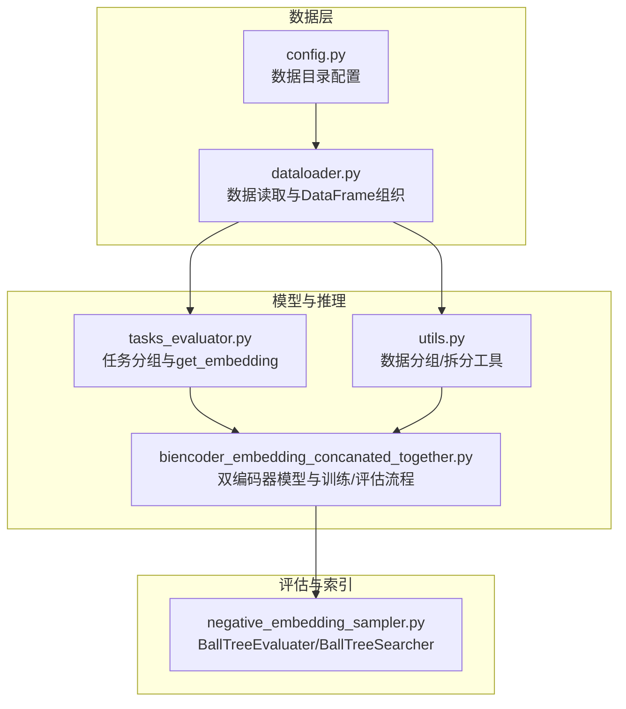
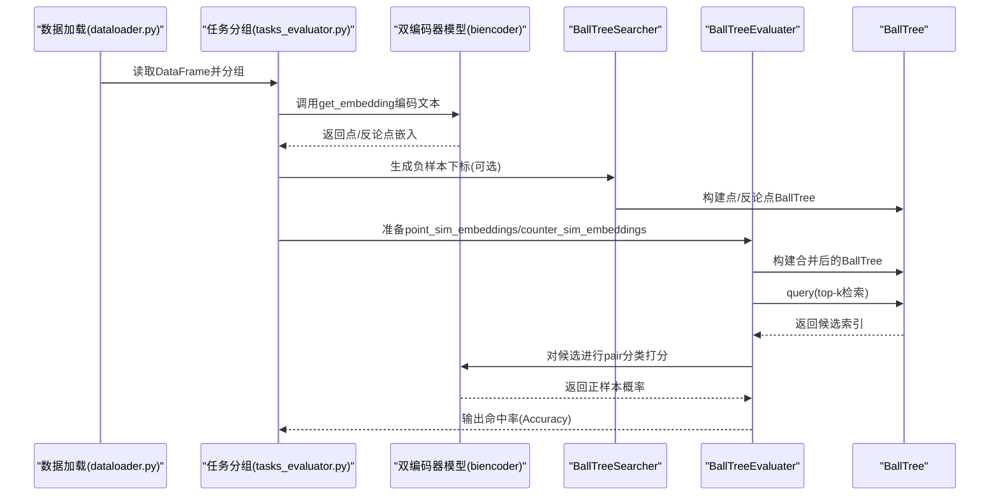
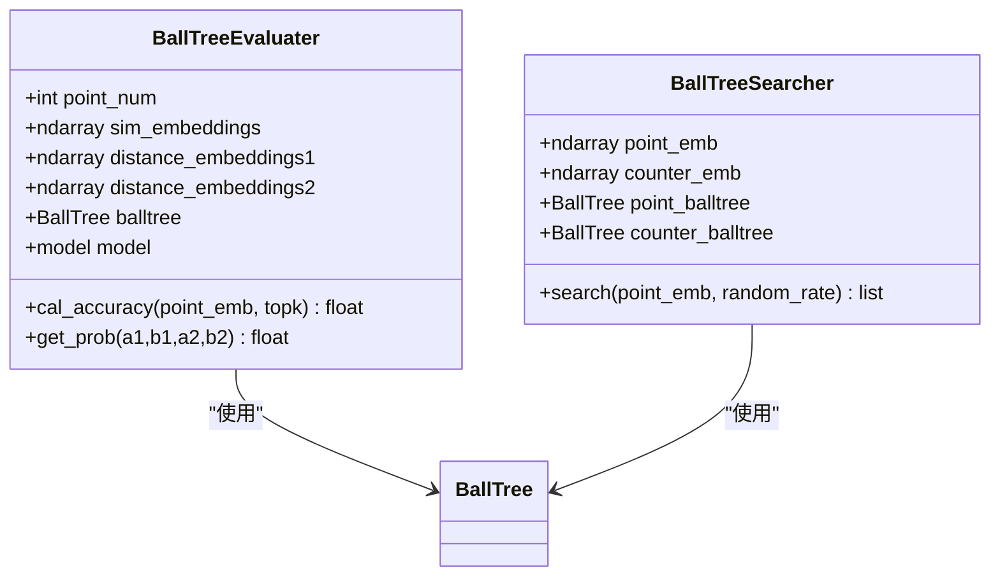
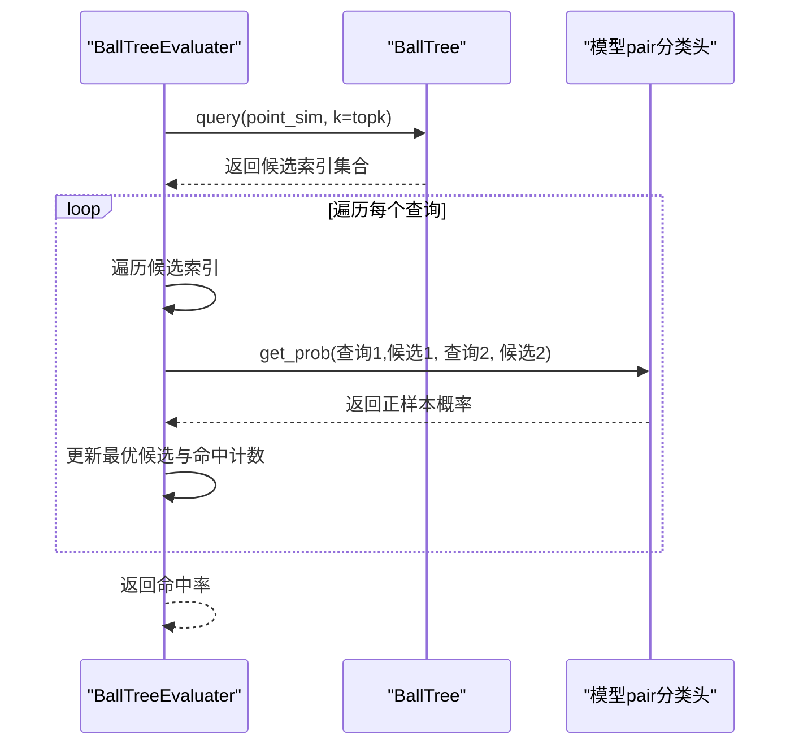
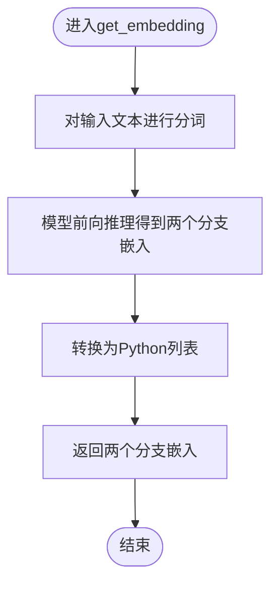
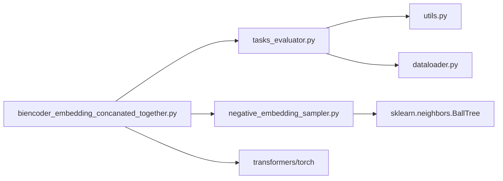

# 评估引擎

<cite>
**本文引用的文件列表**
- [bert/negative_embedding_sampler.py](file://bert/negative_embedding_sampler.py)
- [bert/tasks_evaluator.py](file://bert/tasks_evaluator.py)
- [bert/biencoder/biencoder_embedding_concanated_together.py](file://bert/biencoder/biencoder_embedding_concanated_together.py)
- [utils.py](file://utils.py)
- [dataloader.py](file://dataloader.py)
- [config.py](file://config.py)
- [README.md](file://README.md)
</cite>

## 目录
1. [简介](#简介)
2. [项目结构](#项目结构)
3. [核心组件](#核心组件)
4. [架构总览](#架构总览)
5. [详细组件分析](#详细组件分析)
6. [依赖关系分析](#依赖关系分析)
7. [性能考量](#性能考量)
8. [故障排查指南](#故障排查指南)
9. [结论](#结论)
10. [附录](#附录)

## 简介
本文件围绕评估体系中的 BallTreeEvaluater 类展开，系统阐述其在检索评估中的核心作用：基于训练好的双编码器模型对文本进行编码，生成嵌入向量；利用 BallTree 构建高效索引以支持快速 k 近邻搜索；通过 top-k 检索与分类打分计算命中率（Accuracy）。文档同时结合 tasks_evaluator.py 中的 get_embedding 函数，说明模型推理与向量提取的具体实现方式，并给出单任务评估的调用示例路径、时间复杂度与空间优化策略，以及 BallTree 相较于线性搜索的优势与大规模检索场景下的性能表现。

## 项目结构
该项目围绕辩论论点与反论点的配对数据进行训练与评估，包含数据加载、模型训练、负样本采样、BallTree 检索与评估等模块。关键文件与职责如下：
- bert/negative_embedding_sampler.py：定义 BallTreeEvaluater 与 BallTreeSearcher，负责构建 BallTree 并执行检索与评估。
- bert/tasks_evaluator.py：提供任务级数据分组与 get_embedding 推理接口，用于从模型中提取向量。
- bert/biencoder/biencoder_embedding_concanated_together.py：双编码器模型与训练脚本，演示如何使用 BallTreeEvaluater 进行评估。
- utils.py：数据分组与拆分工具，支撑多任务评估的数据准备。
- dataloader.py：数据读取与 DataFrame 组织，为评估提供输入数据。
- config.py：数据目录配置。
- README.md：项目背景与数据来源说明。

图表来源
- [dataloader.py](file://dataloader.py#L1-L87)
- [config.py](file://config.py#L1-L11)
- [bert/biencoder/biencoder_embedding_concanated_together.py](file://bert/biencoder/biencoder_embedding_concanated_together.py#L1-L280)
- [bert/tasks_evaluator.py](file://bert/tasks_evaluator.py#L1-L37)
- [utils.py](file://utils.py#L1-L304)
- [bert/negative_embedding_sampler.py](file://bert/negative_embedding_sampler.py#L1-L92)

章节来源
- [dataloader.py](file://dataloader.py#L1-L87)
- [config.py](file://config.py#L1-L11)
- [bert/biencoder/biencoder_embedding_concanated_together.py](file://bert/biencoder/biencoder_embedding_concanated_together.py#L1-L280)
- [bert/tasks_evaluator.py](file://bert/tasks_evaluator.py#L1-L37)
- [utils.py](file://utils.py#L1-L304)
- [bert/negative_embedding_sampler.py](file://bert/negative_embedding_sampler.py#L1-L92)

## 核心组件
本节聚焦 BallTreeEvaluater 的设计与职责，以及与之配套的 BallTreeSearcher 和 get_embedding 接口。

- BallTreeEvaluater
  - 负责将“点-反论点”配对的嵌入向量拼接后构建 BallTree，支持后续的 top-k 检索与命中率评估。
  - 提供 cal_accuracy 方法，基于检索结果与分类打分计算命中率。
  - 使用模型的 pair 分类头对检索到的候选进行概率打分，选择最优匹配并统计命中。

- BallTreeSearcher
  - 面向负样本采样场景，分别针对“点”和“反论点”构建独立 BallTree，按规则选择负样本。
  - 支持随机率控制，平衡确定性与随机性。

- get_embedding（来自 tasks_evaluator.py）
  - 对单条文本进行分词与前向推理，返回两个分支的嵌入向量，用于后续检索或评估。

章节来源
- [bert/negative_embedding_sampler.py](file://bert/negative_embedding_sampler.py#L1-L92)
- [bert/tasks_evaluator.py](file://bert/tasks_evaluator.py#L1-L37)

## 架构总览
下图展示了从数据到评估的整体流程：数据加载与分组 -> 模型推理提取向量 -> 构建 BallTree -> 执行 top-k 检索 -> 分类打分与命中率统计。

图表来源
- [dataloader.py](file://dataloader.py#L1-L87)
- [bert/tasks_evaluator.py](file://bert/tasks_evaluator.py#L1-L37)
- [bert/biencoder/biencoder_embedding_concanated_together.py](file://bert/biencoder/biencoder_embedding_concanated_together.py#L1-L280)
- [bert/negative_embedding_sampler.py](file://bert/negative_embedding_sampler.py#L1-L92)

## 详细组件分析

### BallTreeEvaluater 类分析
BallTreeEvaluater 将“点”和“反论点”的嵌入向量进行拼接，构建统一的 BallTree，随后对查询向量执行 top-k 检索，并通过模型的 pair 分类头对检索到的候选进行打分，最终统计命中率。

图表来源
- [bert/negative_embedding_sampler.py](file://bert/negative_embedding_sampler.py#L1-L92)

章节来源
- [bert/negative_embedding_sampler.py](file://bert/negative_embedding_sampler.py#L48-L92)

#### 计算命中率流程（序列图）
以下序列图展示 cal_accuracy 的执行流程：对每个查询向量执行 top-k 检索，然后对候选对进行打分，选择最优匹配并判断是否命中。

图表来源
- [bert/negative_embedding_sampler.py](file://bert/negative_embedding_sampler.py#L61-L92)

章节来源
- [bert/negative_embedding_sampler.py](file://bert/negative_embedding_sampler.py#L61-L92)

#### get_embedding 推理流程（流程图）
get_embedding 用于从模型中提取单条文本的嵌入向量，作为检索与评估的基础。

图表来源
- [bert/tasks_evaluator.py](file://bert/tasks_evaluator.py#L11-L19)

章节来源
- [bert/tasks_evaluator.py](file://bert/tasks_evaluator.py#L11-L19)

### 单任务评估调用示例
以下示例展示如何在训练/验证/测试阶段调用 BallTreeEvaluater 进行单任务评估（以 concatenated_together 为例）：
- 数据准备：使用 dataloader 读取数据并转为 DataFrame，再通过 utils 的分组/拆分函数组织任务数据。
- 模型推理：对训练/验证/测试集中的每条“点-反论点”配对进行 get_embedding 编码，得到嵌入向量。
- 构建索引：将“点”和“反论点”的嵌入向量拼接后传入 BallTreeEvaluater，内部自动构建 BallTree。
- 执行评估：调用 cal_accuracy 对查询向量执行 top-k 检索并统计命中率。

调用路径参考：
- [bert/biencoder/biencoder_embedding_concanated_together.py](file://bert/biencoder/biencoder_embedding_concanated_together.py#L1-L280)
- [bert/tasks_evaluator.py](file://bert/tasks_evaluator.py#L1-L37)
- [utils.py](file://utils.py#L292-L296)
- [dataloader.py](file://dataloader.py#L1-L87)
- [bert/negative_embedding_sampler.py](file://bert/negative_embedding_sampler.py#L48-L92)

章节来源
- [bert/biencoder/biencoder_embedding_concanated_together.py](file://bert/biencoder/biencoder_embedding_concanated_together.py#L1-L280)
- [bert/tasks_evaluator.py](file://bert/tasks_evaluator.py#L1-L37)
- [utils.py](file://utils.py#L292-L296)
- [dataloader.py](file://dataloader.py#L1-L87)
- [bert/negative_embedding_sampler.py](file://bert/negative_embedding_sampler.py#L48-L92)

## 依赖关系分析
- 模块耦合
  - tasks_evaluator.py 与 dataloader.py、utils.py 协作，提供任务级数据分组与推理接口。
  - biencoder_embedding_concanated_together.py 作为训练/评估入口，依赖上述模块与 BallTreeEvaluater。
  - negative_embedding_sampler.py 独立提供 BallTree 检索与评估能力，既可用于负样本采样，也可用于评估。

- 外部依赖
  - sklearn.neighbors.BallTree：用于高效 k 近邻检索。
  - transformers 与 torch：用于模型推理与向量提取。
  - numpy：用于向量拼接与数组操作。

图表来源
- [bert/tasks_evaluator.py](file://bert/tasks_evaluator.py#L1-L37)
- [utils.py](file://utils.py#L1-L304)
- [dataloader.py](file://dataloader.py#L1-L87)
- [bert/biencoder/biencoder_embedding_concanated_together.py](file://bert/biencoder/biencoder_embedding_concanated_together.py#L1-L280)
- [bert/negative_embedding_sampler.py](file://bert/negative_embedding_sampler.py#L1-L92)

章节来源
- [bert/tasks_evaluator.py](file://bert/tasks_evaluator.py#L1-L37)
- [utils.py](file://utils.py#L1-L304)
- [dataloader.py](file://dataloader.py#L1-L87)
- [bert/biencoder/biencoder_embedding_concanated_together.py](file://bert/biencoder/biencoder_embedding_concanated_together.py#L1-L280)
- [bert/negative_embedding_sampler.py](file://bert/negative_embedding_sampler.py#L1-L92)

## 性能考量
- 时间复杂度
  - BallTree 构建：O(N log N)，N 为向量数量。
  - 查询：单次查询 O(k log N)，k 为检索的候选数量。
  - 命中率计算：对每个查询遍历 top-k 候选并进行 pair 分类打分，整体约为 O(Q · k)，Q 为查询数量。
  - 相比线性搜索（暴力法），BallTree 在大规模检索场景下显著降低查询复杂度。

- 空间优化策略
  - 向量拼接：BallTreeEvaluater 将“点”和“反论点”嵌入向量拼接为统一数组，减少重复存储与多次索引维护成本。
  - leaf_size 参数：BallTree 初始化时设置较小的叶子节点大小，有助于提升查询效率与内存占用平衡。
  - GPU 加速：get_embedding 与 pair 分类打分过程在 CUDA 设备上执行，充分利用显存与并行计算能力。

- 大规模检索表现
  - BallTree 在高维稀疏或稠密向量空间中均具备良好检索性能，尤其适合静态向量库的快速检索。
  - 在本项目中，通过将“点-反论点”配对嵌入统一索引，可在保持语义一致性的同时实现高效检索。

章节来源
- [bert/negative_embedding_sampler.py](file://bert/negative_embedding_sampler.py#L48-L92)
- [bert/tasks_evaluator.py](file://bert/tasks_evaluator.py#L11-L19)
- [bert/biencoder/biencoder_embedding_concanated_together.py](file://bert/biencoder/biencoder_embedding_concanated_together.py#L1-L280)

## 故障排查指南
- CUDA 内存不足
  - 现象：推理或打分阶段报错。
  - 排查：检查设备显存占用，适当减小 batch size 或 top-k 数量。
  - 参考路径：[bert/biencoder/biencoder_embedding_concanated_together.py](file://bert/biencoder/biencoder_embedding_concanated_together.py#L1-L280)

- 数据分组错误导致评估异常
  - 现象：评估指标异常或为空。
  - 排查：确认数据分组函数 group_and_split 的分组键与拆分逻辑正确。
  - 参考路径：[utils.py](file://utils.py#L292-L296)

- BallTree 查询结果不符合预期
  - 现象：命中率过低或候选分布异常。
  - 排查：检查向量拼接顺序与索引映射，确保查询向量与候选向量来自同一语料库且未混入自身。
  - 参考路径：[bert/negative_embedding_sampler.py](file://bert/negative_embedding_sampler.py#L48-L92)

- 模型推理失败
  - 现象：get_embedding 报错或输出维度异常。
  - 排查：确认分词器与模型版本兼容，检查输入张量维度与设备分配。
  - 参考路径：[bert/tasks_evaluator.py](file://bert/tasks_evaluator.py#L11-L19)

章节来源
- [bert/biencoder/biencoder_embedding_concanated_together.py](file://bert/biencoder/biencoder_embedding_concanated_together.py#L1-L280)
- [utils.py](file://utils.py#L292-L296)
- [bert/negative_embedding_sampler.py](file://bert/negative_embedding_sampler.py#L48-L92)
- [bert/tasks_evaluator.py](file://bert/tasks_evaluator.py#L11-L19)

## 结论
BallTreeEvaluater 在本评估体系中承担“索引构建—检索—打分—命中率统计”的核心职责。它通过将“点-反论点”嵌入向量统一索引，结合模型 pair 分类头进行细粒度打分，实现了高效且准确的检索评估。相较线性搜索，BallTree 在大规模数据场景下具有显著的时间与空间优势。配合 tasks_evaluator.py 的 get_embedding 接口与 utils 的数据分组工具，评估流程清晰、可扩展性强，适用于多任务与多领域辩论文本的检索评估。

## 附录
- 项目背景与数据来源：参见 README.md。
- 数据目录配置：参见 config.py。
- 数据读取与 DataFrame 组织：参见 dataloader.py。

章节来源
- [README.md](file://README.md#L1-L7)
- [config.py](file://config.py#L1-L11)
- [dataloader.py](file://dataloader.py#L1-L87)