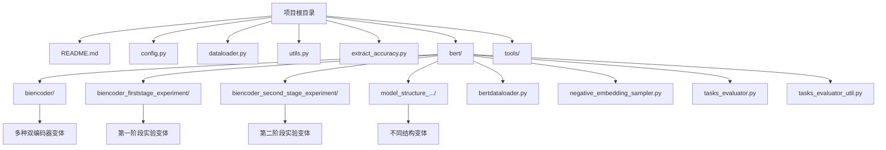
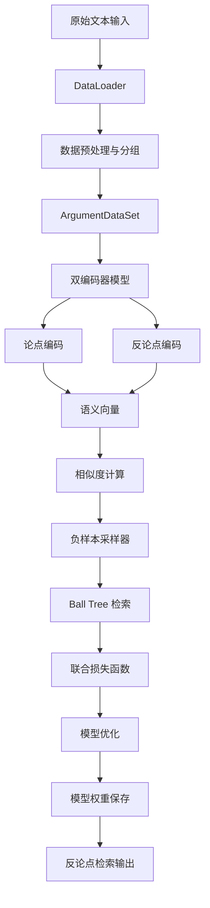
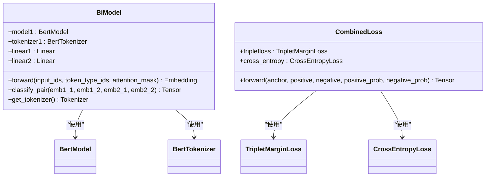
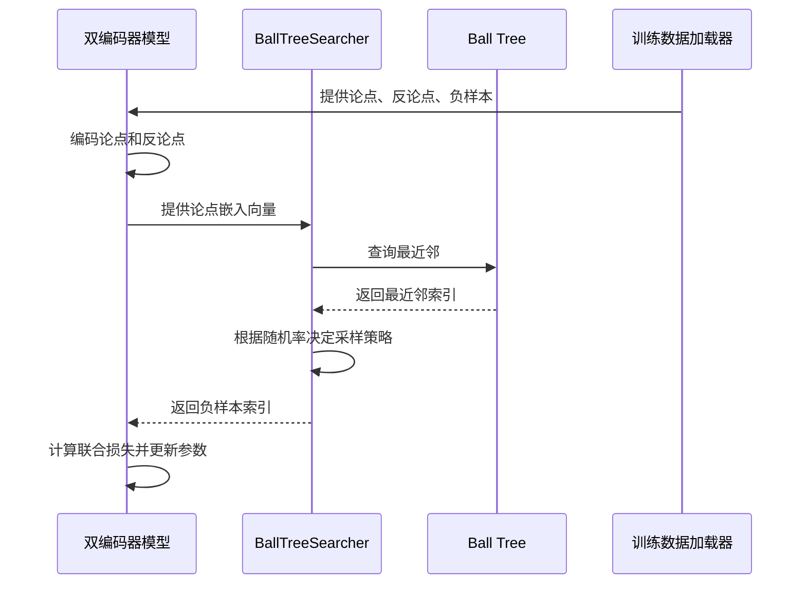
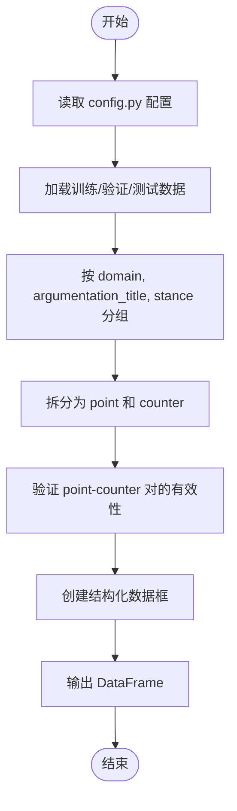
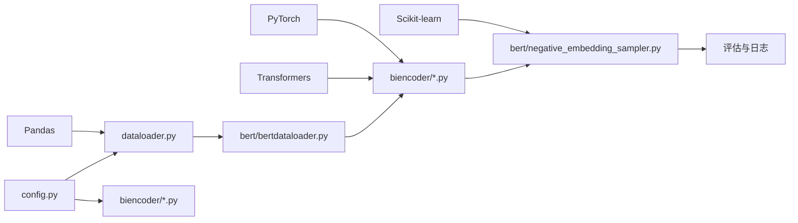

# 项目概述

<cite>
**本文档中引用的文件**  
- [README.md](file://README.md)
- [config.py](file://config.py)
- [dataloader.py](file://dataloader.py)
- [utils.py](file://utils.py)
- [bert/biencoder/biencoder_embedding_classification_concanated_together.py](file://bert/biencoder/biencoder_embedding_classification_concanated_together.py)
- [bert/biencoder/biencoder_embedding_classification_only_cls.py](file://bert/biencoder/biencoder_embedding_classification_only_cls.py)
- [bert/biencoder/biencoder_embedding_classification_only_embedding.py](file://bert/biencoder/biencoder_embedding_classification_only_embedding.py)
- [bert/bertdataloader.py](file://bert/bertdataloader.py)
- [bert/negative_embedding_sampler.py](file://bert/negative_embedding_sampler.py)
- [extract_accuracy.py](file://extract_accuracy.py)
- [tasks_evaluator.py](file://bert/tasks_evaluator.py)
- [tasks_evaluator_util.py](file://bert/tasks_evaluator_util.py)
</cite>

## 目录
1. [引言](#引言)
2. [项目结构](#项目结构)
3. [核心组件](#核心组件)
4. [架构概述](#架构概述)
5. [详细组件分析](#详细组件分析)
6. [依赖分析](#依赖分析)
7. [性能考量](#性能考量)
8. [故障排除指南](#故障排除指南)
9. [结论](#结论)

## 引言

CounterArgumentRetrieval 项目是一个基于 BERT 双编码器架构的反论点检索系统，旨在从自然语言文本中识别和检索与给定论点对立的观点。该项目在自然语言处理（NLP）领域具有重要应用，特别是在论点挖掘、辩论分析和对立观点识别等任务中。系统通过对比学习和语义相似度计算，实现对反论点的高效检索。

目标用户主要包括 NLP 研究人员、机器学习工程师以及对辩论系统、观点挖掘感兴趣的技术人员。项目采用实验驱动的开发模式，通过大量变体文件探索不同模型结构、训练策略和超参数配置的影响，体现了其在模型优化和鲁棒性验证方面的设计哲学。

## 项目结构

CounterArgumentRetrieval 项目采用模块化设计，主要分为数据处理、模型实现、实验配置和工具支持四个部分。项目根目录包含核心配置文件和数据加载器，`bert` 目录下存放所有与 BERT 模型相关的实现，包括双编码器架构、数据集封装和负样本采样器。`tools` 目录提供辅助脚本，`logs` 目录用于存储训练日志和评估结果。

**图示来源**
- [README.md](file://README.md#L1-L7)
- [config.py](file://config.py#L3-L5)
- [dataloader.py](file://dataloader.py#L11-L28)
- [bert/bertdataloader.py](file://bert/bertdataloader.py#L30-L44)

**本节来源**
- [README.md](file://README.md#L1-L7)
- [config.py](file://config.py#L3-L5)
- [dataloader.py](file://dataloader.py#L11-L87)
- [bert/bertdataloader.py](file://bert/bertdataloader.py#L1-L44)

## 核心组件

CounterArgumentRetrieval 项目的核心组件包括数据加载器、双编码器模型、负样本采样器和评估模块。数据加载器负责从指定目录读取原始文本数据，并将其组织为结构化数据框。双编码器模型基于 BERT 架构，分别编码论点和反论点，计算其语义相似度。负样本采样器利用 Ball Tree 数据结构高效检索负样本，用于对比学习。评估模块则负责在多个任务上测试模型性能。

**本节来源**
- [dataloader.py](file://dataloader.py#L11-L87)
- [bert/biencoder/biencoder_embedding_classification_concanated_together.py](file://bert/biencoder/biencoder_embedding_classification_concanated_together.py#L48-L87)
- [bert/negative_embedding_sampler.py](file://bert/negative_embedding_sampler.py#L13-L47)
- [tasks_evaluator.py](file://bert/tasks_evaluator.py#L1-L37)

## 架构概述

CounterArgumentRetrieval 系统采用基于 BERT 的双编码器架构，整体流程从原始文本输入到反论点检索输出。系统首先通过 `DataLoader` 加载和预处理数据，然后利用 `ArgumentDataSet` 将数据转换为模型可接受的格式。在训练阶段，双编码器模型并行编码论点和反论点，通过联合损失函数（结合三元组损失和交叉熵损失）进行优化。负样本采样器动态更新负样本，提高模型的判别能力。评估阶段使用 Ball Tree 结构进行高效检索，并计算 top-k 准确率。

**图示来源**
- [dataloader.py](file://dataloader.py#L11-L87)
- [bert/bertdataloader.py](file://bert/bertdataloader.py#L30-L44)
- [bert/biencoder/biencoder_embedding_classification_concanated_together.py](file://bert/biencoder/biencoder_embedding_classification_concanated_together.py#L48-L87)
- [bert/negative_embedding_sampler.py](file://bert/negative_embedding_sampler.py#L13-L47)

## 详细组件分析

### 双编码器模型分析

CounterArgumentRetrieval 项目实现了多种双编码器变体，核心模型 `BiModel` 继承自 PyTorch 的 `nn.Module`。模型使用预训练的 BERT 模型作为编码器，通过 `forward` 方法生成 [CLS] 标记的嵌入向量，并经过线性层降维。`classify_pair` 方法用于计算论点对的分类概率，通过拼接两个嵌入向量及其差值来捕捉语义关系。

#### 类图

**图示来源**
- [bert/biencoder/biencoder_embedding_classification_concanated_together.py](file://bert/biencoder/biencoder_embedding_classification_concanated_together.py#L48-L87)

**本节来源**
- [bert/biencoder/biencoder_embedding_classification_concanated_together.py](file://bert/biencoder/biencoder_embedding_classification_concanated_together.py#L48-L87)

### 负样本采样器分析

负样本采样器 `BallTreeSearcher` 是系统的关键组件，用于在训练过程中动态生成困难负样本。该组件利用 Ball Tree 数据结构构建论点和反论点的索引，通过最近邻搜索高效检索语义上接近但标签不同的样本。采样策略结合了确定性搜索和随机采样，随机率随训练轮次递减，以平衡模型的探索与利用。

#### 序列图

**图示来源**
- [bert/negative_embedding_sampler.py](file://bert/negative_embedding_sampler.py#L13-L47)

**本节来源**
- [bert/negative_embedding_sampler.py](file://bert/negative_embedding_sampler.py#L13-L47)

### 数据加载与预处理分析

数据加载器 `DataLoader` 负责从文件系统读取原始文本数据，并将其转换为结构化数据框。系统根据配置文件中的路径（`training_dir`, `validation_dir`, `test_dir`）定位数据目录，递归遍历子目录，提取论点文本。`utils.py` 中的 `group_and_split` 函数实现了多种分组策略，支持在不同粒度（如主题、立场）上进行反论点检索任务。

#### 流程图

**图示来源**
- [config.py](file://config.py#L3-L5)
- [dataloader.py](file://dataloader.py#L11-L87)
- [utils.py](file://utils.py#L259-L295)

**本节来源**
- [config.py](file://config.py#L3-L5)
- [dataloader.py](file://dataloader.py#L11-L87)
- [utils.py](file://utils.py#L259-L295)

## 依赖分析

CounterArgumentRetrieval 项目依赖于多个关键的 Python 库，包括 PyTorch 用于深度学习模型实现，Transformers 库提供预训练的 BERT 模型，Pandas 用于数据处理，NumPy 用于数值计算，以及 Scikit-learn 提供 Ball Tree 数据结构。项目内部模块之间存在清晰的依赖关系：`dataloader.py` 依赖 `config.py` 获取路径配置；`biencoder` 模型文件依赖 `bertdataloader.py` 获取数据集；`negative_embedding_sampler.py` 依赖模型生成的嵌入向量进行采样。

**图示来源**
- [config.py](file://config.py#L3-L5)
- [dataloader.py](file://dataloader.py#L6)
- [bert/biencoder/biencoder_embedding_classification_concanated_together.py](file://bert/biencoder/biencoder_embedding_classification_concanated_together.py#L5-L6)
- [bert/negative_embedding_sampler.py](file://bert/negative_embedding_sampler.py#L6)

**本节来源**
- [config.py](file://config.py#L3-L5)
- [dataloader.py](file://dataloader.py#L6)
- [bert/biencoder/biencoder_embedding_classification_concanated_together.py](file://bert/biencoder/biencoder_embedding_classification_concanated_together.py#L5-L6)
- [bert/negative_embedding_sampler.py](file://bert/negative_embedding_sampler.py#L6)

## 性能考量

CounterArgumentRetrieval 项目在性能设计上注重训练效率和检索速度。通过使用 `DataParallel` 实现多 GPU 训练，加速模型训练过程。负样本采样器采用 Ball Tree 数据结构，将最近邻搜索的时间复杂度从 O(n) 降低到 O(log n)，显著提升了采样效率。模型评估采用 top-k 准确率作为核心指标，通过 `extract_accuracy.py` 脚本可视化训练过程中的准确率变化，便于监控模型收敛情况。

## 故障排除指南

当遇到训练不收敛或准确率低的问题时，建议首先检查数据路径配置是否正确（参考 `config.py`）。确保 `data/` 目录下包含 `training/`, `validation/`, `test/` 子目录，且数据格式符合预期。检查日志文件（`logs/` 目录）中的 loss 值变化趋势，若 loss 不下降，可能需要调整学习率或检查负样本采样策略。若检索准确率低，可尝试不同的双编码器变体（如 `only_cls` 或 `only_embedding`）或调整随机采样率。

**本节来源**
- [config.py](file://config.py#L3-L5)
- [extract_accuracy.py](file://extract_accuracy.py#L8-L38)
- [bert/biencoder_firststage_experiment/](file://bert/biencoder_firststage_experiment/)
- [bert/model_structure_with_different_decreased_random_rate/](file://bert/model_structure_with_different_decreased_random_rate/)

## 结论

CounterArgumentRetrieval 项目成功实现了一个基于 BERT 双编码器架构的反论点检索系统。项目通过模块化设计和实验驱动的开发模式，系统地探索了不同模型结构和训练策略对检索性能的影响。其核心创新在于结合了语义相似度计算和动态负样本采样，有效提升了模型的判别能力。该系统为 NLP 领域的论点挖掘和对立观点识别任务提供了有价值的参考实现，具有良好的可扩展性和研究价值。