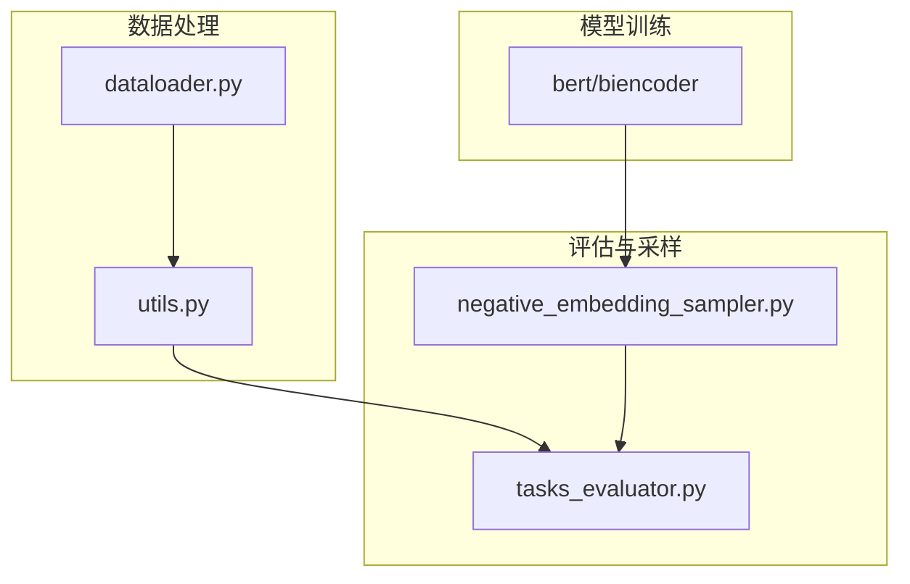
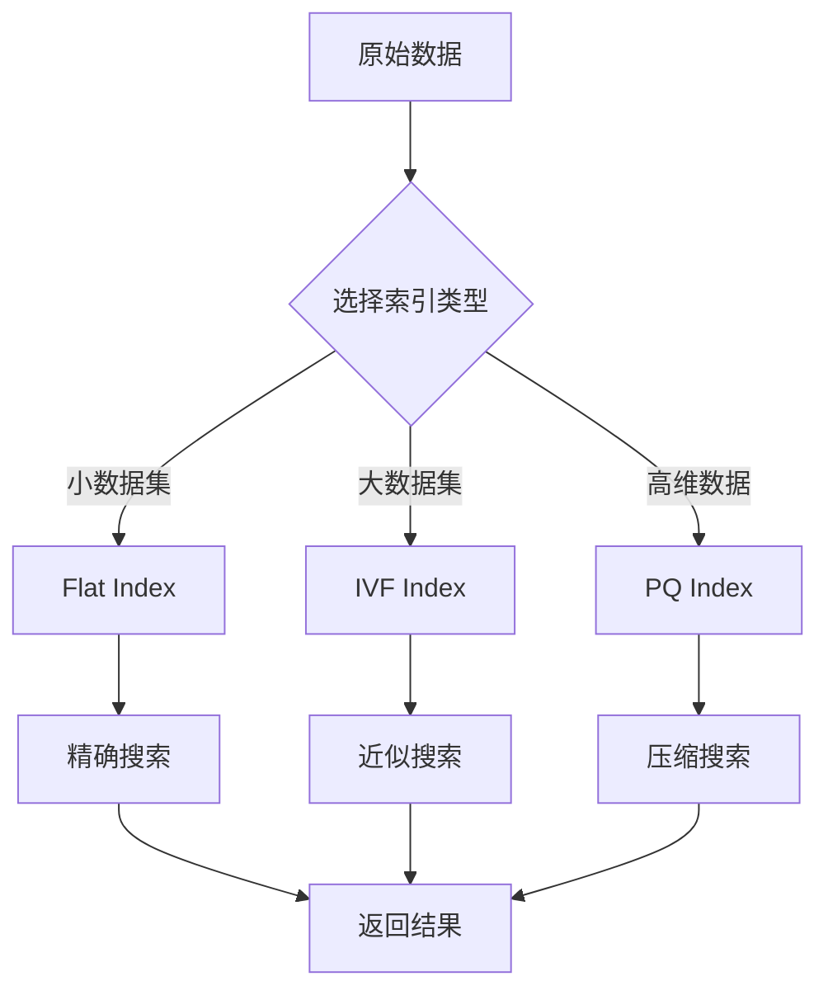
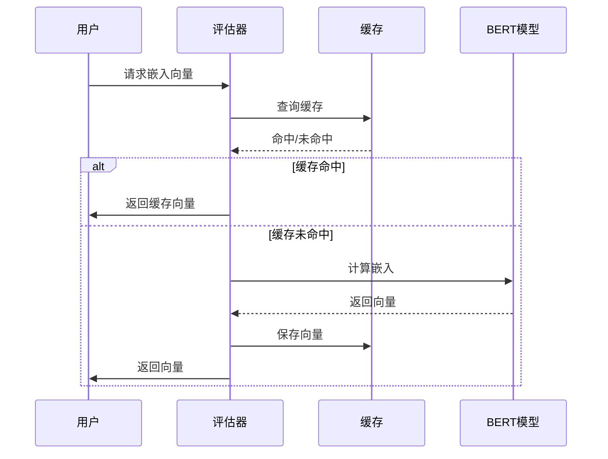
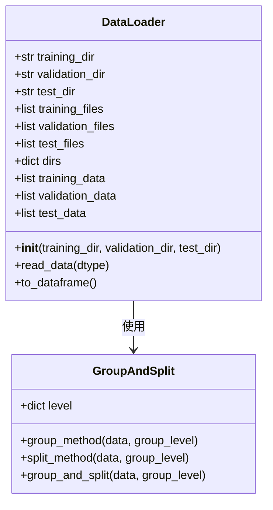
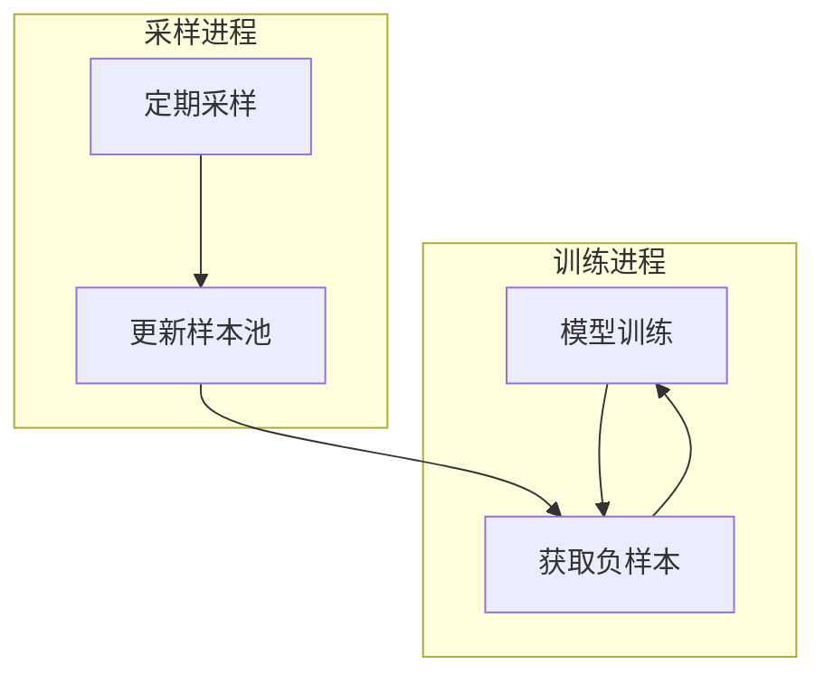

# 性能优化技巧

<cite>
**本文档引用的文件**  
- [utils.py](file://utils.py)
- [negative_embedding_sampler.py](file://bert/negative_embedding_sampler.py)
- [tasks_evaluator.py](file://bert/tasks_evaluator.py)
- [dataloader.py](file://dataloader.py)
- [config.py](file://config.py)
- [bertdataloader.py](file://bert/bertdataloader.py)
</cite>

## 目录
1. [引言](#引言)
2. [项目结构](#项目结构)
3. [核心性能瓶颈分析](#核心性能瓶颈分析)
4. [BallTree性能问题与ANN优化方案](#balltree性能问题与ann优化方案)
5. [模型推理阶段优化策略](#模型推理阶段优化策略)
6. [数据加载效率优化](#数据加载效率优化)
7. [高级训练吞吐量提升技巧](#高级训练吞吐量提升技巧)
8. [结论](#结论)

## 引言
本项目旨在实现反论点检索系统，通过BERT双编码器模型对论点和反论点进行语义匹配。然而，在实际运行过程中，随着数据规模的增长，系统在负样本检索、评估和数据加载等环节出现了显著的性能瓶颈，特别是BallTree构建时间随数据量呈平方级增长的问题。本文将深入分析这些性能瓶颈，并提出一系列优化方案，包括使用近似最近邻（ANN）库替代scikit-learn的BallTree、模型推理优化、数据加载优化以及高级训练技巧，以全面提升系统的训练和推理效率。

## 项目结构
项目采用模块化设计，主要分为数据处理、模型训练和评估三大模块。数据处理模块包括`dataloader.py`和`utils.py`，负责从原始文件中读取和预处理数据；模型训练模块位于`bert/biencoder`目录下，包含多种双编码器模型变体；评估模块包括`tasks_evaluator.py`和`negative_embedding_sampler.py`，用于模型性能评估和负样本采样。

**Diagram sources**
- [dataloader.py](file://dataloader.py#L1-L87)
- [utils.py](file://utils.py#L1-L304)
- [negative_embedding_sampler.py](file://bert/negative_embedding_sampler.py#L1-L92)
- [tasks_evaluator.py](file://bert/tasks_evaluator.py#L1-L37)

**Section sources**
- [dataloader.py](file://dataloader.py#L1-L87)
- [utils.py](file://utils.py#L1-L304)

## 核心性能瓶颈分析
系统的主要性能瓶颈集中在三个环节：BallTree构建与查询、模型推理计算和数据加载过程。其中，BallTree在`negative_embedding_sampler.py`中被用于负样本检索和评估，其构建时间复杂度为O(n²)，当数据量增大时，性能急剧下降。模型推理阶段需要对每个输入文本进行BERT编码，计算开销大。数据加载过程在`dataloader.py`中实现，存在重复读取和处理的问题。

**Section sources**
- [negative_embedding_sampler.py](file://bert/negative_embedding_sampler.py#L1-L92)
- [tasks_evaluator.py](file://bert/tasks_evaluator.py#L1-L37)
- [dataloader.py](file://dataloader.py#L1-L87)

## BallTree性能问题与ANN优化方案
当前系统使用scikit-learn的BallTree进行最近邻搜索，虽然精确但时间复杂度高。建议采用Facebook AI的FAISS库作为替代方案。FAISS是一个高效的近似最近邻搜索库，支持GPU加速，能够将搜索时间从O(n²)降低到O(n log n)甚至O(1)级别。

**Diagram sources**
- [negative_embedding_sampler.py](file://bert/negative_embedding_sampler.py#L6-L19)

**Section sources**
- [negative_embedding_sampler.py](file://bert/negative_embedding_sampler.py#L1-L92)

## 模型推理阶段优化策略
为减少重复计算，建议实施BERT输出缓存和嵌入向量预计算策略。可以在首次推理时将所有文本的BERT嵌入向量保存到磁盘，后续直接加载使用。这需要修改`tasks_evaluator.py`中的`get_embeding`函数，增加缓存读写逻辑。

**Diagram sources**
- [tasks_evaluator.py](file://bert/tasks_evaluator.py#L10-L19)

**Section sources**
- [tasks_evaluator.py](file://bert/tasks_evaluator.py#L1-L37)

## 数据加载效率优化
`utils.py`中的`group_and_split`函数是数据分组和拆分的核心，通过`group_method`和`split_method`实现多级分组策略。为优化数据加载效率，建议在`dataloader.py`中实现数据缓存机制，避免每次训练都重新读取和解析文件。

**Diagram sources**
- [dataloader.py](file://dataloader.py#L11-L28)
- [utils.py](file://utils.py#L259-L295)

**Section sources**
- [utils.py](file://utils.py#L259-L295)
- [dataloader.py](file://dataloader.py#L1-L87)

## 高级训练吞吐量提升技巧
为进一步提升训练效率，建议采用多进程采样和异步负样本更新策略。可以将负样本采样过程与模型训练过程解耦，使用独立的进程定期更新负样本池，实现异步更新。同时，在数据加载时使用PyTorch的DataLoader多进程功能，提高数据吞吐量。

**Diagram sources**
- [bertdataloader.py](file://bert/bertdataloader.py#L5-L6)
- [negative_embedding_sampler.py](file://bert/negative_embedding_sampler.py#L13-L46)

**Section sources**
- [bertdataloader.py](file://bert/bertdataloader.py#L1-L44)
- [negative_embedding_sampler.py](file://bert/negative_embedding_sampler.py#L1-L92)

## 结论
通过对系统性能瓶颈的深入分析，本文提出了从索引结构、模型推理、数据加载到训练策略的全方位优化方案。采用FAISS替代BallTree可显著降低负样本检索时间，实施嵌入向量缓存和预计算能大幅减少重复计算开销，优化数据加载流程可提高I/O效率，而多进程和异步更新策略则能进一步提升整体训练吞吐量。这些优化措施将有效解决当前系统面临的性能挑战，为大规模反论点检索应用提供坚实的技术支持。