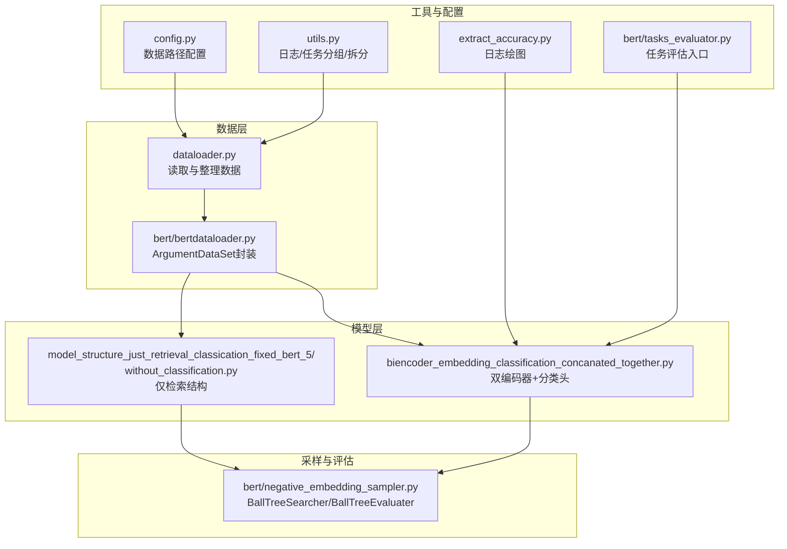
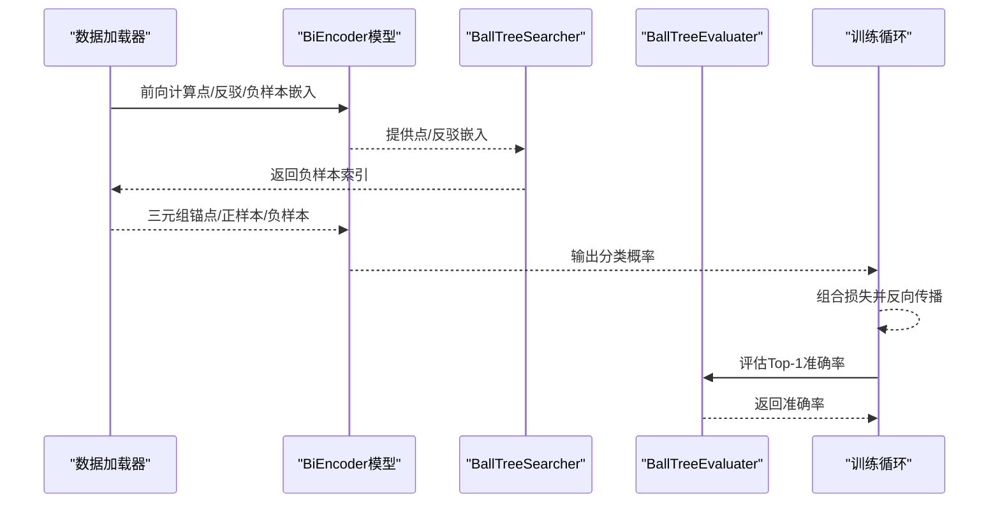
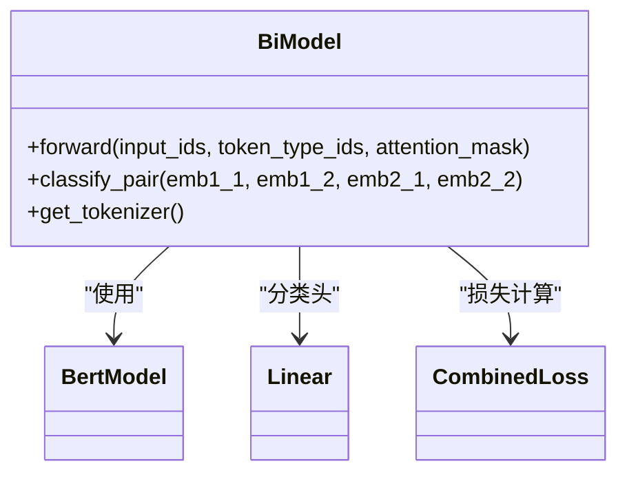
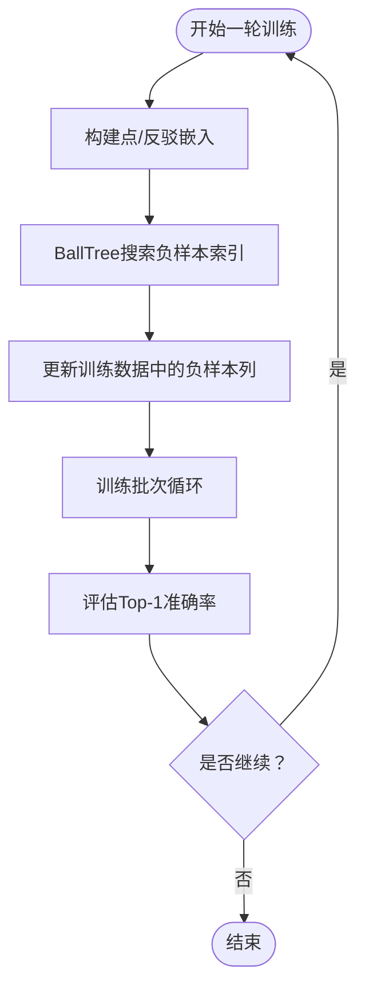
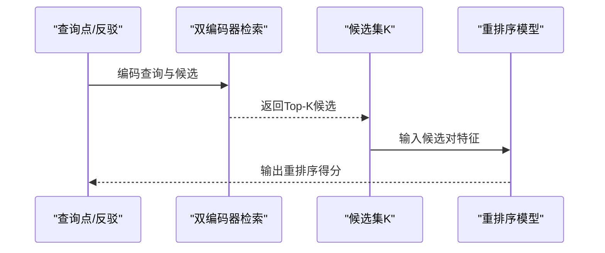
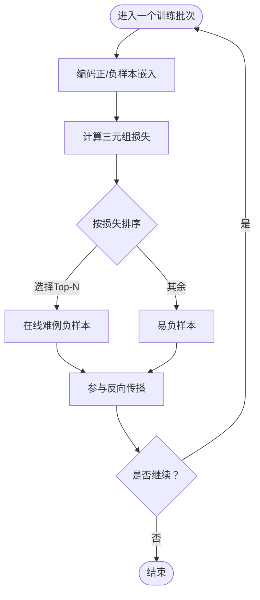
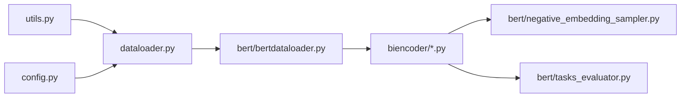

# 未来改进方向

<cite>
**本文引用的文件**
- [README.md](file://README.md)
- [config.py](file://config.py)
- [dataloader.py](file://dataloader.py)
- [bert/bertdataloader.py](file://bert/bertdataloader.py)
- [bert/negative_embedding_sampler.py](file://bert/negative_embedding_sampler.py)
- [bert/biencoder/biencoder_embedding_classification_concanated_together.py](file://bert/biencoder/biencoder_embedding_classification_concanated_together.py)
- [bert/model_structure_just_retrieval_classication_fixed_bert_5/biencoder_embedding_classification_without_classification.py](file://bert/model_structure_just_retrieval_classication_fixed_bert_5/biencoder_embedding_classification_without_classification.py)
- [utils.py](file://utils.py)
- [extract_accuracy.py](file://extract_accuracy.py)
- [bert/tasks_evaluator.py](file://bert/tasks_evaluator.py)
</cite>

## 目录
1. [引言](#引言)
2. [项目结构](#项目结构)
3. [核心组件](#核心组件)
4. [架构总览](#架构总览)
5. [详细组件分析](#详细组件分析)
6. [依赖关系分析](#依赖关系分析)
7. [性能考量](#性能考量)
8. [故障排查指南](#故障排查指南)
9. [结论](#结论)
10. [附录](#附录)

## 引言
本项目围绕论辩反驳检索与分类展开，采用双编码器（BiEncoder）架构：通过预训练语言模型提取句向量，结合对比学习与分类头进行训练，并利用球树（BallTree）进行负样本采样与评估。当前实现以BERT为基础，具备可扩展性与实验空间。本文从“模型结构”“分类头设计”“两阶段检索+重排序”“在线难例挖掘”等维度，提出面向未来的改进方向，旨在提升语义表示能力、分类判别力与训练效率。

## 项目结构
项目采用按功能模块划分的组织方式：
- 数据准备与加载：顶层数据加载器负责读取原始对话文本，转换为统一DataFrame；BERT专用数据集封装点/反驳/负样本三元组。
- 模型实现：位于bert/biencoder及若干实验子目录，包含多种组合与变体，核心为双编码器+分类头。
- 负样本采样与评估：基于嵌入向量的BallTree搜索与评估器，支持Top-K准确率与概率打分。
- 工具与可视化：日志记录、绘图脚本、任务分组与拆分工具。

图表来源
- [dataloader.py](file://dataloader.py#L1-L87)
- [bert/bertdataloader.py](file://bert/bertdataloader.py#L1-L44)
- [bert/biencoder/biencoder_embedding_classification_concanated_together.py](file://bert/biencoder/biencoder_embedding_classification_concanated_together.py#L1-L280)
- [bert/model_structure_just_retrieval_classication_fixed_bert_5/biencoder_embedding_classification_without_classification.py](file://bert/model_structure_just_retrieval_classication_fixed_bert_5/biencoder_embedding_classification_without_classification.py#L1-L284)
- [bert/negative_embedding_sampler.py](file://bert/negative_embedding_sampler.py#L1-L92)
- [config.py](file://config.py#L1-L11)
- [utils.py](file://utils.py#L1-L304)
- [extract_accuracy.py](file://extract_accuracy.py#L1-L38)
- [bert/tasks_evaluator.py](file://bert/tasks_evaluator.py#L1-L37)

章节来源
- [README.md](file://README.md#L1-L7)
- [config.py](file://config.py#L1-L11)
- [dataloader.py](file://dataloader.py#L1-L87)
- [bert/bertdataloader.py](file://bert/bertdataloader.py#L1-L44)

## 核心组件
- 双编码器（BiEncoder）：分别对点（point）与反驳（counter）/负样本（negative）进行编码，输出句向量与[CLS]向量，用于相似度计算与分类头输入。
- 分类头：当前实现为线性层拼接差分特征，输出二分类概率；可扩展为多层感知机（MLP）或注意力融合机制。
- 负样本采样：基于BallTree的最近邻搜索，支持随机率控制与周期性更新策略。
- 训练损失：三元组损失与交叉熵损失的组合，兼顾相似度判别与分类一致性。
- 评估指标：Top-1准确率与概率打分，覆盖多任务场景。

章节来源
- [bert/biencoder/biencoder_embedding_classification_concanated_together.py](file://bert/biencoder/biencoder_embedding_classification_concanated_together.py#L48-L110)
- [bert/negative_embedding_sampler.py](file://bert/negative_embedding_sampler.py#L13-L46)
- [bert/bertdataloader.py](file://bert/bertdataloader.py#L30-L44)

## 架构总览
整体流程包括数据准备、模型前向、负样本采样、损失计算与评估。训练循环中，每轮会重新构建BallTree并更新负样本索引，随后进行分类头训练与评估。

图表来源
- [bert/biencoder/biencoder_embedding_classification_concanated_together.py](file://bert/biencoder/biencoder_embedding_classification_concanated_together.py#L122-L204)
- [bert/negative_embedding_sampler.py](file://bert/negative_embedding_sampler.py#L13-L46)
- [bert/bertdataloader.py](file://bert/bertdataloader.py#L30-L44)

## 详细组件分析

### 组件A：双编码器与分类头
- 结构要点
  - 双编码器共享参数或独立参数均可，当前示例采用DataParallel并复用同一模型实例。
  - 前向返回两类向量：用于相似度计算的句向量与[CLS]向量。
  - 分类头将两对向量及其差分拼接后送入线性层，输出二分类得分。
- 改进方向
  - 引入更先进预训练语言模型（如RoBERTa、DeBERTa），以增强语义表示能力。
  - 设计复杂分类头（MLP或注意力融合），替代简单线性层，提升判别力。
  - 探索“仅检索+重排序”的两阶段架构（见后续章节）。

图表来源
- [bert/biencoder/biencoder_embedding_classification_concanated_together.py](file://bert/biencoder/biencoder_embedding_classification_concanated_together.py#L48-L110)
- [bert/biencoder/biencoder_embedding_classification_concanated_together.py](file://bert/biencoder/biencoder_embedding_classification_concanated_together.py#L129-L141)

章节来源
- [bert/biencoder/biencoder_embedding_classification_concanated_together.py](file://bert/biencoder/biencoder_embedding_classification_concanated_together.py#L48-L110)
- [bert/biencoder/biencoder_embedding_classification_concanated_together.py](file://bert/biencoder/biencoder_embedding_classification_concanated_together.py#L129-L141)

### 组件B：负样本采样与评估
- 球树搜索
  - 构建点/反驳嵌入的BallTree，查询各自最近邻，按距离选择负样本。
  - 支持随机率控制，平衡确定性与多样性。
- 周期性更新
  - 每轮训练后重新抽取负样本索引，逐步降低随机率，提升稳定性。
- 评估
  - 使用BallTreeEvaluater计算Top-1准确率，结合分类头概率打分。

图表来源
- [bert/negative_embedding_sampler.py](file://bert/negative_embedding_sampler.py#L13-L46)
- [bert/biencoder/biencoder_embedding_classification_concanated_together.py](file://bert/biencoder/biencoder_embedding_classification_concanated_together.py#L175-L204)

章节来源
- [bert/negative_embedding_sampler.py](file://bert/negative_embedding_sampler.py#L13-L46)
- [bert/biencoder/biencoder_embedding_classification_concanated_together.py](file://bert/biencoder/biencoder_embedding_classification_concanated_together.py#L175-L204)

### 组件C：两阶段检索+重排序（可行性探索）
- 当前目录“model_structure_just_retrieval_classication_fixed_bert_5”提供“无分类头”的双编码器实现，仅保留句向量与[CLS]向量输出，便于后续接入重排序模块。
- 两阶段思路
  - 阶段一：双编码器检索，快速召回候选对。
  - 阶段二：引入轻量级重排序模型（如MLP/注意力融合），对候选对进行细粒度打分。
- 优势
  - 降低分类头训练成本，提升检索效率与可扩展性。
  - 重排序模块可独立优化，适配不同下游任务。

图表来源
- [bert/model_structure_just_retrieval_classication_fixed_bert_5/biencoder_embedding_classification_without_classification.py](file://bert/model_structure_just_retrieval_classication_fixed_bert_5/biencoder_embedding_classification_without_classification.py#L48-L110)

章节来源
- [bert/model_structure_just_retrieval_classication_fixed_bert_5/biencoder_embedding_classification_without_classification.py](file://bert/model_structure_just_retrieval_classication_fixed_bert_5/biencoder_embedding_classification_without_classification.py#L48-L110)

### 组件D：在线难例挖掘（OHNM）机制
- 现状
  - 当前采用周期性更新策略：每轮训练后重建BallTree并更新负样本索引，同时逐步降低随机率。
- 在线策略建议
  - 在每个训练批次内动态识别“最难负样本”，即在当前batch中使三元组损失最大化的负样本，优先纳入训练。
  - 结合在线难度阈值（如基于batch内损失分布的百分位），动态调整负样本难度。
- 优势
  - 提升训练效率与鲁棒性，避免固定周期导致的过时负样本。
  - 更贴合实际训练动态，加速收敛。

图表来源
- [bert/biencoder/biencoder_embedding_classification_concanated_together.py](file://bert/biencoder/biencoder_embedding_classification_concanated_together.py#L147-L174)
- [bert/negative_embedding_sampler.py](file://bert/negative_embedding_sampler.py#L13-L46)

章节来源
- [bert/biencoder/biencoder_embedding_classification_concanated_together.py](file://bert/biencoder/biencoder_embedding_classification_concanated_together.py#L147-L174)
- [bert/negative_embedding_sampler.py](file://bert/negative_embedding_sampler.py#L13-L46)

## 依赖关系分析
- 模块耦合
  - 数据加载器与BERT数据集紧密耦合，确保三元组格式一致。
  - 模型与负样本采样器解耦，通过嵌入向量接口交互。
  - 评估器依赖模型的分类头方法，用于概率打分。
- 外部依赖
  - Transformers（BERT/RoBERTa/DeBERTa）、PyTorch、BallTree（sklearn）。
- 循环依赖
  - 未发现直接循环导入；训练循环与采样器之间为单向调用。

图表来源
- [dataloader.py](file://dataloader.py#L1-L87)
- [bert/bertdataloader.py](file://bert/bertdataloader.py#L1-L44)
- [bert/biencoder/biencoder_embedding_classification_concanated_together.py](file://bert/biencoder/biencoder_embedding_classification_concanated_together.py#L1-L280)
- [bert/negative_embedding_sampler.py](file://bert/negative_embedding_sampler.py#L1-L92)
- [bert/tasks_evaluator.py](file://bert/tasks_evaluator.py#L1-L37)
- [utils.py](file://utils.py#L1-L304)
- [config.py](file://config.py#L1-L11)

章节来源
- [dataloader.py](file://dataloader.py#L1-L87)
- [bert/bertdataloader.py](file://bert/bertdataloader.py#L1-L44)
- [bert/biencoder/biencoder_embedding_classification_concanated_together.py](file://bert/biencoder/biencoder_embedding_classification_concanated_together.py#L1-L280)
- [bert/negative_embedding_sampler.py](file://bert/negative_embedding_sampler.py#L1-L92)
- [bert/tasks_evaluator.py](file://bert/tasks_evaluator.py#L1-L37)
- [utils.py](file://utils.py#L1-L304)
- [config.py](file://config.py#L1-L11)

## 性能考量
- 模型规模与表示能力
  - 引入RoBERTa/DeBERTa可显著提升语义表征质量，但需注意显存与吞吐开销。
- 分类头复杂度
  - MLP/注意力融合可提升判别力，但会增加参数量与前向时间；可在推理阶段降级为线性层。
- 负样本采样
  - BallTree查询复杂度与数据规模相关；可考虑增量更新或缓存热点样本。
- 训练稳定性
  - 周期性更新与随机率衰减有助于稳定训练；在线OHNM可进一步提升收敛速度与泛化。

## 故障排查指南
- 数据加载异常
  - 检查数据路径配置与文件夹结构，确保训练/验证/测试目录存在且包含预期文件。
- 三元组构建失败
  - 确认DataFrame中“point_text/counter_text/negative_text”列完整，缺失行会被丢弃。
- 负样本索引为空
  - 检查嵌入维度与BallTree构建参数，确保输入非空且维度一致。
- 评估指标异常
  - 核对评估器的合并嵌入顺序与分类头概率计算逻辑，确保Top-K查询正确。

章节来源
- [config.py](file://config.py#L1-L11)
- [dataloader.py](file://dataloader.py#L1-L87)
- [bert/bertdataloader.py](file://bert/bertdataloader.py#L12-L44)
- [bert/negative_embedding_sampler.py](file://bert/negative_embedding_sampler.py#L48-L92)

## 结论
本项目已形成稳定的双编码器+分类头框架，并通过BallTree实现高效的负样本采样与评估。面向未来，建议：
- 将BERT替换为RoBERTa/DeBERTa以提升语义表示能力；
- 设计更复杂的分类头（MLP/注意力融合）以增强判别力；
- 探索“仅检索+重排序”的两阶段架构，将分类头剥离至重排序阶段；
- 引入在线难例挖掘（OHNM），在每个批次动态更新最难负样本，替代周期性更新策略，提升训练效率与鲁棒性。

## 附录
- 任务分组与拆分工具可用于多场景评估，便于对比不同模型结构与采样策略的效果。
- 日志绘图脚本可辅助观察训练过程中的Top-1准确率变化趋势。

章节来源
- [utils.py](file://utils.py#L277-L304)
- [extract_accuracy.py](file://extract_accuracy.py#L1-L38)
- [bert/tasks_evaluator.py](file://bert/tasks_evaluator.py#L1-L37)