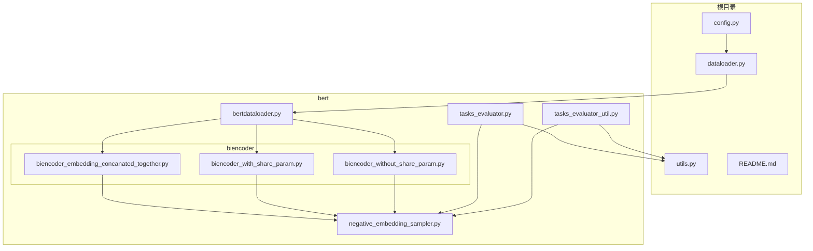
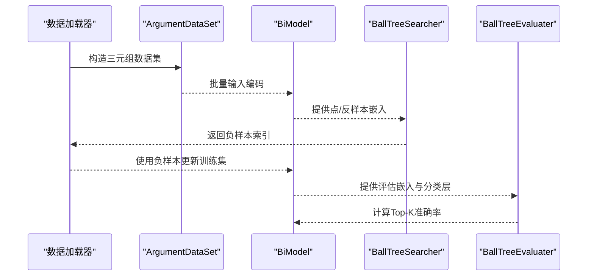
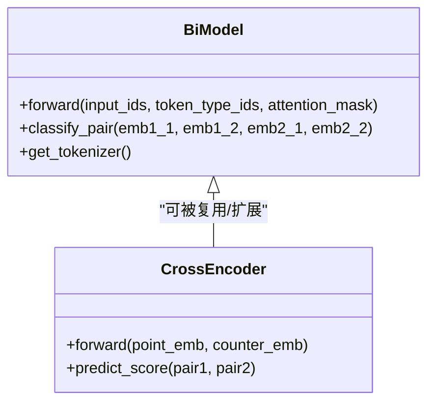
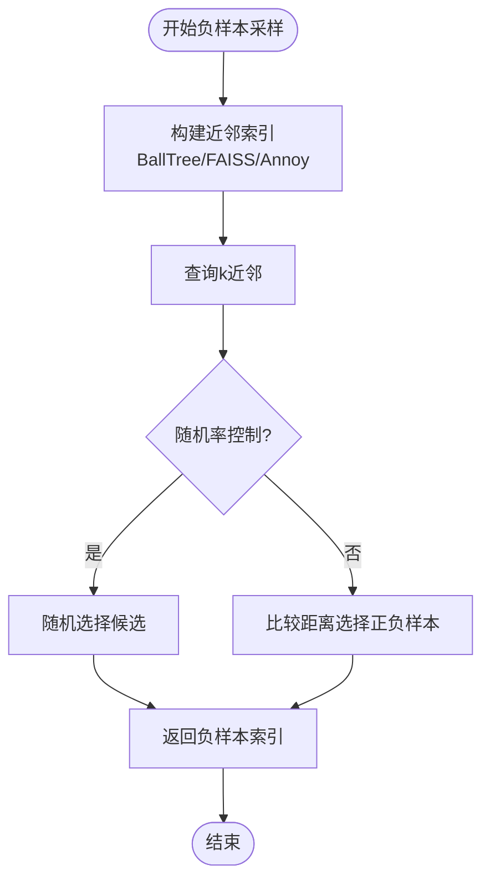
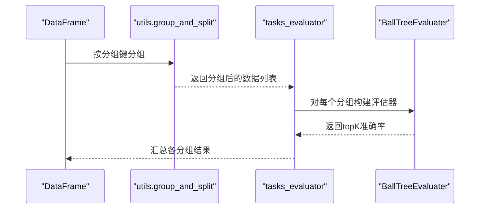
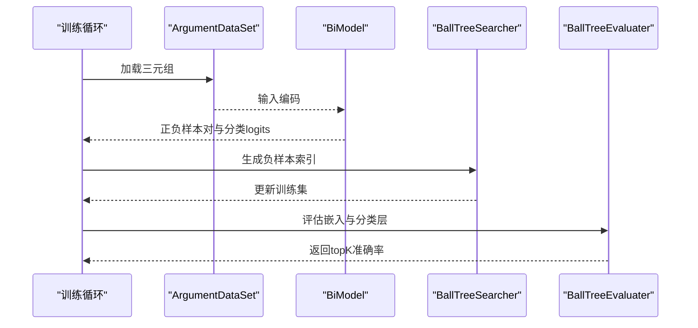
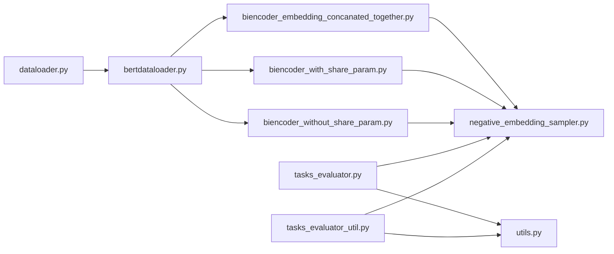

# 框架扩展方法

<cite>
**本文引用的文件**
- [README.md](file://README.md)
- [config.py](file://config.py)
- [dataloader.py](file://dataloader.py)
- [utils.py](file://utils.py)
- [bert/bertdataloader.py](file://bert/bertdataloader.py)
- [bert/negative_embedding_sampler.py](file://bert/negative_embedding_sampler.py)
- [bert/tasks_evaluator.py](file://bert/tasks_evaluator.py)
- [bert/tasks_evaluator_util.py](file://bert/tasks_evaluator_util.py)
- [bert/biencoder/biencoder_embedding_concanated_together.py](file://bert/biencoder/biencoder_embedding_concanated_together.py)
- [bert/biencoder/biencoder_with_share_param.py](file://bert/biencoder/biencoder_with_share_param.py)
- [bert/biencoder/biencoder_without_share_param.py](file://bert/biencoder/biencoder_without_share_param.py)
</cite>

## 目录
1. [引言](#引言)
2. [项目结构](#项目结构)
3. [核心组件](#核心组件)
4. [架构总览](#架构总览)
5. [详细组件分析](#详细组件分析)
6. [依赖关系分析](#依赖关系分析)
7. [性能考量](#性能考量)
8. [故障排查指南](#故障排查指南)
9. [结论](#结论)
10. [附录](#附录)

## 引言
本指南面向希望在现有框架基础上扩展新模型结构与评估流程的开发者。重点围绕以下目标展开：
- 如何通过继承与复写 BiModel 类实现交叉编码器（Cross-Encoder）以提升重排序精度
- 如何扩展 negative_embedding_sampler.py 以支持基于 FAISS 或 Annoy 的高效近邻搜索
- 如何在 tasks_evaluator.py 中注册新的评估任务分组逻辑，并确保与 BallTreeEvaluater 兼容
- 关键集成点：接口一致性、配置文件同步、日志格式规范

## 项目结构
该项目采用“功能模块化 + 层次清晰”的组织方式：
- 根目录提供基础数据加载与配置入口
- bert 子目录承载与 BERT 相关的数据准备、采样器、评估器与多种 BiEncoder 实现
- utils 提供通用分组与切分逻辑
- 多个 biencoder 实现文件演示了不同的模型结构与训练流程

图表来源
- [config.py](file://config.py#L1-L11)
- [dataloader.py](file://dataloader.py#L1-L87)
- [utils.py](file://utils.py#L1-L304)
- [bert/bertdataloader.py](file://bert/bertdataloader.py#L1-L44)
- [bert/negative_embedding_sampler.py](file://bert/negative_embedding_sampler.py#L1-L92)
- [bert/tasks_evaluator.py](file://bert/tasks_evaluator.py#L1-L37)
- [bert/tasks_evaluator_util.py](file://bert/tasks_evaluator_util.py#L1-L101)
- [bert/biencoder/biencoder_embedding_concanated_together.py](file://bert/biencoder/biencoder_embedding_concanated_together.py#L1-L280)
- [bert/biencoder/biencoder_with_share_param.py](file://bert/biencoder/biencoder_with_share_param.py#L1-L278)
- [bert/biencoder/biencoder_without_share_param.py](file://bert/biencoder/biencoder_without_share_param.py#L1-L278)

章节来源
- [README.md](file://README.md#L1-L7)
- [config.py](file://config.py#L1-L11)
- [dataloader.py](file://dataloader.py#L1-L87)
- [utils.py](file://utils.py#L1-L304)
- [bert/bertdataloader.py](file://bert/bertdataloader.py#L1-L44)
- [bert/negative_embedding_sampler.py](file://bert/negative_embedding_sampler.py#L1-L92)
- [bert/tasks_evaluator.py](file://bert/tasks_evaluator.py#L1-L37)
- [bert/tasks_evaluator_util.py](file://bert/tasks_evaluator_util.py#L1-L101)
- [bert/biencoder/biencoder_embedding_concanated_together.py](file://bert/biencoder/biencoder_embedding_concanated_together.py#L1-L280)
- [bert/biencoder/biencoder_with_share_param.py](file://bert/biencoder/biencoder_with_share_param.py#L1-L278)
- [bert/biencoder/biencoder_without_share_param.py](file://bert/biencoder/biencoder_without_share_param.py#L1-L278)

## 核心组件
- 数据加载与预处理
  - 根级 DataLoader：从指定目录读取论辩文本，构造训练/验证/测试 DataFrame
  - bertdataloader.ArgumentDataSet：将 DataFrame 转换为三元组（正样本点、反样本点、负样本）
- 嵌入采样与评估
  - BallTreeSearcher：基于 BallTree 的近邻搜索，用于生成负样本索引
  - BallTreeEvaluater：基于 BallTree 的评估器，结合分类层计算正样本概率并评估 Top-K 准确率
- 模型结构
  - BiModel：BERT 双塔编码器，提供 forward 与 pair 分类接口；多个 biencoder 文件展示了不同组合与损失策略
- 评估任务分组
  - utils.group_and_split：按领域、立场强度等维度对数据进行分组与拆分
  - tasks_evaluator/tasks_evaluator_util：定义任务分组集合与评估流程

章节来源
- [dataloader.py](file://dataloader.py#L1-L87)
- [bert/bertdataloader.py](file://bert/bertdataloader.py#L1-L44)
- [bert/negative_embedding_sampler.py](file://bert/negative_embedding_sampler.py#L1-L92)
- [bert/tasks_evaluator.py](file://bert/tasks_evaluator.py#L1-L37)
- [bert/tasks_evaluator_util.py](file://bert/tasks_evaluator_util.py#L1-L101)
- [utils.py](file://utils.py#L1-L304)
- [bert/biencoder/biencoder_embedding_concanated_together.py](file://bert/biencoder/biencoder_embedding_concanated_together.py#L1-L280)

## 架构总览
整体流程由“数据准备 -> 嵌入提取 -> 负样本采样 -> 训练 -> 评估”构成。BiEncoder 模型负责编码，BallTreeSearcher/BallTreeEvaluater 提供高效的近邻搜索与评估能力，utils 提供灵活的任务分组策略。

图表来源
- [bert/bertdataloader.py](file://bert/bertdataloader.py#L1-L44)
- [bert/negative_embedding_sampler.py](file://bert/negative_embedding_sampler.py#L1-L92)
- [bert/biencoder/biencoder_embedding_concanated_together.py](file://bert/biencoder/biencoder_embedding_concanated_together.py#L1-L280)

## 详细组件分析

### 组件A：BiModel 与 Cross-Encoder 扩展
- 接口一致性
  - BiModel.forward：返回两个向量，分别用于相似度计算与 pair 分类
  - BiModel.classify_pair：接收四路嵌入，拼接差分与差分绝对值，输出二分类 logits
- 扩展建议
  - 新增 Cross-Encoder：在 BiModel 上新增 classify_pair 的交叉编码器实现，保持输入签名一致
  - 重写 evaluate 流程：在评估阶段调用新的交叉编码器进行重排序，替换原有 BallTreeEvaluater 的分类层
  - 配置同步：在 config.py 中新增交叉编码器相关参数（如是否启用交叉编码器、是否冻结编码器等）
  - 日志规范：统一使用 utils.logger 输出训练/评估日志，确保字段一致（如 epoch、loss、topK 准确率）

图表来源
- [bert/biencoder/biencoder_embedding_concanated_together.py](file://bert/biencoder/biencoder_embedding_concanated_together.py#L48-L78)
- [bert/negative_embedding_sampler.py](file://bert/negative_embedding_sampler.py#L48-L92)

章节来源
- [bert/biencoder/biencoder_embedding_concanated_together.py](file://bert/biencoder/biencoder_embedding_concanated_together.py#L48-L78)
- [bert/negative_embedding_sampler.py](file://bert/negative_embedding_sampler.py#L48-L92)

### 组件B：负样本采样器扩展（FAISS/Annoy）
- 现状
  - BallTreeSearcher 基于 BallTree 进行 k 近邻搜索，支持随机率控制与正负样本选择策略
- 扩展方案
  - 新增 FAISSSearcher/AnnoySearcher：实现与 BallTreeSearcher 一致的 search 接口，内部使用 FAISS/Annoy 构建索引
  - 评估兼容：BallTreeEvaluater 依赖 classify_pair 层，FAISS/AnnoySearcher 不影响评估接口
  - 性能优化：FAISS/Annoy 在大规模向量检索场景下具有更优的吞吐与内存占用
  - 配置同步：在 config.py 中新增索引类型与索引参数（如 nlist、nprobe、n_trees 等）
  - 日志规范：记录索引构建耗时、查询耗时、召回率等指标

图表来源
- [bert/negative_embedding_sampler.py](file://bert/negative_embedding_sampler.py#L1-L47)

章节来源
- [bert/negative_embedding_sampler.py](file://bert/negative_embedding_sampler.py#L1-L47)

### 组件C：评估任务分组与注册
- 现状
  - tasks_evaluator.py 定义了 8 个任务分组（按领域、立场强度等），通过 group_and_split 实现
  - tasks_evaluator_util.py 提供了 BallTreeEvaluater 的另一种实现，便于在不同场景下切换
- 扩展方案
  - 注册新分组：在 utils.group_and_split 中新增分组键与对应切分函数映射
  - 评估兼容：BallTreeEvaluater 的接口（cal_accuracy/get_prob）保持不变，确保新分组可直接复用
  - 配置同步：在 config.py 中新增评估任务列表与评估参数
  - 日志规范：统一输出各分组的 topK 准确率、评估耗时等信息

图表来源
- [utils.py](file://utils.py#L259-L296)
- [bert/tasks_evaluator.py](file://bert/tasks_evaluator.py#L1-L37)
- [bert/tasks_evaluator_util.py](file://bert/tasks_evaluator_util.py#L1-L101)

章节来源
- [utils.py](file://utils.py#L259-L296)
- [bert/tasks_evaluator.py](file://bert/tasks_evaluator.py#L1-L37)
- [bert/tasks_evaluator_util.py](file://bert/tasks_evaluator_util.py#L1-L101)

### 组件D：训练与评估流水线
- 训练阶段
  - 通过 ArgumentDataSet 获取三元组样本，BiModel 编码后计算 triplet loss 与交叉熵损失
  - 使用 BallTreeSearcher 动态生成负样本索引，逐步提高随机率衰减
- 评估阶段
  - 使用 BallTreeEvaluater 计算 topK 准确率，结合交叉编码器进行重排序

图表来源
- [bert/bertdataloader.py](file://bert/bertdataloader.py#L1-L44)
- [bert/negative_embedding_sampler.py](file://bert/negative_embedding_sampler.py#L1-L92)
- [bert/biencoder/biencoder_embedding_concanated_together.py](file://bert/biencoder/biencoder_embedding_concanated_together.py#L120-L278)

章节来源
- [bert/bertdataloader.py](file://bert/bertdataloader.py#L1-L44)
- [bert/negative_embedding_sampler.py](file://bert/negative_embedding_sampler.py#L1-L92)
- [bert/biencoder/biencoder_embedding_concanated_together.py](file://bert/biencoder/biencoder_embedding_concanated_together.py#L120-L278)

## 依赖关系分析
- 组件耦合
  - BiModel 与 ArgumentDataSet、DataLoader 高内聚，训练流程清晰
  - BallTreeSearcher/BallTreeEvaluater 与 BiModel 解耦，通过嵌入接口交互
  - 评估任务分组通过 utils.group_and_split 与具体评估器解耦
- 外部依赖
  - sklearn.neighbors.BallTree：用于近邻搜索与评估
  - torch/torchvision：用于模型训练与推理
  - pandas/numpy：用于数据处理与向量操作

图表来源
- [dataloader.py](file://dataloader.py#L1-L87)
- [bert/bertdataloader.py](file://bert/bertdataloader.py#L1-L44)
- [bert/negative_embedding_sampler.py](file://bert/negative_embedding_sampler.py#L1-L92)
- [bert/tasks_evaluator.py](file://bert/tasks_evaluator.py#L1-L37)
- [bert/tasks_evaluator_util.py](file://bert/tasks_evaluator_util.py#L1-L101)
- [utils.py](file://utils.py#L1-L304)
- [bert/biencoder/biencoder_embedding_concanated_together.py](file://bert/biencoder/biencoder_embedding_concanated_together.py#L1-L280)
- [bert/biencoder/biencoder_with_share_param.py](file://bert/biencoder/biencoder_with_share_param.py#L1-L278)
- [bert/biencoder/biencoder_without_share_param.py](file://bert/biencoder/biencoder_without_share_param.py#L1-L278)

章节来源
- [dataloader.py](file://dataloader.py#L1-L87)
- [bert/bertdataloader.py](file://bert/bertdataloader.py#L1-L44)
- [bert/negative_embedding_sampler.py](file://bert/negative_embedding_sampler.py#L1-L92)
- [bert/tasks_evaluator.py](file://bert/tasks_evaluator.py#L1-L37)
- [bert/tasks_evaluator_util.py](file://bert/tasks_evaluator_util.py#L1-L101)
- [utils.py](file://utils.py#L1-L304)
- [bert/biencoder/biencoder_embedding_concanated_together.py](file://bert/biencoder/biencoder_embedding_concanated_together.py#L1-L280)
- [bert/biencoder/biencoder_with_share_param.py](file://bert/biencoder/biencoder_with_share_param.py#L1-L278)
- [bert/biencoder/biencoder_without_share_param.py](file://bert/biencoder/biencoder_without_share_param.py#L1-L278)

## 性能考量
- 近邻搜索
  - BallTree：适合中小规模向量，查询与构建开销适中
  - FAISS/Annoy：适合大规模向量检索，需关注索引参数（如 nlist、nprobe、n_trees）对性能与内存的影响
- 训练稳定性
  - triplet loss 与交叉熵损失的权重平衡对收敛性有显著影响
  - 随机率衰减策略有助于稳定训练初期的负样本质量
- 评估效率
  - 评估阶段可缓存嵌入与 BallTree，避免重复构建
  - 评估器的 get_prob 仅在 topK 内进行，注意 topK 设置对评估时间的影响

## 故障排查指南
- 数据加载异常
  - 检查 config.py 中训练/验证/测试目录路径是否正确
  - 确认 dataloader.py 能正确读取文件并构造 DataFrame
- 嵌入维度不匹配
  - 确保 BiModel.forward 输出的维度与后续分类层输入一致
  - 检查 ArgumentDataSet 的三元组字段与训练脚本中的列名一致
- 评估器报错
  - 确认 BallTreeEvaluater 的 classify_pair 层与 BiModel.classify_pair 签名一致
  - 若使用 FAISS/AnnoySearcher，请检查索引构建与查询参数
- 日志与可视化
  - 使用 utils.logger 输出关键指标（epoch、loss、topK 准确率），便于定位问题

章节来源
- [config.py](file://config.py#L1-L11)
- [dataloader.py](file://dataloader.py#L1-L87)
- [bert/bertdataloader.py](file://bert/bertdataloader.py#L1-L44)
- [bert/negative_embedding_sampler.py](file://bert/negative_embedding_sampler.py#L1-L92)
- [utils.py](file://utils.py#L297-L304)

## 结论
通过遵循接口一致性、配置同步与日志规范，开发者可以平滑地在现有框架上扩展新的模型结构与评估流程。建议优先实现 FAISS/AnnoySearcher 以提升大规模检索性能，并在 tasks_evaluator 中注册新的评估分组，确保与 BallTreeEvaluater 的兼容性。同时，保持 BiModel 的 forward 与 classify_pair 接口稳定，以便交叉编码器无缝接入。

## 附录
- 关键文件清单
  - 数据与配置：config.py、dataloader.py、bert/bertdataloader.py
  - 采样与评估：bert/negative_embedding_sampler.py、bert/tasks_evaluator.py、bert/tasks_evaluator_util.py
  - 模型实现：bert/biencoder/*.py
  - 工具与日志：utils.py、utils.logger