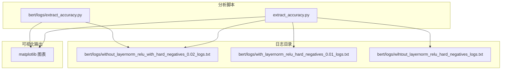
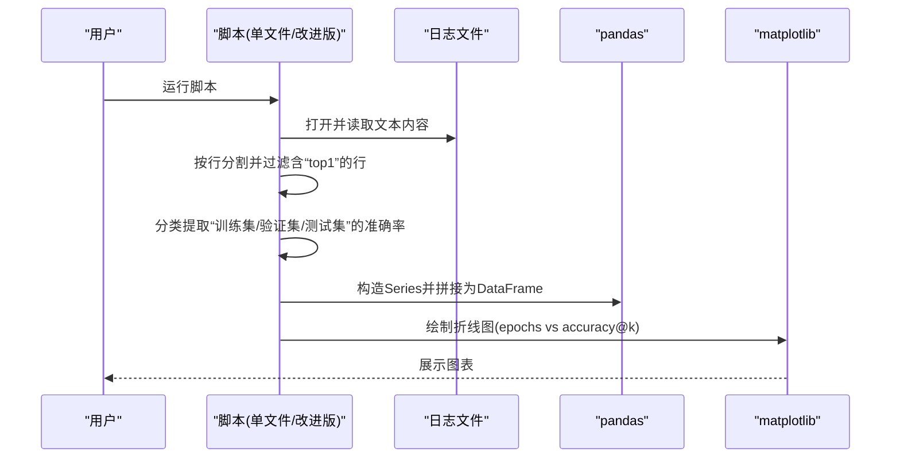
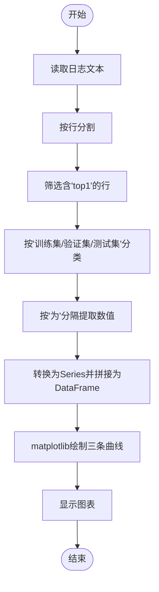
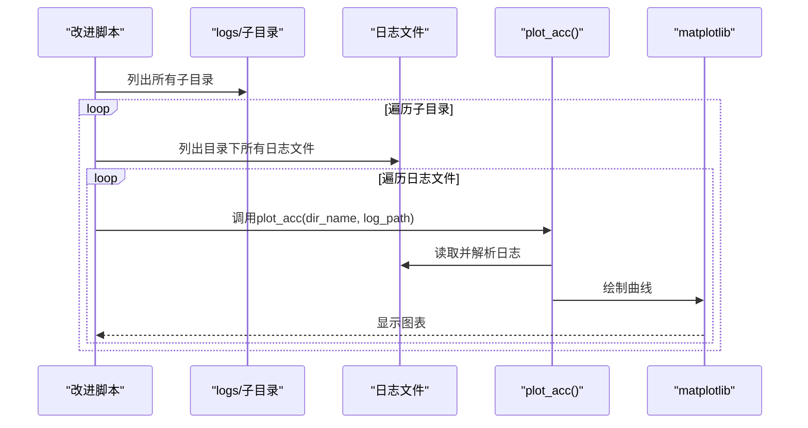
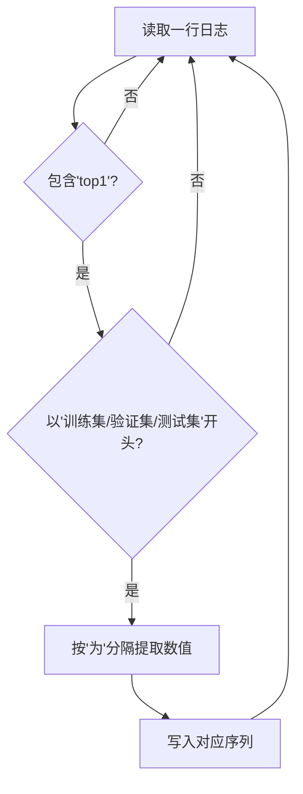
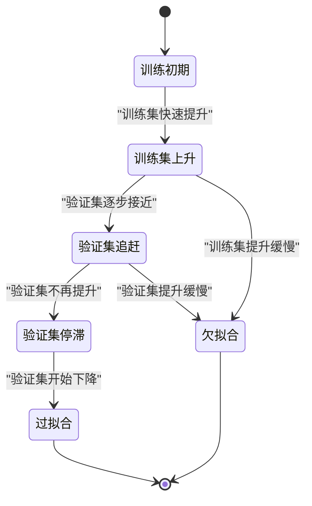
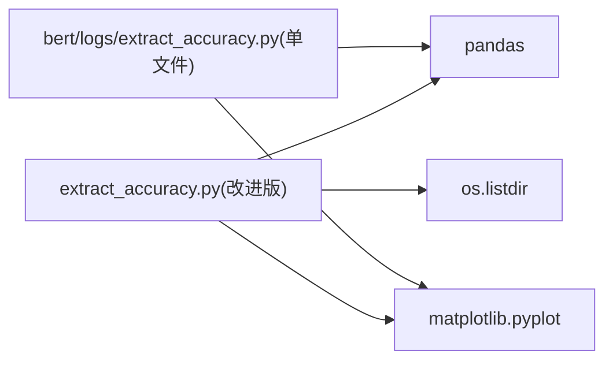

# 训练日志分析

<cite>
**本文引用的文件**
- [extract_accuracy.py](file://bert/logs/extract_accuracy.py)
- [extract_accuracy.py](file://extract_accuracy.py)
- [without_layernorm_relu_with_hard_negatives_0.02_logs.txt](file://bert/logs/without_layernorm_relu_with_hard_negatives_0.02_logs.txt)
- [with_layernorm_relu_hard_negatives_0.01_logs.txt](file://bert/logs/with_layernorm_relu_hard_negatives_0.01_logs.txt)
- [wihtout_layernorm_relu_hard_negatives_logs.txt](file://bert/logs/wihtout_layernorm_relu_hard_negatives_logs.txt)
- [README.md](file://README.md)
</cite>

## 目录
1. [简介](#简介)
2. [项目结构](#项目结构)
3. [核心组件](#核心组件)
4. [架构总览](#架构总览)
5. [详细组件分析](#详细组件分析)
6. [依赖关系分析](#依赖关系分析)
7. [性能考量](#性能考量)
8. [故障排查指南](#故障排查指南)
9. [结论](#结论)
10. [附录](#附录)

## 简介
本文件面向使用该仓库进行训练日志分析的用户，系统讲解如何利用脚本从训练日志中提取“训练集/验证集/测试集”的 top-k 准确率曲线，并结合 matplotlib 进行可视化；同时提供如何解读准确率趋势以识别过拟合与欠拟合的方法，以及如何通过损失值与准确率的关联性辅助判断学习率设置是否合理。最后给出日志关键字匹配规则与解析逻辑说明，并演示如何修改脚本以适配新的日志格式或提取额外指标。

## 项目结构
围绕“训练日志分析”的核心文件位于 bert/logs 与根目录两个位置：
- bert/logs/extract_accuracy.py：单文件示例脚本，直接读取某一个日志文件并绘制曲线。
- extract_accuracy.py：改进版脚本，自动遍历 logs 下的子目录与日志文件，批量提取并可视化多组实验结果。
- 日志文件：位于 bert/logs/ 下，包含若干以“_logs.txt”结尾的日志文件，记录每个 epoch 的 loss 与各集合的 top-k 准确率。

图表来源
- [extract_accuracy.py](file://bert/logs/extract_accuracy.py#L1-L26)
- [extract_accuracy.py](file://extract_accuracy.py#L1-L38)
- [without_layernorm_relu_with_hard_negatives_0.02_logs.txt](file://bert/logs/without_layernorm_relu_with_hard_negatives_0.02_logs.txt#L1-L200)

章节来源
- [README.md](file://README.md#L1-L7)

## 核心组件
- 单文件脚本（bert/logs/extract_accuracy.py）
  - 功能：读取指定日志文件，筛选包含“top1”的行，按“训练集/验证集/测试集”分类提取准确率数值，构造 Series 并合并为 DataFrame，最后用 matplotlib 绘制三条曲线。
  - 关键点：硬编码了日志路径、使用“top1”作为关键词过滤、使用“为”字分隔符提取数值。
- 改进脚本（extract_accuracy.py）
  - 功能：自动扫描 logs/ 下的子目录与文件，逐个调用解析函数，批量绘制多组实验对比曲线。
  - 关键点：封装了 plot_acc(dir_name, log_path) 用于单次解析与绘图；通过 os.listdir 遍历目录；标题与图例由目录名与文件名组合生成。

章节来源
- [extract_accuracy.py](file://bert/logs/extract_accuracy.py#L1-L26)
- [extract_accuracy.py](file://extract_accuracy.py#L1-L38)

## 架构总览
下面的时序图展示了从日志到可视化的完整流程，包括单文件脚本与改进脚本两种模式。

图表来源
- [extract_accuracy.py](file://bert/logs/extract_accuracy.py#L1-L26)
- [extract_accuracy.py](file://extract_accuracy.py#L1-L38)

## 详细组件分析

### 组件A：单文件脚本（bert/logs/extract_accuracy.py）
- 输入：固定路径的日志文件
- 处理流程：
  - 读取全文并按行分割
  - 过滤包含“top1”的行
  - 对每类集合（训练集/验证集/测试集）按“为”字分隔提取数值
  - 转换为 Series 并拼接为 DataFrame
  - 使用 matplotlib 绘制三条曲线并显示
- 输出：一张包含训练/验证/测试三条曲线的图表

图表来源
- [extract_accuracy.py](file://bert/logs/extract_accuracy.py#L1-L26)

章节来源
- [extract_accuracy.py](file://bert/logs/extract_accuracy.py#L1-L26)

### 组件B：改进脚本（extract_accuracy.py）
- 输入：logs/ 目录下的多个子目录与日志文件
- 处理流程：
  - 遍历 logs/ 子目录
  - 遍历每个子目录中的日志文件
  - 调用 plot_acc(dir_name, log_path) 完成单次解析与绘图
- 输出：对每个日志文件生成一张图表，便于横向对比不同实验配置

图表来源
- [extract_accuracy.py](file://extract_accuracy.py#L1-L38)

章节来源
- [extract_accuracy.py](file://extract_accuracy.py#L1-L38)

### 组件C：日志文件格式与关键字匹配规则
- 日志中每轮 epoch 结束后会打印三行，分别对应训练集、验证集、测试集的 top-k 准确率。
- 匹配规则：
  - 行内必须包含“top1”（或相应 top-k）作为关键词
  - 以“训练集/验证集/测试集”开头标识集合类型
  - 使用“为”作为分隔符提取准确率数值
- 示例（节选）：
  - 训练集top1 accuracy为0.26666666666666666
  - 验证集top1 accuracy为0.2345679012345679
  - 测试集top1 accuracy为0.3068181818181818

图表来源
- [without_layernorm_relu_with_hard_negatives_0.02_logs.txt](file://bert/logs/without_layernorm_relu_with_hard_negatives_0.02_logs.txt#L1-L200)
- [with_layernorm_relu_hard_negatives_0.01_logs.txt](file://bert/logs/with_layernorm_relu_hard_negatives_0.01_logs.txt#L1-L200)
- [wihtout_layernorm_relu_hard_negatives_logs.txt](file://bert/logs/wihtout_layernorm_relu_hard_negatives_logs.txt#L1-L200)

章节来源
- [without_layernorm_relu_with_hard_negatives_0.02_logs.txt](file://bert/logs/without_layernorm_relu_with_hard_negatives_0.02_logs.txt#L1-L200)
- [with_layernorm_relu_hard_negatives_0.01_logs.txt](file://bert/logs/with_layernorm_relu_hard_negatives_0.01_logs.txt#L1-L200)
- [wihtout_layernorm_relu_hard_negatives_logs.txt](file://bert/logs/wihtout_layernorm_relu_hard_negatives_logs.txt#L1-L200)

### 组件D：如何解读准确率趋势与识别过拟合/欠拟合
- 过拟合：训练集准确率持续上升，验证集准确率在某个点后不再提升甚至开始下降。
- 欠拟合：训练集与验证集准确率均未达到较高水平且增长缓慢。
- 建议观察要点：
  - 训练集与验证集曲线的相对位置与收敛速度
  - 是否出现“验证集曲线停滞或回退”的迹象
  - 与损失值（loss）的联动：若验证集准确率下降但 loss 仍在下降，可能需要降低学习率或增加正则

（此图为概念性流程图，不直接映射具体源码）

## 依赖关系分析
- 外部依赖
  - pandas：用于构造 Series 与 DataFrame，进行列拼接与索引管理
  - matplotlib：用于绘制 epochs 与 accuracy 的折线图
  - os：用于遍历 logs/ 目录结构
- 内部依赖
  - 改进脚本依赖单文件脚本的解析逻辑（二者共享相同的日志解析规则）

图表来源
- [extract_accuracy.py](file://extract_accuracy.py#L1-L38)
- [extract_accuracy.py](file://bert/logs/extract_accuracy.py#L1-L26)

章节来源
- [extract_accuracy.py](file://extract_accuracy.py#L1-L38)
- [extract_accuracy.py](file://bert/logs/extract_accuracy.py#L1-L26)

## 性能考量
- 文件读取与字符串处理：日志文件通常较大，建议仅在必要时一次性读取全文；若内存受限，可考虑逐行读取并流式过滤。
- 数据结构选择：pandas Series 与 concat 在小到中等规模数据上性能良好；大规模数据可考虑使用 numpy 或优化的 pandas 接口。
- 可视化渲染：matplotlib 渲染大量数据点时可能较慢，可通过减少采样点或调整图表分辨率优化。

（本节为通用建议，不直接分析具体文件）

## 故障排查指南
- 无法找到日志文件
  - 检查脚本中硬编码的路径是否正确；改进脚本默认读取 logs/ 目录，请确认日志文件放置位置。
- 解析不到任何数据
  - 确认日志中每轮 epoch 结尾确实包含“训练集/验证集/测试集”的 top-k 准确率行
  - 确认过滤关键词“top1”与分隔符“为”与日志一致
- 图表无显示或报错
  - 确保已安装 pandas 与 matplotlib
  - 若在某些环境中无法弹窗显示，可改为保存图片到文件后再查看

章节来源
- [extract_accuracy.py](file://extract_accuracy.py#L1-L38)
- [extract_accuracy.py](file://bert/logs/extract_accuracy.py#L1-L26)

## 结论
通过本仓库提供的脚本，用户可以快速从训练日志中提取训练集、验证集与测试集的 top-k 准确率，并以折线图直观呈现。结合准确率趋势与损失值的联动分析，能够有效辅助判断是否存在过拟合或欠拟合问题，并为学习率等超参数的调整提供参考依据。对于新日志格式，只需遵循“包含 top-k 关键词 + 集合前缀 + 数值分隔符”的约定，即可轻松扩展脚本以支持更多指标与格式。

## 附录

### 如何修改脚本以支持新日志格式或提取额外指标
- 新增 top-k 指标
  - 在过滤阶段增加对“top2/top3/...”的匹配条件
  - 在列名与 legend 中添加对应标签
- 新增集合类型
  - 在分类阶段增加新的集合前缀（如“测试集A/B/C”）
  - 在 DataFrame 列名与绘图中补充对应列
- 新增其他指标（如 loss）
  - 在日志中定位包含“loss”的行，按相同方式提取数值并拼接到 DataFrame
  - 在绘图时添加第二纵轴或双轴图以同时展示 loss 与 accuracy
- 适配不同分隔符
  - 修改分隔符提取逻辑，确保能正确切分数值
- 自动化对比
  - 保持改进脚本的目录遍历结构，新增实验配置时只需将日志文件放入对应子目录即可自动生成对比图

（本节为方法性说明，不直接分析具体文件）