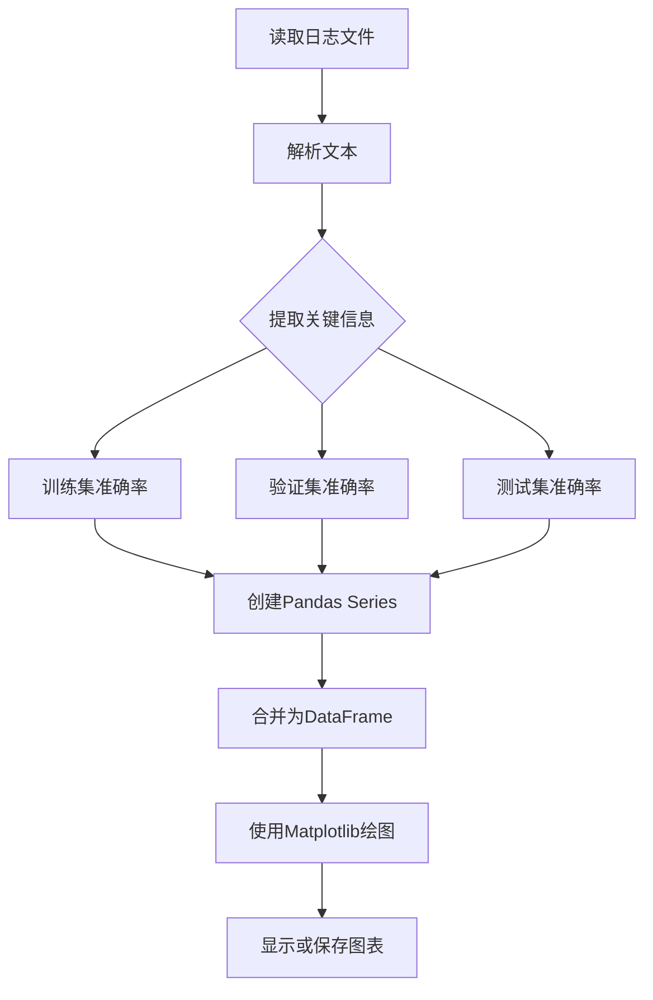

# 高级主题

<cite>
**本文档中引用的文件**   
- [biencoder_embedding_classification_concanated_together.py](file://bert/biencoder/biencoder_embedding_classification_concanated_together.py)
- [biencoder_embedding_classification_only_cls.py](file://bert/biencoder/biencoder_embedding_classification_only_cls.py)
- [biencoder_embedding_classification_only_embedding.py](file://bert/biencoder/biencoder_embedding_classification_only_embedding.py)
- [negative_embedding_sampler.py](file://bert/negative_embedding_sampler.py)
- [extract_accuracy.py](file://bert/extract_accuracy.py)
- [logs/with_layernorm_relu_hard_negatives_0.01_logs.txt](file://bert/logs/with_layernorm_relu_hard_negatives_0.01_logs.txt)
- [logs/wihtout_layernorm_relu_hard_negatives_logs.txt](file://bert/logs/wihtout_layernorm_relu_hard_negatives_logs.txt)
- [logs/without_layernorm_relu_with_hard_negatives_0.02_logs.txt](file://bert/logs/without_layernorm_relu_with_hard_negatives_0.02_logs.txt)
- [tasks_evaluator.py](file://bert/tasks_evaluator.py)
- [bertdataloader.py](file://bert/bertdataloader.py)
- [utils.py](file://utils.py)
- [config.py](file://config.py)
</cite>

## 目录
1. [模型调优与特征融合策略](#模型调优与特征融合策略)
2. [负样本采样率优化](#负样本采样率优化)
3. [系统扩展与新模型结构](#系统扩展与新模型结构)
4. [性能瓶颈与优化技巧](#性能瓶颈与优化技巧)
5. [训练日志分析与诊断](#训练日志分析与诊断)
6. [结果对比与可视化](#结果对比与可视化)
7. [可能的改进方向](#可能的改进方向)

## 模型调优与特征融合策略

本系统提供了多种特征融合策略，通过不同的模型文件实现。核心策略包括：

1.  **拼接融合 (Concatenated Together)**: 使用 `biencoder_embedding_classification_concanated_together.py` 文件中的模型。该策略将两个BERT编码器的输出向量进行拼接，形成更丰富的联合表示。其 `classify_pair` 方法通过 `torch.cat` 操作将两个文本的嵌入向量及其差值的绝对值进行拼接，然后通过一个线性层进行分类。

2.  **仅使用[CLS]标记**: 使用 `biencoder_embedding_classification_only_cls.py` 文件中的模型。该策略仅提取BERT输出中[CLS]标记对应的向量作为整个句子的表示，然后进行相似度计算或分类。这种方法计算效率高，但可能丢失部分上下文信息。

3.  **仅使用平均池化嵌入**: 使用 `biencoder_embedding_classification_only_embedding.py` 文件中的模型。该策略对BERT输出的所有token嵌入进行平均池化，得到一个固定维度的句子向量。这种方法在保留全局信息的同时，对长文本的表示更为鲁棒。

**调优建议**:
- **任务需求**: 对于需要精细语义匹配的任务（如反论点检索），推荐使用**拼接融合**策略，因为它能捕捉更复杂的交互特征。
- **计算资源**: 在资源受限的场景下，可优先考虑**仅使用[CLS]标记**的策略，以获得更快的推理速度。
- **实验验证**: 应通过在验证集上的A/B测试来确定最优策略。例如，比较 `concanated_together` 和 `only_cls` 模型在 `validation_df` 上的 `top1 accuracy`。

**Section sources**
- [biencoder_embedding_classification_concanated_together.py](file://bert/biencoder/biencoder_embedding_classification_concanated_together.py#L64-L76)
- [biencoder_embedding_classification_only_cls.py](file://bert/biencoder/biencoder_embedding_classification_only_cls.py)
- [biencoder_embedding_classification_only_embedding.py](file://bert/biencoder/biencoder_embedding_classification_only_embedding.py)

## 负样本采样率优化

负样本采样是训练过程中的关键环节，直接影响模型学习到的区分能力。系统通过 `BallTreeSearcher` 类（位于 `negative_embedding_sampler.py`）实现高效的负样本检索。

**核心机制**:
1.  **硬负样本挖掘**: 模型在每个epoch后，使用训练好的编码器为所有文本生成嵌入向量。
2.  **球树索引**: 利用 `sklearn.neighbors.BallTree` 构建点（point）和反论点（counter）嵌入向量的索引，支持快速的最近邻搜索。
3.  **混合采样**: 在 `search` 方法中，通过 `random_rate` 参数控制随机采样的比例。当随机数大于 `random_rate` 时，从最近邻中选择最难的负样本；否则，随机选择一个负样本。

**调优建议**:
- **初始高随机率**: 训练初期，建议使用较高的随机率（如0.8），以避免模型过早陷入局部最优。
- **动态衰减**: 可以实现 `random_rate` 随着训练epoch的增加而线性衰减（如 `0.8 - i * 0.02`）。这能促使模型在后期专注于区分更难的负样本，从而提升最终性能。
- **实验对比**: 通过 `model_structure_with_different_decreased_random_rate` 目录下的不同文件（如 `decreased_0.01.py`）进行实验，比较不同衰减率对最终准确率的影响。

**Section sources**
- [negative_embedding_sampler.py](file://bert/negative_embedding_sampler.py#L20-L46)
- [biencoder_embedding_classification_concanated_together.py](file://bert/biencoder/biencoder_embedding_classification_concanated_together.py#L199-L203)

## 系统扩展与新模型结构

本框架具有良好的可扩展性，可以方便地集成新的模型结构和评估任务。

**引入交叉编码器 (Cross-Encoder)**:
当前系统主要采用双编码器（Bi-Encoder）架构，计算效率高但交互能力有限。要引入更强大的交叉编码器：
1.  **创建新模型文件**: 在 `biencoder` 目录下创建如 `cross_encoder.py` 的新文件。
2.  **定义模型**: 继承 `nn.Module`，重写 `forward` 方法，将两个文本拼接后输入BERT，利用[CLS]标记的输出直接进行二分类。
3.  **修改数据加载器**: 修改 `bertdataloader.py` 中的 `ArgumentDataSet`，使其能处理拼接后的文本对。
4.  **调整训练逻辑**: 由于交叉编码器计算量大，需调整 `batch_size` 并可能移除负样本采样步骤。

**支持新评估任务**:
要支持新的评估任务（如主题分类）：
1.  **数据预处理**: 在 `utils.py` 中定义新的 `split_method` 函数，根据新任务的需求对数据进行分组和划分。
2.  **评估器**: 在 `tasks_evaluator.py` 中添加新的评估逻辑，加载训练好的模型，并使用 `get_embeding` 函数获取向量，然后进行新任务的预测。
3.  **配置文件**: 在 `config.py` 中添加新任务所需的数据路径。

**Section sources**
- [negative_embedding_sampler.py](file://bert/negative_embedding_sampler.py#L13-L46)
- [tasks_evaluator.py](file://bert/tasks_evaluator.py#L24-L37)
- [utils.py](file://utils.py#L259-L295)

## 性能瓶颈与优化技巧

系统在训练和推理过程中存在一些潜在的性能瓶颈，可通过以下技巧进行优化。

**性能瓶颈**:
- **BallTree构建时间**: 在每个epoch后，需要重新计算所有文本的嵌入向量并构建BallTree。对于大规模数据集，`BallTree(point_sim_embeddings, leaf_size=2)` 的构建时间会成为主要瓶颈。

**优化技巧**:
1.  **使用更高效的近邻搜索库**:
    - **FAISS**: Facebook AI开发的库，专为高效相似性搜索和聚类设计，支持GPU加速，性能远超scikit-learn的BallTree。
    - **Annoy**: Spotify开发的库，使用随机投影树，内存占用小，适合超大规模数据集。
    - **HNSW**: 基于分层导航小世界图的算法，是目前最先进、性能最好的近似最近邻搜索算法之一。

2.  **优化BallTree参数**:
    - 调整 `leaf_size` 参数。较大的 `leaf_size` 可以减少树的深度，加快构建速度，但可能降低查询效率。需要在构建时间和查询时间之间权衡。

3.  **异步处理**:
    - 将BallTree的构建过程与模型训练并行化。在训练下一个epoch的同时，启动一个后台进程来计算嵌入和构建索引。

**Section sources**
- [negative_embedding_sampler.py](file://bert/negative_embedding_sampler.py#L6)
- [biencoder_embedding_classification_concanated_together.py](file://bert/biencoder/biencoder_embedding_classification_concanated_together.py#L117-L118)

## 训练日志分析与诊断

分析 `logs/` 目录下的训练日志是诊断训练问题的关键。

**解读日志**:
日志文件（如 `with_layernorm_relu_hard_negatives_0.01_logs.txt`）记录了每个epoch的损失值和准确率。关键信息包括：
- `当前第X个mini batch，当前loss为Y`: 损失值应随训练进行而下降。
- `训练集top1 accuracy为Z`: 训练集准确率，反映模型拟合能力。
- `验证集top1 accuracy为Z`: 验证集准确率，反映模型泛化能力。
- `测试集top1 accuracy为Z`: 测试集准确率，反映最终性能。

**诊断训练问题**:
- **过拟合 (Overfitting)**: 当训练集准确率持续上升，而验证集准确率在达到峰值后开始下降时，表明模型过拟合。可通过增加正则化（如Dropout）、使用早停（Early Stopping）或增加数据增强来缓解。
- **收敛缓慢 (Slow Convergence)**: 如果损失值下降非常缓慢，可能是学习率（`lr=3e-6`）设置过低。可以尝试使用学习率调度器（如 `ReduceLROnPlateau`）或适当提高初始学习率。
- **不收敛 (Non-convergence)**: 如果损失值波动剧烈或不下降，可能是学习率过高或数据预处理存在问题。

**Section sources**
- [logs/with_layernorm_relu_hard_negatives_0.01_logs.txt](file://bert/logs/with_layernorm_relu_hard_negatives_0.01_logs.txt)
- [logs/wihtout_layernorm_relu_hard_negatives_logs.txt](file://bert/logs/wihtout_layernorm_relu_hard_negatives_logs.txt)

## 结果对比与可视化

`extract_accuracy.py` 脚本提供了结果对比与可视化的基本功能。

**功能分析**:
该脚本读取日志文件，提取训练集、验证集和测试集的 `top1 accuracy`，并使用 `matplotlib` 绘制趋势图。

**增强可视化**:
1.  **多模型对比**: 修改脚本，同时读取多个日志文件（如不同 `random_rate` 或不同激活函数的日志），将它们的准确率曲线绘制在同一张图上，便于直观比较。
2.  **损失曲线**: 除了准确率，还应绘制损失曲线，以更全面地观察训练动态。
3.  **保存图表**: 使用 `plt.savefig()` 将图表保存为图片文件，便于分享和报告。

**Diagram sources**
- [extract_accuracy.py](file://bert/extract_accuracy.py)

## 可能的改进方向

基于现有系统，可以探索以下几个方向来进一步提升性能。

**引入更先进的预训练模型**:
- **RoBERTa, DeBERTa**: 这些模型在BERT的基础上进行了改进，在多个NLP基准测试上表现更优。只需将 `BertModel.from_pretrained('bert-base-uncased')` 替换为 `RobertaModel.from_pretrained('roberta-base')` 即可。
- **领域特定模型**: 使用在辩论或论辩数据上微调过的预训练模型，可能获得更好的领域适应性。

**设计更复杂的分类头**:
当前的分类头（`linear2`）是一个简单的线性层。可以尝试：
- **多层感知机 (MLP)**: 添加更多的隐藏层和非线性激活函数（如ReLU, GELU）。
- **注意力机制**: 在拼接后的向量上应用自注意力或交叉注意力，让模型学习不同特征的重要性。

**实现在线难例挖掘 (Online Hard Example Mining)**:
目前的难例挖掘是离线的（每个epoch后更新一次）。可以实现在线挖掘：
- 在每个mini-batch内部，动态计算样本间的相似度，为每个正样本对选择batch内最难的负样本。
- 这能更及时地让模型接触到难例，可能加速收敛。

**Section sources**
- [biencoder_embedding_classification_concanated_together.py](file://bert/biencoder/biencoder_embedding_classification_concanated_together.py#L57)
- [negative_embedding_sampler.py](file://bert/negative_embedding_sampler.py)